# Lights

---

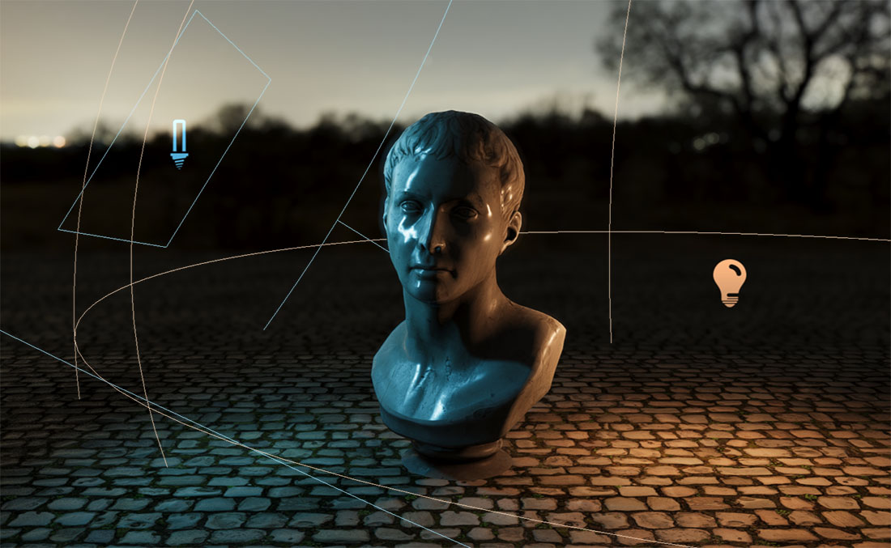

**Lights** illuminate the objects of a scene and make them cast shadows. Evergine uses physically based shading, so the same light model works for everything from a desk lamp to the sun, and a scene can contain many lights of different kinds at once.

Each light is a component on an entity. The entity's `Transform3D` gives the light its position and, for lights that have one, its direction: lights shine along the transform's **forward** vector.

## Create a light in Evergine Studio

In the **Entities Hierarchy** panel of the scene editor, click **Add Entity**, open **Lights 3D** and choose the kind of light:

* Point Light
* Directional Light
* Spot Light
* Sphere Light
* Disk Light
* Rectangle Light
* Tube Light

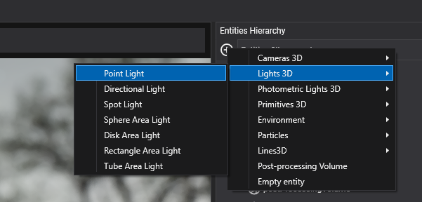

**Photometric Lights 3D** has the same seven kinds, configured in physical units:

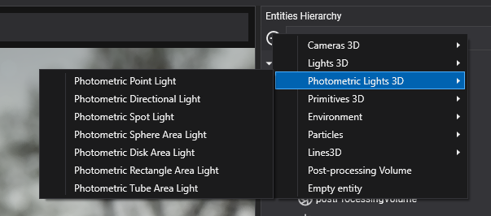

The **Environment** menu also has a **Sun Light**, a directional light that drives the sky; see [Environment](environment/index.md).

## Create a light from code

```csharp
using Evergine.Common.Graphics;
using Evergine.Framework;
using Evergine.Framework.Graphics;
using Evergine.Mathematics;

public class MyScene : Scene
{
    protected override void CreateScene()
    {
        Entity lamp = new Entity("lamp")
            .AddComponent(new Transform3D() { Position = new Vector3(0, 3, 0) })
            .AddComponent(new PointLight()
            {
                Color = Color.Orange,
                Intensity = 3,
                LightRange = 10,
                IsShadowEnabled = true,
            });

        // Directional lights ignore position; only the orientation of the transform matters.
        Entity sun = new Entity("sun")
            .AddComponent(new Transform3D() { LocalRotation = new Vector3(-MathHelper.PiOver4, MathHelper.PiOver4, 0) })
            .AddComponent(new DirectionalLight()
            {
                Intensity = 2,
                IsShadowEnabled = true,
            });

        this.Managers.EntityManager.Add(lamp);
        this.Managers.EntityManager.Add(sun);
    }
}
```

## Common properties

Every light has these properties:

| Property | Default | Description |
| --- | --- | --- |
| **IsEnabled** | true | Turns the light on or off. |
| **Color** | White | Color of the light. Photometric lights can derive it from a temperature instead. |
| **Intensity** | 1 | Brightness in an arbitrary unit. Photometric lights hide it and expose a physical unit instead. |
| **IsShadowEnabled** | false | Whether the light casts shadows. Shown as **Shadow enabled** in Evergine Studio. |
| **ShadowBias** | 0.004 (0.005 for directional lights) | Depth offset applied when comparing against the shadow map. Raise it if surfaces shadow themselves in stripes ("shadow acne"); lower it if shadows detach from their casters ("peter panning"). |
| **ShadowOpacity** | 1 | How dark the shadow is, from 0 (invisible) to 1 (fully dark). |

## Photometric and non-photometric lights

**Non-photometric** lights use `Color` and `Intensity`: simple and easy to tune by eye. **Photometric** lights are the same lights configured in physical units, so an 800 lm bulb or a 100,000 lux sun look right next to each other and next to a camera with [physical exposure](cameras.md#exposure).

Each photometric light class derives from its non-photometric counterpart (`PhotometricPointLight` from `PointLight`, and so on) and adds:

| Property | Default | Description |
| --- | --- | --- |
| **ColorByTemperature** | true | Derive the color from `Temperature` instead of `Color`. |
| **Temperature** | 6500 | [Color temperature](https://en.wikipedia.org/wiki/Color_temperature) in kelvin. 6500 K is daylight white; lower values are warmer, higher values bluer. |

The intensity is set in the unit that suits each kind of light:

| Light | Property | Unit |
| --- | --- | --- |
| `PhotometricDirectionalLight` | **Illuminance** | lux, the light arriving per square meter of surface |
| `PhotometricPointLight`, `PhotometricSpotLight` and the four photometric area lights | **LuminousPower** | lumens, the total light the source emits |

`PhotometricSpotLight` also has **IsFocusedSpot**. When it is on, the luminous power is concentrated in the cone, so narrowing the cone makes the light brighter, like a real focused spot. When it is off (the default), the intensity is the same as that of a point light with the same power.

## Types of lights

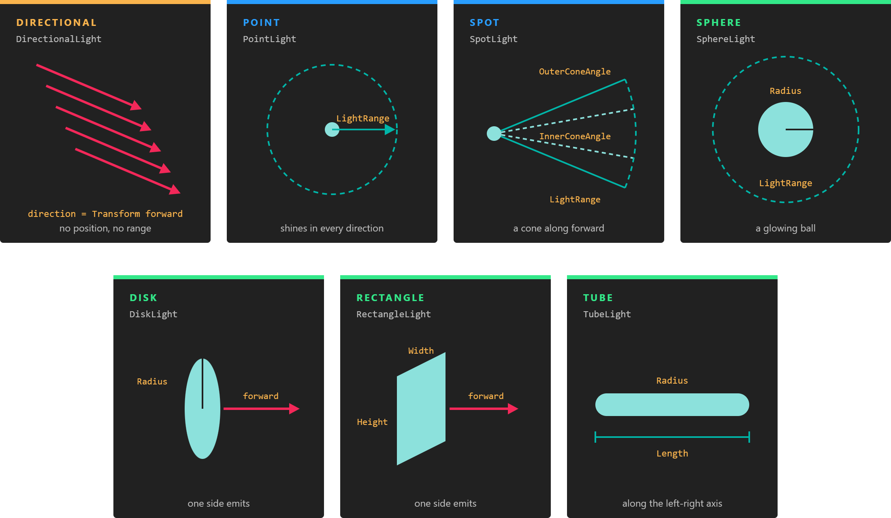

*Directional lights have only a direction. Every other light has a position and a range; spot lights add a cone, and area lights add a shape that emits.*

Lights fall into three groups:

* **Directional** lights have a direction but no position, and reach every object.
* **Punctual** lights (point and spot) emit from a single point and fade out at `LightRange`.
* **Area** lights (sphere, disk, rectangle and tube) emit from a surface. They give softer highlights and more realistic reflections, at a higher shading cost.

### Directional light

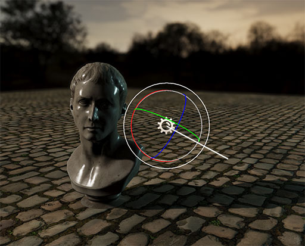

A **directional light** comes from infinitely far away along one direction, like sunlight. It lights every object in the scene the same way, whatever its position.

| Property | Default | Description |
| --- | --- | --- |
| **ShadowDistance** | 80 | How far from the camera, in meters, directional shadows are drawn. |
| **GammaDistribution** | 0.8 | How the shadow cascades are spread over that distance, from 0 (evenly) to 1 (logarithmically, with more detail near the camera). |
| **DebugMode** | false | Tints each shadow cascade with its own color, to tune the two properties above. |

Directional shadows use **cascaded shadow maps**: the part of the camera's view within `ShadowDistance` is cut into four slices, and each slice gets its own shadow map. Slices close to the camera cover little space and give sharp shadows; distant slices cover more and are coarser.

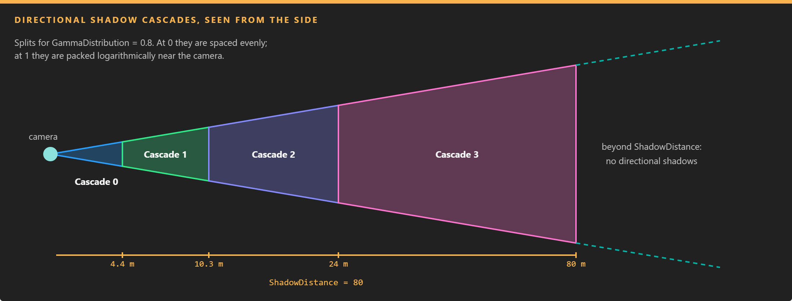

*The first cascade covers the few meters in front of the camera at full resolution. Lowering `ShadowDistance` makes every cascade smaller and every shadow sharper.*

### Point light

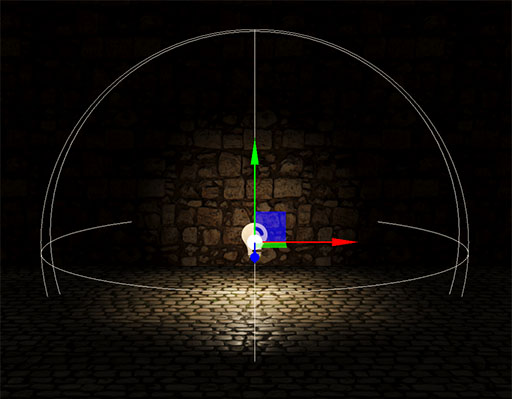

A **point light** shines equally in all directions from its position and fades to zero at its range. Use it for bulbs, candles and other small local sources.

| Property | Default | Description |
| --- | --- | --- |
| **LightRange** | 20 | Distance in meters at which the light reaches zero. Keep it as small as the scene allows: objects outside the range skip this light entirely. |
| **ShadowNearPlane** | 0.1 | Near plane of the shadow map cameras. |
| **DebugMode** | false | Tints the six faces of the shadow cube map. |

A point light renders its shadows into a cube map: six shadow maps, one per face.

### Spot light

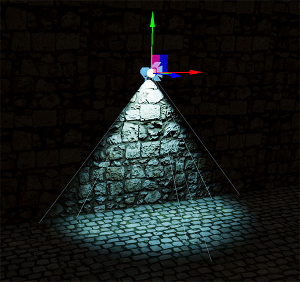

A **spot light** shines from its position in a cone around its forward direction, like a flashlight or a stage light.

| Property | Default | Description |
| --- | --- | --- |
| **LightRange** | 20 | Distance in meters at which the light reaches zero. |
| **OuterConeAngle** | π/4 (45°) | Full angle of the cone, in radians. Nothing outside it is lit. |
| **InnerConeAngle** | 0 | Full angle, in radians, of the inner cone at full intensity. Between the inner and outer cones the light fades. Equal angles give a hard edge. |
| **ShadowNearPlane** | 0.1 | Near plane of the shadow map camera. |

### Area lights

Area lights emit from a shape instead of a point. They are all cube-map lights with `LightRange` (default 20), `ShadowNearPlane` and `DebugMode`, plus the dimensions of their shape:

| Light | Shape | Properties (defaults) | Typical use |
| --- | --- | --- | --- |
| **Sphere light** | 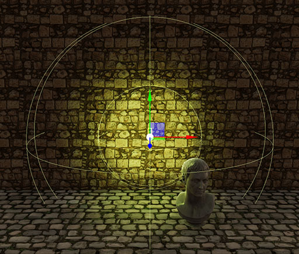 | `Radius` (2) | Large round lamps and glowing orbs. |
| **Disk light** | 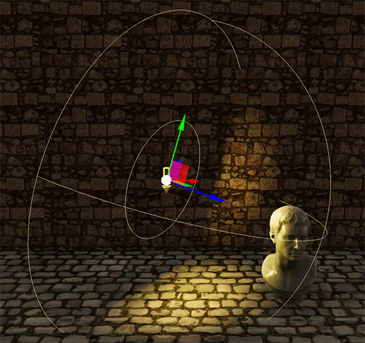 | `Radius` (2) | Ceiling lights and soft spots. It emits from one side, along its forward direction. |
| **Rectangle light** | 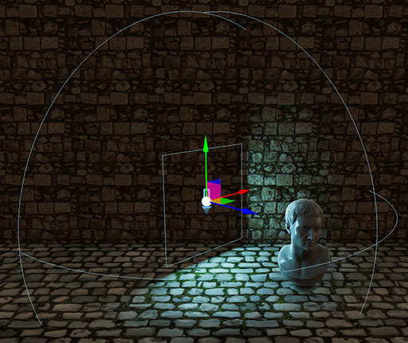 | `Width` (3), `Height` (3) | Windows, screens and softboxes. It emits from one side, along its forward direction. |
| **Tube light** | 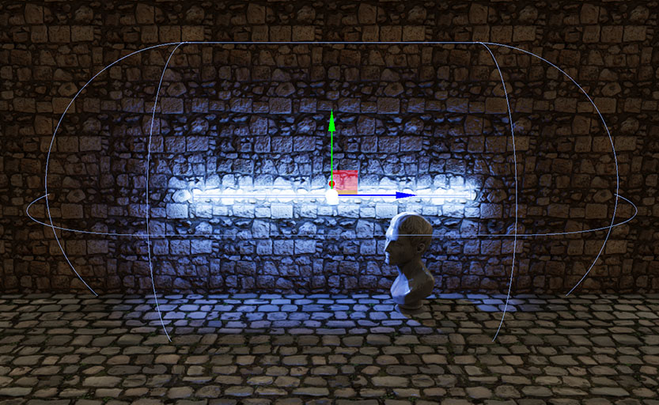 | `Length` (6), `Radius` (0.2) | Fluorescent tubes and neon. The tube lies along the entity's left-right axis. |

> [!NOTE]
> Area lights evaluate their shape for every shaded pixel, so they cost noticeably more than point and spot lights. Use them where the soft, shaped highlights are visible.

## How many lights

The forward render path assigns each object only the lights whose range touches its bounding box. A camera handles up to 64 visible lights at a time, and only materials with lighting enabled receive them. Materials created with lighting disabled are not affected by lights at all.

## Shadows

To make a light cast shadows, turn on **IsShadowEnabled**. Every shadow-casting light renders the scene again from its own point of view each frame (four times for a directional light, six for point and area lights), so enable shadows only on the lights that need them.

Objects cast shadows through the `RenderFlags.CastShadows` flag of their drawable, which is on by default.

### ShadowMapManager

The quality of every shadow in a scene is set on the `ShadowMapManager` scene manager, which the default scene template already includes. Select it in the **Scene Managers** list of the scene to change it.

<!-- CAPTURE: images/shadowmapmanager.png; the Scene Managers panel of a scene with ShadowMapManager selected, showing its resolution, filter and AutoDepthBounds properties -->

| Property | Default | Description |
| --- | --- | --- |
| **DirectionalResolution** | `Size_2048` | Size of each directional cascade shadow map: `Size_256` to `Size_4096`. |
| **SpotResolution** | `Size_512` | Size of each spot light shadow map. |
| **PunctualResolution** | `Size_512` | Size of each cube face for point and area lights. |
| **ShadowFilter** | `PCF3x3` | Percentage-closer filtering kernel that softens shadow edges: `PCF2x2`, `PCF3x3`, `PCF5x5` or `PCF7x7`. Larger kernels are softer and more expensive. In low profile mode it is always `PCF3x3`. |
| **AutoDepthBounds** | false | Measures on the GPU how deep the visible scene really is and fits the directional cascades to that range instead of to `ShadowDistance`. It gives sharper shadows when the camera looks at nearby geometry, at the cost of a small compute pass per camera. |

```csharp
using Evergine.Framework;
using Evergine.Framework.Graphics;
using Evergine.Framework.Managers;

public class MyScene : Scene
{
    protected override void CreateScene()
    {
        var shadowMapManager = this.Managers.FindManager<ShadowMapManager>();
        if (shadowMapManager != null)
        {
            shadowMapManager.DirectionalResolution = ShadowMapProvider.ShadowMapSize.Size_4096;
            shadowMapManager.ShadowFilter = ShadowMapProvider.Filter.PCF5x5;
        }
    }
}
```

> [!TIP]
> If directional shadows look blocky, lower `ShadowDistance` on the light before raising `DirectionalResolution`. Halving the distance sharpens shadows about as much as doubling the resolution, and costs nothing.
