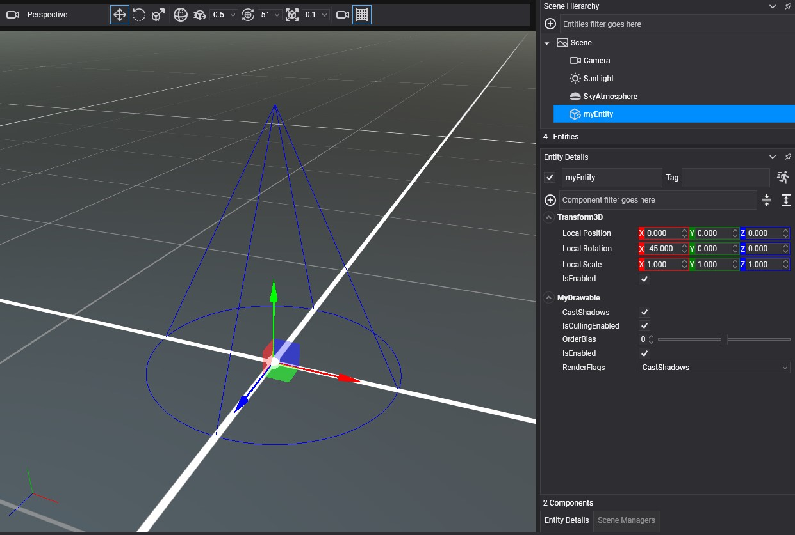

# Create a Custom LineBatch

---

The `LineBatch3D` of the `RenderManager` covers most needs. Create your own batch when you want to transform every line at once, draw into a different render layer, or keep a set of lines that does not change from frame to frame without affecting the shared batch.

## How to create a custom LineBatch

A `LineBatch3D` is a render object: you create it with a `GraphicsContext` and a `RenderLayerDescription`, then register it with the render manager so that it is collected every frame.

```csharp
using Evergine.Common.Graphics;
using Evergine.Framework;
using Evergine.Framework.Graphics;
using Evergine.Framework.Services;
using Evergine.Mathematics;

public class MyDrawable : Drawable3D
{
    [BindService]
    private AssetsService assetsService = null;

    [BindService]
    private GraphicsContext graphicsContext = null;

    private LineBatch3D lineBatch;

    protected override bool OnAttached()
    {
        // The render layer decides the render state (depth, blending, culling) the lines are drawn with.
        var layer = this.assetsService.Load<RenderLayerDescription>(DefaultResourcesIDs.OpaqueRenderLayerID);

        this.lineBatch = new LineBatch3D(this.graphicsContext, layer);

        // Registering the batch is what makes the render manager collect and draw it.
        this.Managers.RenderManager.AddRenderObject(this.lineBatch);

        return base.OnAttached();
    }

    protected override void OnActivated()
    {
        base.OnActivated();
        this.lineBatch.IsEnabled = true;
    }

    protected override void OnDeactivated()
    {
        base.OnDeactivated();
        this.lineBatch.IsEnabled = false;
    }

    protected override void OnDetached()
    {
        this.Managers.RenderManager.RemoveRenderObject(this.lineBatch);
        this.lineBatch.Dispose();
        base.OnDetached();
    }

    public override void Draw(DrawContext drawContext)
    {
        this.lineBatch.DrawCone(0.5f, 1.0f, Vector3.UnitY, Vector3.Down, Color.Blue);
    }
}
```

**Result**



## Useful members

| Member | Default | Description |
| --- | --- | --- |
| **Transform** | Identity | A `Matrix4x4` applied to every line in the batch. Use it to move, rotate or scale everything at once, for instance to rotate a whole CAD drawing. Set it with `SetTransform(ref matrix)` or the property. |
| **ResetAfterRender** | true | When true, the batch is emptied each time it is collected, so you add the lines again every frame. Set it to false to build the batch once and draw the same lines every frame. |
| **LineBatchOrderBias** | 0 | Moves the batch earlier or later inside its render layer. |
| **IsEnabled** | true | Disabled batches are skipped by the render manager. |
| **Reset()** | | Empties the batch. With `ResetAfterRender` set to false, call it when the static lines need to change. |

For a batch that never changes, fill it once and turn the per-frame reset off:

```csharp
this.lineBatch = new LineBatch3D(this.graphicsContext, layer)
{
    // Keep the vertices between frames; nothing is added after this point.
    ResetAfterRender = false,
};

for (int i = -10; i <= 10; i++)
{
    this.lineBatch.DrawLine(new Vector3(i, 0, -10), new Vector3(i, 0, 10), Color.Gray);
    this.lineBatch.DrawLine(new Vector3(-10, 0, i), new Vector3(10, 0, i), Color.Gray);
}
```
