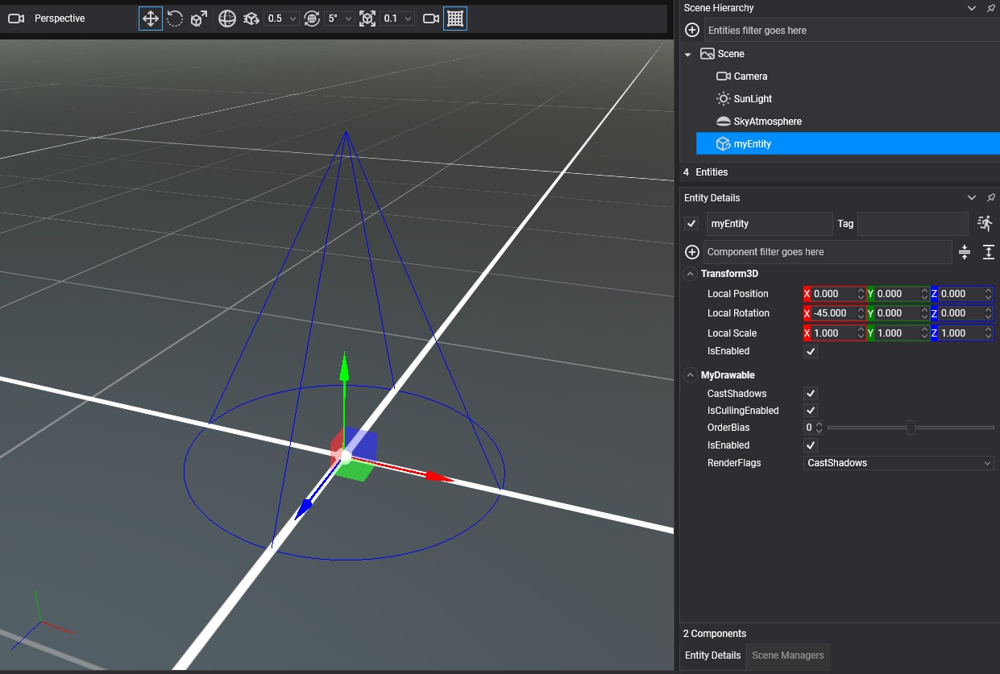

# Create Custom LineBatch
---
In most cases, the default LineBatch3D provided by the RenderManager will be sufficient. However, sometimes it is useful to create your custom line batch so you can modify its global transformation or alter its rendering behavior without impacting the default line batch included in Evergine. In these situations, it can be beneficial to create an independent custom line batch.

## How to Create a Custom LineBatch
```csharp
public class MyDrawable : Drawable3D
{
    [BindService]
    private AssetsService assetsService = null;

    private GraphicsContext graphicsContext;

    private LineBatch3D lineBatch;

    protected override bool OnAttached()
    {
        this.graphicsContext = Application.Current.Container.Resolve<GraphicsContext>();
        var layer = this.assetsService.Load<RenderLayerDescription>(DefaultResourcesIDs.OpaqueRenderLayerID);

        // Create custom line batch 3D
        this.lineBatch = new LineBatch3D(this.graphicsContext, layer);

        // Add line batch to render
        this.Managers.RenderManager.AddRenderObject(this.lineBatch);

        return base.OnAttached();
    }

    protected override void OnActivated()
    {
        // Enable line batch when the component is activated
        this.lineBatch.IsEnabled = true;
        base.OnActivated();
    }

    protected override void OnDeactivated()
    {
        // Disable line batch when the component is deactivated
        this.lineBatch.IsEnabled = false;
        base.OnDeactivated();
    }

    protected override void OnDetached()
    {
        // Remove line batch from render when the component is detached
        this.Managers.RenderManager.RemoveRenderObject(this.lineBatch);
        base.OnDetached();
    }

    public override void Draw(DrawContext drawContext)
    {
        // Draw a sample blue cone
        this.lineBatch.DrawCone(0.5f, 1.0f, Vector3.UnitY, Vector3.Down, Color.Blue);
    }
}
```

**Result**


## Some Interesting Properties

The line batch has a **Transform** property that can be used to apply transformations (translation, rotation, or scale) to all elements added to the batch. For example, if you use the line batch to draw a CAD map, you can use this property to rotate the whole map.

By default, the line batch requires that every frame the elements to draw be added to the batch. However, in some cases, it is useful to create a static batch and draw the same elements every frame because no new elements will need to be added to the batch at runtime. You can use the **ResetAfterRender** property to indicate that the line batch doesn't reset the batch every frame.

```csharp
this.lineBatch = new LineBatch3D(this.graphicsContext, layer)
{
    ResetAfterRender = false,
};
```