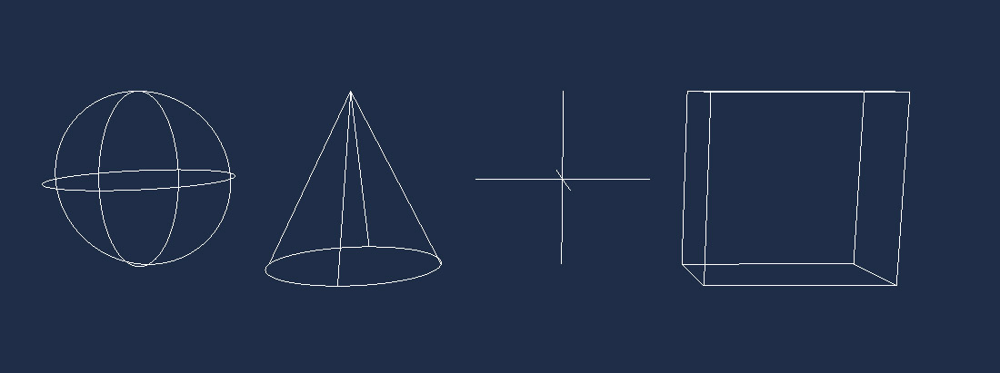

# Line Batch

---

A **line batch** draws large numbers of one-pixel lines, such as debug helpers, gizmos, grids or bounding volumes. Every line you add to a batch ends up in a single vertex buffer and a single draw call, so thousands of lines cost little more than one.

Line batches are only available from code. Each scene's `RenderManager` has one ready to use in its `LineBatch3D` property, and you can create your own when you need a separate transform or render layer.

Lines are always one pixel wide. When you need thick lines, textured lines or lines that are part of the scene rather than a debugging aid, use a [line mesh](../lines_3d.md) instead.

## In this section

* [Using LineBatch](using_linebatch.md)
* [Create a custom LineBatch](custom_linebatch.md)
