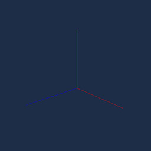
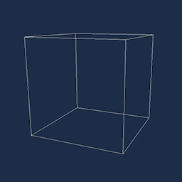
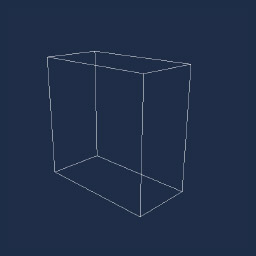
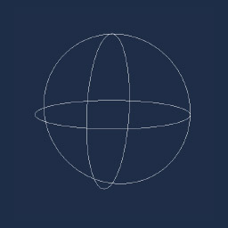
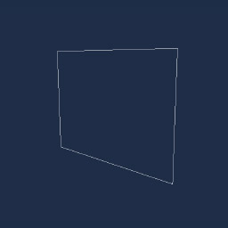
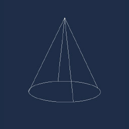
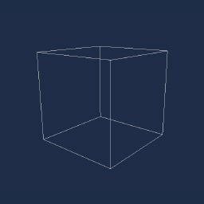
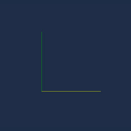
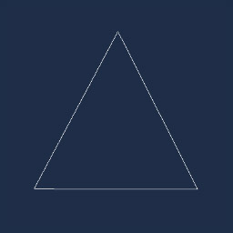

# Using LineBatch

---


The scene's `RenderManager` owns a `LineBatch3D` that any component can draw into. Lines, shapes and bounding volumes added to it during a frame are drawn at the end of that frame and then cleared, so you add them again every frame you want to see them.

## Accessing the line batch

`LineBatch3D` is a property of the concrete `RenderManager` class (namespace `Evergine.Framework.Managers`). Components receive the scene's render manager typed as `BaseRenderManager`, so you either bind it with its concrete type or cast it.

The usual place to draw is a `Drawable3D`, whose `Draw` method runs once per frame while the render manager collects what to render:

```csharp
using Evergine.Common.Graphics;
using Evergine.Framework.Graphics;
using Evergine.Framework.Managers;
using Evergine.Mathematics;

public class MyDrawable : Drawable3D
{
    public override void Draw(DrawContext drawContext)
    {
        // Drawable exposes the manager as BaseRenderManager; LineBatch3D lives on the concrete RenderManager.
        var lineBatch = (this.RenderManager as RenderManager)?.LineBatch3D;
        lineBatch?.DrawLine(Vector3.Zero, Vector3.Up, Color.Red);
    }
}
```

Add it to an entity in your scene like any other component:

```csharp
protected override void CreateScene()
{
    var dummyEntity = new Entity("dummy")
        .AddComponent(new Transform3D())
        .AddComponent(new MyDrawable());

    this.Managers.EntityManager.Add(dummyEntity);
}
```

A `Behavior` works as well, which is convenient when the lines depend on logic that already lives in one. Bind the render manager with its concrete type:

```csharp
using System;
using Evergine.Common.Graphics;
using Evergine.Framework;
using Evergine.Framework.Graphics;
using Evergine.Framework.Managers;
using Evergine.Mathematics;

public class DrawVelocity : Behavior
{
    [BindSceneManager]
    private RenderManager renderManager = null;

    [BindComponent]
    private Transform3D transform = null;

    public Vector3 Velocity { get; set; } = Vector3.Forward;

    protected override void Update(TimeSpan gameTime)
    {
        // The batch is cleared after every frame, so the arrow must be re-added each Update.
        this.renderManager.LineBatch3D.DrawRay(this.transform.Position, this.Velocity, Color.Yellow);
    }
}
```

> [!NOTE]
> There is no 2D line batch. To draw lines in screen space, draw them in 3D in front of an orthographic camera.

> [!TIP]
> Setting `RenderManager.DebugLines` to `true` makes every drawable draw its own debug geometry (bounding boxes, light volumes, camera frustums) into this same batch.

## Shapes

Besides `DrawLine`, `LineBatch3D` has helpers for common shapes. Most methods have an overload that takes the arguments by `ref`, which avoids copying structs when you draw many shapes per frame, and several accept a `Matrix4x4` transform that is applied to the shape.

### DrawArc

```csharp
Vector3 origin = Vector3.Zero;
Color color = Color.White;

// The third argument is the fraction of the full circle to draw.
lineBatch.DrawArc(ref origin, 0.5f, 0.5f, ref color);
```


### DrawAxis

```csharp
lineBatch.DrawAxis(Matrix4x4.Identity, 1.0f);
```



### DrawBoundingBox

```csharp
lineBatch.DrawBoundingBox(new BoundingBox(Vector3.Zero, Vector3.One), Color.White);
```



### DrawBoundingFrustum

```csharp
lineBatch.DrawBoundingFrustum(new BoundingFrustum(Matrix4x4.Identity), Color.White);
```



### DrawBoundingOrientedBox

```csharp
var orientation = Quaternion.CreateFromAxisAngle(Vector3.Right, MathHelper.PiOver4);
lineBatch.DrawBoundingOrientedBox(new BoundingOrientedBox(Vector3.Zero, Vector3.One * 0.5f, orientation), Color.White);
```


### DrawBoundingSphere

```csharp
lineBatch.DrawBoundingSphere(new BoundingSphere(Vector3.Zero, 1.0f), Color.White);
```



### DrawRectangle

```csharp
lineBatch.DrawRectangle(Vector3.Zero, Vector3.One, Color.White);
```



### DrawCircle

```csharp
lineBatch.DrawCircle(Vector3.Zero, 1.0f, Color.White);
```


### DrawCone

```csharp
// Radius, height, apex position and the direction the cone opens towards.
lineBatch.DrawCone(0.5f, 1.0f, Vector3.Zero, Vector3.Down, Color.White);
```



### DrawCube

```csharp
lineBatch.DrawCube(Vector3.Zero, Vector3.One, Color.White);
```



### DrawForward

```csharp
lineBatch.DrawForward(Matrix4x4.Identity, 1.0f);
```



### DrawPoint

```csharp
lineBatch.DrawPoint(Vector3.Zero, 0.5f, Color.White);
```


### DrawRay

```csharp
lineBatch.DrawRay(Vector3.Zero, Vector3.Forward, Color.White);
```


### DrawTriangle

```csharp
lineBatch.DrawTriangle(new Vector3(-0.5f, 0, 0), new Vector3(0, 1.0f, 0), new Vector3(0.5f, 0, 0), Color.White);
```


