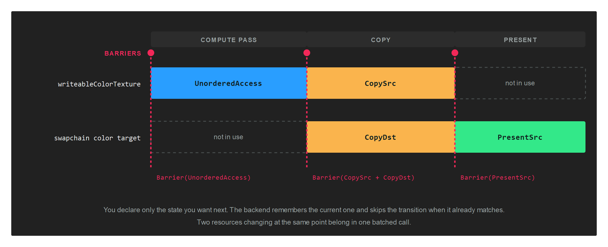
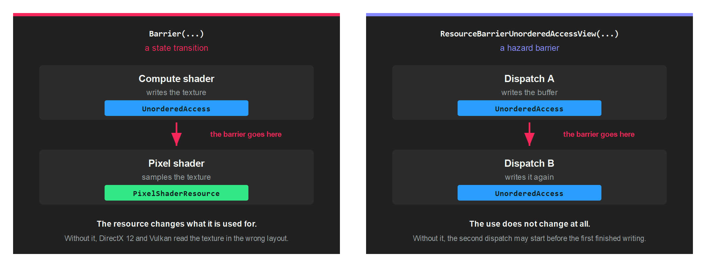

# Barriers

At any moment a GPU resource sits in a state that reflects what it is being used for: a render target, a shader resource, the source of a copy, the image being presented. Changing that use requires telling the backend, and the call that does it is a barrier.

DirectX 12 and Vulkan will not do this for you, and get it wrong when you omit it. DirectX 11, Metal, OpenGL and WebGPU track resource state internally and implement `Barrier` as an empty method, so code that omits barriers runs correctly there and then fails on the explicit backends. Write them everywhere.

## The model

You declare only the state you want next. There is no source state parameter anywhere in the API, because each backend already knows where the resource is and skips the transition when it already matches.



Barriers are recorded on a [CommandBuffer](commandbuffer.md), outside any render pass, and take effect in the order they were recorded relative to the rest of that buffer.

## Buffer barriers

`Buffer.Barrier` names a buffer and the state to move it into.

```csharp
commandBuffer.Barrier(new Buffer.Barrier(this.constantBuffer, Buffer.StateFlags.UniformBuffer));
```

### Buffer.StateFlags

| Buffer.StateFlags | Value | Description |
| --- | --- | --- |
| **None** | 0 | No state. |
| **CopySrc** | 1 | Source of a copy. |
| **CopyDst** | 2 | Destination of a copy. |
| **VertexBuffer** | 4 | Read by the input assembler as vertices. |
| **IndexBuffer** | 8 | Read by the input assembler as indices. |
| **UniformBuffer** | 16 | Read as a constant buffer. |
| **ShaderResource** | 32 | Read by a shader. |
| **UnorderedAccess** | 64 | Written by a shader, usually a compute shader. |

## Texture barriers

`Texture.Barrier` works the same way, and its constructor defaults the subresource range to the whole texture.

```csharp
commandBuffer.Barrier(new Texture.Barrier(this.texture, Texture.StateFlags.PixelShaderResource));
```

### Texture.StateFlags

| Texture.StateFlags | Value | Description |
| --- | --- | --- |
| **None** | 0 | No state. |
| **CopySrc** | 1 | Source of a copy. |
| **CopyDst** | 2 | Destination of a copy. |
| **PixelShaderResource** | 4 | Sampled by a pixel shader. |
| **NonPixelShaderResource** | 8 | Sampled by any other stage. |
| **RenderTarget** | 16 | Drawn into as a colour attachment. |
| **UnorderedAccess** | 32 | Written by a shader. |
| **DepthRead** | 64 | Used as a depth buffer for reads. |
| **DepthWrite** | 128 | Used as a depth buffer for writes. |
| **ResolveSrc** | 256 | Source of a multisample resolve. |
| **ResolveDst** | 512 | Destination of a multisample resolve. |
| **PresentSrc** | 1024 | Handed to the swapchain for presentation. |

### Subresources

`Texture.Barrier` carries four extra fields that narrow the transition to part of the texture:

| Field | Type | Description |
| --- | --- | --- |
| **firstMip** | `uint` | First mip level to transition. |
| **numMips** | `uint` | Number of mip levels. |
| **firstLayer** | `uint` | First array layer to transition. |
| **numLayers** | `uint` | Number of array layers. |

> [!WARNING]
> The constructor sets `numMips` and `numLayers` to the whole texture. Building the struct with an object initializer instead leaves both at `0`, and a barrier covering zero subresources transitions nothing. Use the constructor, then narrow the range if you need to:
>
> ```csharp
> var barrier = new Texture.Barrier(this.texture, Texture.StateFlags.PixelShaderResource);
> barrier.firstMip = 2;
> barrier.numMips = 1;
> commandBuffer.Barrier(barrier);
> ```

Only the Vulkan backend honours the subresource range. DirectX 12 transitions the whole resource regardless of what you ask for, which is conservative and therefore safe.

> [!NOTE]
> Both `StateFlags` enums are bit flags, but neither carries the `[Flags]` attribute. Combining them with `|` works, and is what the engine does internally when a texture is read by both pixel and non-pixel stages.

## Batching

Every overload of `Barrier` ends at the same two-span method, and each call becomes one native barrier command. Transitioning several resources at one point belongs in one call:

```csharp
graphicsCommandBuffer.Barrier(new[]
{
    new Texture.Barrier(this.writeableDepthTexture, Texture.StateFlags.NonPixelShaderResource),
    new Texture.Barrier(this.writeableColorTexture, Texture.StateFlags.UnorderedAccess),
});
```

The five overloads are:

| Overload | Use |
| --- | --- |
| `Barrier(Buffer.Barrier)` | One buffer. |
| `Barrier(Texture.Barrier)` | One texture. |
| `Barrier(ReadOnlySpan<Buffer.Barrier>)` | Several buffers. |
| `Barrier(ReadOnlySpan<Texture.Barrier>)` | Several textures. |
| `Barrier(ReadOnlySpan<Buffer.Barrier>, ReadOnlySpan<Texture.Barrier>)` | Both at once. |

## When you need one

| Situation | Transition to |
| --- | --- |
| Before a compute shader writes a texture | `Texture.StateFlags.UnorderedAccess` |
| Before a pixel shader samples it | `Texture.StateFlags.PixelShaderResource` |
| Before a vertex or compute shader samples it | `Texture.StateFlags.NonPixelShaderResource` |
| Before a copy or a blit | `CopySrc` on the source, `CopyDst` on the destination |
| Before presenting a swapchain texture you wrote yourself | `Texture.StateFlags.PresentSrc` |
| After updating a constant buffer that a shader will read | `Buffer.StateFlags.UniformBuffer` |
| Before a compute shader writes a buffer | `Buffer.StateFlags.UnorderedAccess` |

A full pass, from `CopyToDepthTextureTest`:

```csharp
// Compute writes both textures...
graphicsCommandBuffer.Barrier(new[]
{
    new Texture.Barrier(this.writeableDepthTexture, Texture.StateFlags.NonPixelShaderResource),
    new Texture.Barrier(this.writeableColorTexture, Texture.StateFlags.UnorderedAccess),
});

// ...then the result is copied into the swapchain...
graphicsCommandBuffer.Barrier(new Texture.Barrier(this.writeableColorTexture, Texture.StateFlags.CopySrc));
graphicsCommandBuffer.Barrier(new Texture.Barrier(swapchainColor, Texture.StateFlags.CopyDst));

// ...and the swapchain is handed over for presentation.
graphicsCommandBuffer.Barrier(new Texture.Barrier(swapchainColor, Texture.StateFlags.PresentSrc));
```

## A ResourceSet already knows its barriers

Creating a [ResourceSet](resourceset.md) works out, from the layout, the state each resource has to be in. You do not repeat that by hand for resources bound through a set. `CollectBarriers` returns the list when you are writing your own submission code:

```csharp
var bufferBarriers = new List<Buffer.Barrier>();
var textureBarriers = new List<Texture.Barrier>();
resourceSet.CollectBarriers(bufferBarriers, textureBarriers);
```

## The other barrier

`ResourceBarrierUnorderedAccessView` shares part of its name with `Barrier` and does something different. It is not a state transition. It says that two pieces of work using a resource in the same way have to be ordered against each other.



```csharp
commandBuffer.Dispatch2D(width, height);
commandBuffer.ResourceBarrierUnorderedAccessView(this.buffer);
commandBuffer.Dispatch2D(width, height);
```

Without it, the second dispatch is free to begin before the first has finished writing, and each reads whatever happens to be there. There is one overload for a `Buffer` and one for a `Texture`.

> [!NOTE]
> The XML documentation on the `Buffer` overload says "texture". It applies to buffers.

DirectX 12 forwards this to a native UAV barrier and Vulkan to a full pipeline barrier. DirectX 11 has no equivalent, so the backend unbinds the view and lets the driver's own read-after-write hazard detection insert one. On OpenGL, Metal and WebGPU it does nothing.

## Getting it wrong

Barriers fail quietly, and the way they fail depends on the backend:

* **DirectX 12** reports the mismatch through the debug layer as a resource state error. Create the device with a `ValidationLayer` and the message names the resource and both states. See [GraphicsContext](graphicscontext.md).
* **Vulkan** reports it through validation layers as an image layout error, usually naming the layout it expected.
* **Everything else** renders as though nothing were wrong, which is why a missing barrier normally reaches you as a bug report from someone running a different backend.

> [!TIP]
> Develop against DirectX 12 or Vulkan with the validation layer enabled, even when your application ships on another backend. It is the only configuration that tells you a barrier is missing.
