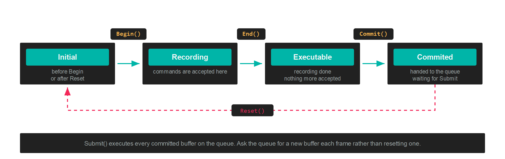

# CommandBuffer

A `CommandBuffer` stores commands until they are committed for execution by the GPU. Nothing you record runs at the moment you call it. The buffer accumulates a list, and the GPU sees that list only after its [CommandQueue](commandqueue.md) submits.

Command buffers are transient and single use. Ask the queue for a new one each frame rather than holding on to one.

## The states a buffer passes through



| CommandBufferState | Meaning |
| --- | --- |
| **Initial** | Before `Begin` has been called, or after `Reset`. |
| **Recording** | Between `Begin` and `End`, where commands are accepted. |
| **Executable** | After `End`. Recording has finished and the buffer can be committed. |
| **Commited** | After `Commit`. The buffer is waiting for the queue to submit it. |

`State` is readable at any time, which is useful when a helper method has to know whether recording is already open.

## Recording

```csharp
var commandBuffer = this.commandQueue.CommandBuffer();

commandBuffer.Begin();

// ...record commands here...

commandBuffer.End();
commandBuffer.Commit();

this.commandQueue.Submit();
```

`Begin()` has to be called before any other command. `End()` closes recording, `Commit()` hands the buffer to its queue, and `Submit()` on the queue starts the GPU work.

## Render passes

Draw commands only make sense inside a render pass, which names the [FrameBuffer](framebuffer.md) being drawn into and what to clear it to:

```csharp
RenderPassDescription renderPassDescription = new RenderPassDescription(
    this.frameBuffer,
    new ClearValue(ClearFlags.All, Color.CornflowerBlue));

commandBuffer.BeginRenderPass(ref renderPassDescription);

// ...draws...

commandBuffer.EndRenderPass();
```

### RenderPassDescription

| Property | Type | Description |
| --- | --- | --- |
| **FrameBuffer** | `FrameBuffer` | The attachments this pass renders into. |
| **ClearValue** | `ClearValue` | What each attachment is cleared to when the pass opens. |

The constructor throws `ArgumentException` when the number of colour clear values does not match the number of colour targets on the framebuffer.

### ClearValue

| Property | Type | Description |
| --- | --- | --- |
| **Flags** | `ClearFlags` | Which attachments to clear. |
| **ColorValues** | `Vector4[]` | One clear colour per colour attachment. |
| **Depth** | `float` | Depth clear value. |
| **Stencil** | `byte` | Stencil clear value. |

`ClearValue.Default` clears one colour attachment to `CornflowerBlue`, depth to 1 and stencil to 0. `ClearValue.None` clears nothing, which is what a pass that draws on top of existing content wants.

### ClearFlags

| ClearFlags | Value | Description |
| --- | --- | --- |
| **None** | 0 | Clear nothing. |
| **Target** | 1 | Clear the colour attachments. |
| **Depth** | 2 | Clear the depth attachment. |
| **Stencil** | 4 | Clear the stencil attachment. |
| **All** | 7 | `Target`, `Depth` and `Stencil` together. |

> [!IMPORTANT]
> Barriers, buffer updates and copies belong outside the render pass. Record them between `Begin()` and `BeginRenderPass()`, or after `EndRenderPass()`. See [Barriers](barriers.md).

## Setting state before a draw

| Method | Purpose |
| --- | --- |
| `SetGraphicsPipelineState(pipeline)` | Binds a [GraphicsPipeline](graphicspipeline.md). |
| `SetResourceSet(set, index, offsets)` | Binds a [ResourceSet](resourceset.md) to a register space. |
| `SetVertexBuffers(buffers)` | Binds the vertex buffers, matching the pipeline's `InputLayouts`. |
| `SetVertexBuffer(slot, buffer, offset)` | Binds one vertex buffer at a given slot. |
| `SetIndexBuffer(buffer, format, offset)` | Binds an index buffer. `IndexFormat.UInt16` by default. |
| `SetViewports(viewports)` | Sets the viewport rectangles. |
| `SetScissorRectangles(rectangles)` | Sets the scissor rectangles. |

> [!NOTE]
> Viewports and scissor rectangles are not part of the pipeline state, so they have to be set inside every render pass. Forgetting the scissor rectangle produces a pass that clears correctly and then draws nothing.

## Drawing

| Method | Purpose |
| --- | --- |
| `Draw(vertexCount, startVertexLocation)` | Draws from the vertex buffer directly. |
| `DrawIndexed(indexCount, startIndexLocation, baseVertexLocation)` | Draws through the index buffer. |
| `DrawInstanced(...)` | Draws the same geometry many times. |
| `DrawIndexedInstanced(...)` | Indexed and instanced together. |
| `DrawInstancedIndirect(argBuffer, offset, drawCount, stride)` | Reads the draw arguments from a GPU buffer. |
| `DrawIndexedInstancedIndirect(...)` | Indexed version of the same. |

The indirect variants take their arguments from a `Buffer` created with `BufferFlags.IndirectBuffer`, which lets a compute shader decide how much to draw without the result travelling back to the CPU.

## Compute and ray tracing

| Method | Purpose |
| --- | --- |
| `SetComputePipelineState(pipeline)` | Binds a [ComputePipeline](computepipeline.md). |
| `Dispatch(groupCountX, groupCountY, groupCountZ)` | Launches a grid of thread groups. |
| `Dispatch1D`, `Dispatch2D`, `Dispatch3D` | Take the problem size and compute the group count for you. |
| `DispatchIndirect(argBuffer, offset)` | Reads the group counts from a GPU buffer. |
| `SetRaytracingPipelineState(pipeline)` | Binds a [RaytracingPipeline](raytracingpipeline.md). |
| `DispatchRays(description)` | Launches the ray generation grid. |
| `BuildRaytracingAccelerationStructure(...)` | Builds a bottom or top level structure. |
| `UpdateRaytracingAccelerationStructure(ref tlas, description)` | Rebuilds a top level structure in place. |
| `SetMeshShaderPipelineState(pipeline)` | Binds a mesh shader pipeline. |
| `DispatchMesh(groupCountX, groupCountY, groupCountZ)` | Launches mesh shader groups. |

These are recorded outside a render pass, the same as copies and barriers.

## Moving data

| Method | Purpose |
| --- | --- |
| `UpdateBufferData(buffer, data, ...)` | Writes CPU data into a buffer as part of the recorded stream. |
| `CopyBufferDataTo(origin, destination, sizeInBytes, ...)` | Copies between two buffers on the GPU. |
| `CopyTextureDataTo(source, destination)` | Copies a whole texture, or one mip level and array layer, or a region. |
| `Blit(source, destination)` | Copies with scaling and format conversion. |
| `ResolveTexture(source, destination)` | Resolves a multisampled texture into a single sampled one. |
| `GenerateMipmaps(texture)` | Fills the mip chain from level 0. |

Copies need their source and destination in the `CopySrc` and `CopyDst` states first. See [Barriers](barriers.md).

## Barriers

Five overloads, all recording the same operation. See [Barriers](barriers.md) for what to pass and when.

```csharp
commandBuffer.Barrier(new Texture.Barrier(this.texture, Texture.StateFlags.PixelShaderResource));
```

## Queries

| Method | Purpose |
| --- | --- |
| `WriteTimestamp(heap, index)` | Records a GPU timestamp into a [QueryHeap](queryheap.md). |
| `BeginQuery(heap, index)` | Opens an occlusion query. |
| `EndQuery(heap, index)` | Closes it. |

## Debug markers

Markers group commands in a graphics debugger, and cost nothing in a release build:

```csharp
commandBuffer.BeginDebugMarker("Shadow pass");
// ...draws...
commandBuffer.EndDebugMarker();

commandBuffer.InsertDebugMarker("Lights uploaded");
```

Setting `commandBuffer.Name` labels the buffer itself in the same tools.

## Recording on several threads

Each command buffer records independently, so several threads can record at the same time as long as no two share a buffer. Commit them all and submit once:

```csharp
Parallel.For(0, threadCount, i =>
{
    var commandBuffer = this.commandQueue.CommandBuffer();
    commandBuffer.Begin();
    // ...record this thread's slice...
    commandBuffer.End();
    commandBuffer.Commit();
});

this.commandQueue.Submit();
```

The queue's pool holds 64 buffers, so a frame cannot have more than 64 uncommitted buffers alive on one queue.

> [!WARNING]
> `GraphicsContext` operations that record onto a shared internal copy buffer, such as `UpdateBufferData` on the context rather than on your own command buffer, are not free to run concurrently. A barrier and the copy that follows it have to stay sequential.
