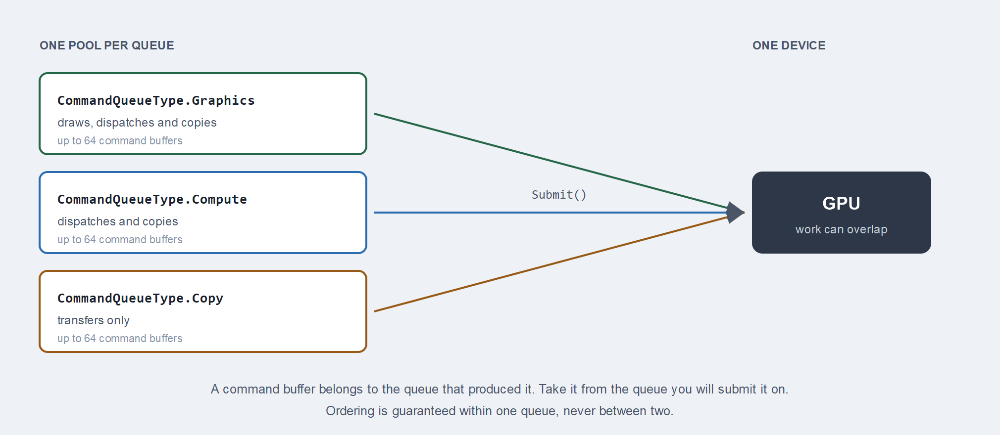

# CommandQueue

A `CommandQueue` is a pool of [CommandBuffer](commandbuffer.md) objects and the channel that sends their recorded work to the GPU. You ask it for a buffer, record into that buffer, and give it back. Nothing reaches the device until the queue submits.

Most applications need one graphics queue. A second queue is worth adding when compute or transfer work can proceed independently of drawing, because the driver is then free to overlap them.



## Creation

```csharp
this.commandQueue = this.graphicsContext.Factory.CreateCommandQueue();
```

The parameterless call creates a graphics queue. Pass a `CommandQueueType` for anything else:

```csharp
this.computeCommandQueue = this.graphicsContext.Factory.CreateCommandQueue(CommandQueueType.Compute);
```

### CommandQueueType

| CommandQueueType | Value | Accepts |
| --- | --- | --- |
| **Graphics** | 0 | Draws, dispatches and copies. The general purpose queue. |
| **Compute** | 2 | Dispatches and copies, no draws. |
| **Copy** | 3 | Transfers only. |

The three form a hierarchy: anything a copy queue accepts, a compute queue also accepts, and a graphics queue accepts everything. A narrower queue is not faster on its own. What it buys you is the chance for the driver to run its work alongside the graphics queue instead of behind it.

> [!IMPORTANT]
> Ordering is guaranteed inside one queue and nowhere else. Two queues run independently, so work submitted to a compute queue may finish before or after graphics work submitted earlier.

## Members

| Member | Description |
| --- | --- |
| **CommandBuffer()** | Returns the next available command buffer from the pool, ready to `Begin()`. |
| **Submit()** | Sends every committed command buffer to the GPU and empties the pending list. |
| **WaitIdle()** | Blocks the calling thread until the GPU has finished everything submitted on this queue. |
| **Name** | A debug name, shown in graphics debugging tools. |
| **CommandBufferArraySize** | The pool size, a constant of 64. |

## Getting a buffer and submitting it

```csharp
var commandBuffer = this.commandQueue.CommandBuffer();

commandBuffer.Begin();
// ...record...
commandBuffer.End();

commandBuffer.Commit();

this.commandQueue.Submit();
```

`Commit()` moves a finished buffer into the queue's pending list. `Submit()` sends everything pending at once, so recording several buffers and committing each of them costs one submission rather than several.

> [!NOTE]
> A command buffer belongs to the queue that produced it. Take a buffer from the queue you intend to submit it on, especially when you have more than one queue in play.

## Naming a queue

Set `Name` on every queue you create. It costs nothing and it is the difference between a readable capture and a wall of unnamed objects in RenderDoc, PIX or Xcode:

```csharp
this.commandQueue.Name = "Main graphics queue";
this.computeCommandQueue.Name = "Particle simulation";
```

## Waiting for the GPU

`WaitIdle()` drains the whole queue and blocks until the GPU has caught up:

```csharp
this.commandQueue.Submit();
this.commandQueue.WaitIdle();
```

That is correct, and it is what every sample does because it keeps the sample short. It also means the CPU spends the rest of the frame doing nothing while the GPU works, and then the GPU idles while the CPU records the next frame. Neither is ever busy at the same time as the other.

`WaitIdle()` remains the right call in two places: before destroying resources the GPU might still be reading, and at shutdown.

## Cleaning up

Wait for the queue to drain before disposing anything it might still be using:

```csharp
this.commandQueue.WaitIdle();
this.commandQueue.Dispose();
```
