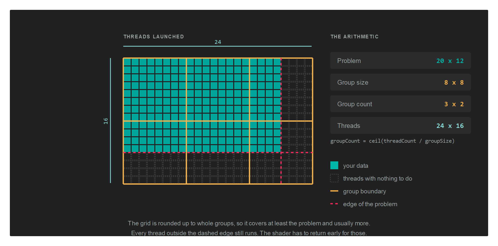

# ComputePipeline

A `ComputePipelineState` runs a compute shader. It is the same idea as a [GraphicsPipeline](graphicspipeline.md) with most of it removed: no vertex format, no raster or blend state, no output attachments. What remains is a single shader, the resource layouts it reads, and the size of a thread group.

Compute work does not go through a render pass. You record it directly on the command buffer, between `Begin()` and `End()`.

## Creation

```csharp
var computePipelineDescription = new ComputePipelineDescription()
{
    ResourceLayouts = new[] { computeResourceLayout },
    shaderDescription = new ComputeShaderStateDescription() { ComputeShader = computeShader },
    ThreadGroupSizeX = GroupSizeX,
    ThreadGroupSizeY = GroupSizeY,
    ThreadGroupSizeZ = 1,
};

var computePipelineState = this.graphicsContext.Factory.CreateComputePipeline(ref computePipelineDescription);
```

### ComputePipelineDescription

| Property | Type | Description |
| --- | --- | --- |
| **ResourceLayouts** | `ResourceLayout[]` | The layouts the compute shader reads, in the order their sets will be bound. |
| **shaderDescription** | `ComputeShaderStateDescription` | Holds the single `ComputeShader`. |
| **ThreadGroupSizeX** | `uint` | Threads per group in X. `1` by default. |
| **ThreadGroupSizeY** | `uint` | Threads per group in Y. `1` by default. |
| **ThreadGroupSizeZ** | `uint` | Threads per group in Z. `1` by default. |

> [!IMPORTANT]
> The three `ThreadGroupSize` values have to match the `[numthreads(x, y, z)]` attribute in the shader source. Nothing checks the two against each other, and a mismatch produces wrong results rather than an error.

## Dispatching

A compute shader does not run once. It runs once per thread, and the threads are arranged in two levels:

* A **thread group** is a fixed block of threads that run together and can share memory. Its size is decided in the shader source and cannot change at run time.
* A **dispatch** launches a grid of those groups. How many groups it launches is what you decide at the call site.

The number of threads along an axis is therefore the group count multiplied by the group size, and a shader reads its own position in that grid from the dispatch thread ID.

### The group size is written in three places

The same three numbers appear in the shader, in the pipeline description and, if you use the helpers, at the call site. Nothing compares them:

| Where | How it looks with a group of 8 by 8 |
| --- | --- |
| The shader source | `[numthreads(8, 8, 1)]` |
| `ComputePipelineDescription` | `ThreadGroupSizeX = 8`, `ThreadGroupSizeY = 8`, `ThreadGroupSizeZ = 1` |
| `Dispatch2D` | `commandBuffer.Dispatch2D(width, height, 8, 8)` |

> [!IMPORTANT]
> A mismatch between the three is not an error. The shader keeps its own `numthreads` and the dispatch keeps its own arithmetic, so the result is a grid that covers the wrong amount of work: too small and part of the problem is skipped, too large and threads run off the end. Declare the group size once as a constant and use it in all three.

### Dispatch takes group counts

`Dispatch` is the raw form. It takes the number of groups, not the number of threads:

```csharp
commandBuffer.SetComputePipelineState(this.computePipelineState);
commandBuffer.SetResourceSet(this.computeResourceSet);
commandBuffer.Dispatch(groupCountX, groupCountY, groupCountZ);
```

| Parameter | Type | Description |
| --- | --- | --- |
| **groupCountX** | `uint` | Groups launched along X. |
| **groupCountY** | `uint` | Groups launched along Y. Pass `1` for a one dimensional problem. |
| **groupCountZ** | `uint` | Groups launched along Z. Pass `1` unless the problem is a volume. |

Every count is at least `1`. Passing `0` on any axis launches nothing at all, silently, which is worth remembering when a count is computed from a collection that happens to be empty.

> [!NOTE]
> Keep each count at or below 65535. Devices differ in what they allow above that, so staying under it is what keeps the same dispatch working everywhere.

### The helpers take problem sizes

You usually know how big the problem is rather than how many groups that needs. The three helpers do the division:

| Method | Parameters | Default group size |
| --- | --- | --- |
| `Dispatch1D` | `threadCountX`, `groupSizeX` | 64 |
| `Dispatch2D` | `threadCountX`, `threadCountY`, `groupSizeX`, `groupSizeY` | 8 by 8 |
| `Dispatch3D` | `threadCountX`, `threadCountY`, `threadCountZ`, `groupSizeX`, `groupSizeY`, `groupSizeZ` | none, all three are required |

| Parameter | Description |
| --- | --- |
| **threadCount** | The size of the problem on that axis: pixels across, elements in the array, voxels deep. |
| **groupSize** | The matching value from `[numthreads]` on that axis. |

Each one reduces to `Dispatch` through a division that rounds up, so the last partial group still runs:

```
groupCount = (threadCount + groupSize - 1) / groupSize
```

```csharp
// Cover a width by height image with groups of 8 by 8...
commandBuffer.Dispatch2D(this.width, this.height, GroupSizeX, GroupSizeY);
```

`Dispatch1D` and `Dispatch2D` default to 64 and to 8 by 8. Those defaults are only correct if the shader says the same thing, so pass the value explicitly unless you are certain it matches.

### The grid usually covers more than the problem

Rounding up means the grid is at least as large as the problem and often larger.



A 1920 by 1080 image with groups of 16 by 16 needs 120 groups across and 68 down, because 1080 divided by 16 is 67.5. That is 1920 by 1088 threads, so 15,360 of them fall past the bottom edge of the image.

Those threads still run. Without a guard they read and write outside the data:

```hlsl
[numthreads(16, 16, 1)]
void CS(uint3 threadID : SV_DispatchThreadID)
{
    if (threadID.x >= data.width || threadID.y >= data.height)
    {
        return;
    }

    // ...the real work...
}
```

The size the shader compares against has to reach it somehow, which is why compute shaders so often take a small constant buffer holding nothing but the dimensions.

> [!TIP]
> Group sizes work out best as multiples of 32 or 64, since that is the granularity hardware schedules threads in. A group of 8 by 8 is 64 threads, and a group of 16 by 16 is 256. A group of 10 by 10 is 100, which wastes part of every scheduling unit.

### Letting the GPU decide how much to run

`DispatchIndirect` reads the three counts out of a buffer instead of taking them as arguments, so work produced by one pass can size the next one without the numbers travelling back to the CPU:

```csharp
commandBuffer.DispatchIndirect(this.argBuffer, 0);
```

| Parameter | Type | Description |
| --- | --- | --- |
| **argBuffer** | `Buffer` | Holds the group counts. Create it with `BufferFlags.IndirectBuffer`. |
| **offset** | `uint` | Byte offset of the arguments inside that buffer, so one buffer can hold several sets. |

The layout the buffer has to contain is `IndirectDispatchArgs`:

| Property | Type | Description |
| --- | --- | --- |
| **ThreadGroupCountX** | `uint` | Groups along X. |
| **ThreadGroupCountY** | `uint` | Groups along Y. |
| **ThreadGroupCountZ** | `uint` | Groups along Z. |

Whatever writes those counts, a compute shader or the CPU, is writing group counts and not thread counts. There is no helper that divides for you here, so the shader that fills the buffer does the same rounding up itself.

## Compute writes, graphics reads

The pattern that breaks is writing a texture from compute and then sampling it in a pixel shader without declaring the change. Each side needs a barrier: one to put the texture into `UnorderedAccess` before the dispatch, one to put it back into `PixelShaderResource` before the draw.

```csharp
// The compute pass writes the texture...
var computeCommandBuffer = this.computeCommandQueue.CommandBuffer();
computeCommandBuffer.Begin();

computeCommandBuffer.Barrier(new Texture.Barrier(this.texture, Texture.StateFlags.UnorderedAccess));

computeCommandBuffer.UpdateBufferData(this.constantBuffer, ref this.computeData);
computeCommandBuffer.SetComputePipelineState(this.computePipelineState);
computeCommandBuffer.SetResourceSet(this.computeResourceSet);
computeCommandBuffer.Dispatch2D(this.width, this.height, GroupSizeX, GroupSizeY);

computeCommandBuffer.End();
computeCommandBuffer.Commit();
this.computeCommandQueue.Submit();
this.computeCommandQueue.WaitIdle();

// ...and the graphics pass samples it.
var graphicsCommandBuffer = this.graphicsCommandQueue.CommandBuffer();
graphicsCommandBuffer.Begin();

graphicsCommandBuffer.Barrier(new Texture.Barrier(this.texture, Texture.StateFlags.PixelShaderResource));

RenderPassDescription renderPassDescription = new RenderPassDescription(this.frameBuffer, ClearValue.Default);
graphicsCommandBuffer.BeginRenderPass(ref renderPassDescription);

graphicsCommandBuffer.SetGraphicsPipelineState(this.graphicsPipelineState);
graphicsCommandBuffer.SetResourceSet(this.resourceSet);
graphicsCommandBuffer.SetViewports(this.viewports);
graphicsCommandBuffer.SetScissorRectangles(this.scissors);
graphicsCommandBuffer.Draw(3);

graphicsCommandBuffer.EndRenderPass();
graphicsCommandBuffer.End();
graphicsCommandBuffer.Commit();

this.graphicsCommandQueue.Submit();
this.graphicsCommandQueue.WaitIdle();
```

The texture in that example was created with both `TextureFlags.UnorderedAccess` and `TextureFlags.ShaderResource`, and it appears in two resource layouts: as `TextureViewReadWrite` for the compute side, and as `TextureView` for the graphics side.

See [Barriers](barriers.md) for the full set of states, and for the separate case of two dispatches writing the same resource one after the other.

## A dedicated compute queue

Compute work can go on its own queue, which lets the driver overlap it with graphics work:

```csharp
this.computeCommandQueue = this.graphicsContext.Factory.CreateCommandQueue(CommandQueueType.Compute);
```

A command buffer belongs to the queue that produced it, so take it from the same queue you will submit it on. See [CommandQueue](commandqueue.md).

## Support

Compute is not available on every backend. Ask the device before creating a compute pipeline:

```csharp
if (this.graphicsContext.Capabilities.IsComputeShaderSupported)
{
    // ...
}
```

## Cleaning up

```csharp
computePipelineState.Dispose();
```
