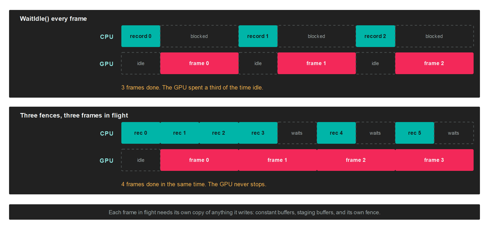

# Fence

A `Fence` is a signal the GPU raises when the work submitted alongside it has finished. The CPU can ask whether it has been raised, or block until it is. It is what lets you know that one particular submission is done, rather than waiting for the whole queue to drain.

Without a fence the only completion signal is `CommandQueue.WaitIdle()`, which blocks until the GPU has finished everything. That fully serialises the two processors: the CPU records a frame, then does nothing while the GPU draws it, then the GPU does nothing while the CPU records the next one.

## Why it matters



With N sets of per-frame resources and N fences, the CPU keeps recording while the GPU stays up to N-1 frames behind, and blocks only when it comes back round to a set the GPU has not released yet.

> [!NOTE]
> Measured by `FencesTest` on an RTX-class GPU at 10,000 draw calls with vertical sync off, replacing `WaitIdle` with fences raised the frame rate by between 1.8 and 3 times.

## Creation

```csharp
this.frameFences = new Fence[FramesInFlight];
for (int i = 0; i < FramesInFlight; i++)
{
    this.frameFences[i] = this.graphicsContext.Factory.CreateFence();
    this.frameFences[i].Name = $"Frame fence {i}";
}
```

A fence with no submitted work pending counts as signaled. That is what lets the first turns of a frames-in-flight loop wait on a fence that has never been submitted, without a special case for the first N frames.

## Members

| Member | Description |
| --- | --- |
| **IsSignaled** | Whether the GPU has signaled the fence, or nothing is pending on it. Never blocks. |
| **Wait(timeoutNanoseconds)** | Blocks the calling thread until the fence is signaled or the timeout elapses. Returns `false` on timeout. Waits forever by default. |
| **Reset()** | Returns the fence to the unsignaled state so it can be submitted again. Has no effect when nothing is pending. |
| **Name** | A debug name, shown in graphics debugging tools. |

`Fence` derives from `GraphicsResource`, so it also carries `NativePointer`, `Context` and `Dispose`.

## The loop

A fence is signaled by passing it to `Submit`, and there is no method that signals one from the CPU:

```csharp
var frameFence = this.frameFences[this.frameIndex % FramesInFlight];

frameFence.Wait();
frameFence.Reset();

var commandBuffer = this.commandQueue.CommandBuffer();
commandBuffer.Begin();
// ...record the frame...
commandBuffer.End();
commandBuffer.Commit();

this.commandQueue.Submit(frameFence);

this.frameIndex++;
```

The order matters and is not obvious:

1. `Wait()` **before** recording, not after submitting. You are waiting for the frame that used this slot N frames ago, so that its resources are free to overwrite.
2. `Reset()` immediately after the wait, while nothing is pending on the fence.
3. `Submit(fence)` on a fence that is already reset.

> [!IMPORTANT]
> The fence passed to `Submit` has to be unsignaled. Submitting one that was never reset leaves you waiting on a fence that is already signaled, which returns at once and gives you no synchronisation at all. The failure is silent, and looks like corrupted geometry or flickering rather than like a hang.

`Submit()` with no argument still works and passes `null`, which submits without signaling anything.

## Polling instead of blocking

`IsSignaled` never blocks, so it suits work that can be picked up whenever it happens to be ready, such as a screenshot readback or an occlusion query result:

```csharp
if (this.readbackFence.IsSignaled)
{
    var mapped = this.graphicsContext.MapMemory(this.stagingBuffer, MapMode.Read);
    // ...consume the data...
    this.graphicsContext.UnmapMemory(this.stagingBuffer);

    this.readbackFence.Reset();
}
```

`Wait` also takes a timeout in nanoseconds, and returns `false` when it expires rather than throwing:

```csharp
if (!this.frameFence.Wait(2_000_000_000))
{
    // Two seconds without the GPU finishing. Something is wrong.
}
```

## What a fence is not

It synchronises the GPU with the CPU, in one direction, for one batch. It is not a general purpose primitive:

* **Binary, not a timeline.** There are no counters and no values to wait on. A fence is signaled or it is not.
* **No GPU to GPU waiting.** Two [CommandQueue](commandqueue.md) objects cannot be ordered against each other with a fence. The CPU has to wait on the first and then submit to the second.
* **The GPU signals, never you.** There is no `Signal` method. A fence changes state only through `Submit` and `Reset`.

## Per-backend behaviour

The primitive is the same everywhere, but two backends behave differently enough to matter:

| Backend | Implementation |
| --- | --- |
| **DirectX 12** | A native fence signaled with an increasing value, waited on through an event. |
| **Vulkan** | A native fence handle, passed into the queue submission. |
| **DirectX 11** | An event query placed behind the submitted work, polled by yielding. |
| **OpenGL** | A sync object, waited on with a client wait. |
| **Metal** | An empty command buffer committed with a completion handler, which costs one extra submission. |
| **WebGPU** | A submitted-work-done callback. |

> [!WARNING]
> A platform whose main loop must not be blocked, a browser being the usual one, returns the current state instead of waiting. Poll `IsSignaled` across frames rather than calling `Wait`, and the same code then behaves the same everywhere.

## Frames in flight need duplicated resources

A fence tells you when a frame is done. It does not stop you from overwriting data that frame is still reading. Everything the CPU writes per frame needs one copy per frame in flight:

* Constant buffers updated each frame.
* Staging and upload buffers.
* The fences themselves, one per slot.

Resources that never change after loading, such as vertex buffers, textures and pipelines, are shared by every frame and need no duplication.

> [!TIP]
> Three frames in flight is a common starting point. More adds latency between input and image without adding throughput once the GPU is saturated, and each one costs another copy of every per-frame resource.

## Cleaning up

Wait for the fence before disposing anything the submission it tracks might still be using:

```csharp
foreach (var fence in this.frameFences)
{
    fence.Wait();
    fence.Dispose();
}
```
