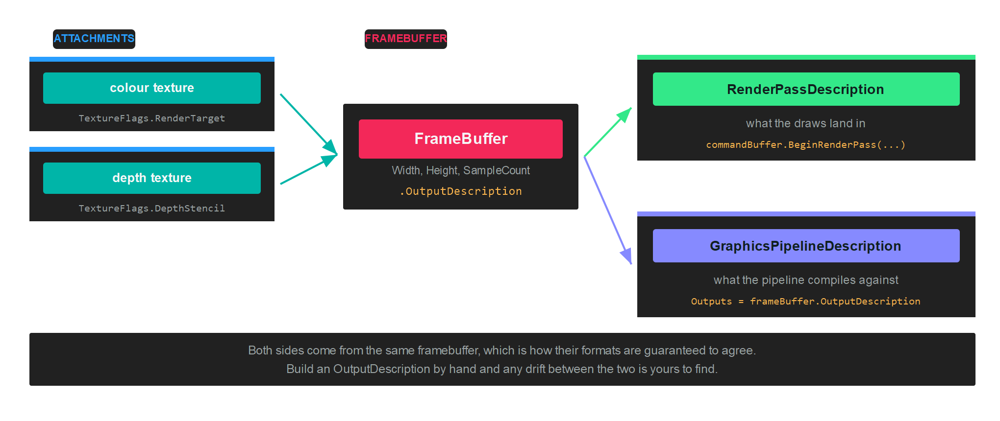

# Framebuffer

A `FrameBuffer` is the set of textures a render pass draws into: one or more colour attachments and, usually, a depth attachment. It says where the output goes, and its `OutputDescription` says what format that output is in.

Every application already has one without creating it. `swapChain.FrameBuffer` is the framebuffer whose contents reach the screen. You create your own when drawing somewhere else: a shadow map, a G-buffer, an offscreen target you will sample later.

## Why it appears in two places



A framebuffer is named by the render pass that draws into it, and its `OutputDescription` is named by the pipeline that draws. Both have to agree on formats, sample count and attachment count, which is why you take the pipeline's `Outputs` from the framebuffer rather than describing it separately.

## Creation

Create the textures first. A colour attachment needs `TextureFlags.RenderTarget`, plus `ShaderResource` if you intend to sample it afterwards. A depth attachment needs `TextureFlags.DepthStencil`:

```csharp
var colorTargetDescription = new TextureDescription()
{
    Format = PixelFormat.R8G8B8A8_UNorm,
    Width = rtSize,
    Height = rtSize,
    Depth = 1,
    Layers = 1,
    Flags = TextureFlags.RenderTarget | TextureFlags.ShaderResource,
    CpuAccess = ResourceCpuAccess.None,
    MipLevels = 1,
    Type = TextureType.Texture2D,
    Usage = ResourceUsage.Default,
    SampleCount = TextureSampleCount.None,
};
var colorTarget = this.graphicsContext.Factory.CreateTexture(ref colorTargetDescription);

var depthTargetDescription = colorTargetDescription;
depthTargetDescription.Format = PixelFormat.D24_UNorm_S8_UInt;
depthTargetDescription.Flags = TextureFlags.DepthStencil;
var depthTarget = this.graphicsContext.Factory.CreateTexture(ref depthTargetDescription);

// Wrap each texture in an attachment, then build the framebuffer...
var depthAttachment = new FrameBufferAttachment(depthTarget, 0, 1);
var colorAttachments = new[] { new FrameBufferAttachment(colorTarget, 0, 1) };

this.frameBuffer = this.graphicsContext.Factory.CreateFrameBuffer(depthAttachment, colorAttachments);
```

See [Texture](texture.md) for the full set of description properties.

### FrameBufferAttachment

An attachment is a texture plus the slice of it being drawn into:

```csharp
new FrameBufferAttachment(texture, arraySlice, sliceCount);
```

`arraySlice` and `sliceCount` select part of a texture array or a cubemap. Pass `0, 1` for an ordinary 2D texture. Rendering into all six faces of a cubemap in one pass, for instance, uses `0, 6`.

### FrameBuffer members

| Member | Type | Description |
| --- | --- | --- |
| **ColorTargets** | `FrameBufferAttachment[]` | The colour attachments, in the order the pixel shader writes them. |
| **DepthStencilTarget** | `FrameBufferAttachment?` | The depth attachment, or `null` for a colour only pass. |
| **OutputDescription** | `OutputDescription` | The formats and sample count, for a pipeline to compile against. |
| **Width**, **Height** | `uint` | Dimensions, taken from the attachments. |
| **ArraySize** | `uint` | Number of array slices rendered at once. `1` by default. |
| **SampleCount** | `TextureSampleCount` | Multisample count shared by every attachment. |
| **RequireFlipProjection** | `bool` | Whether the backend needs the projection flipped vertically when drawing into this target. |
| **BelongsToSwapChain** | `bool` | `true` for the framebuffer a swapchain owns. |
| **Name** | `string` | Debug name, shown in graphics debugging tools. |

> [!IMPORTANT]
> Every attachment has to share the same width, height and sample count. Multiple render targets also need the backend to support them, which `graphicsContext.Capabilities.IsMRTSupported` reports.

### OutputDescription

| Property | Type | Description |
| --- | --- | --- |
| **ColorAttachments** | `OutputAttachmentDescription[]` | One entry per colour attachment, carrying its format. |
| **DepthAttachment** | `OutputAttachmentDescription?` | The depth format, or `null`. |
| **SampleCount** | `TextureSampleCount` | Samples per attachment. |
| **ArraySliceCount** | `uint` | Number of views rendered. |
| **CachedHashCode** | `int` | Precomputed hash, so pipeline compatibility checks are cheap. |

## Drawing into it

Build the pipeline against the framebuffer's output description:

```csharp
var pipelineDescription = new GraphicsPipelineDescription()
{
    PrimitiveTopology = PrimitiveTopology.TriangleList,
    InputLayouts = triangleVertexLayouts,
    ResourceLayouts = new[] { triangleResourceLayout },
    Shaders = new GraphicsShaderStateDescription()
    {
        VertexShader = triangleVertexShader,
        PixelShader = trianglePixelShader,
    },
    RenderStates = new RenderStateDescription()
    {
        RasterizerState = RasterizerStates.None,
        BlendState = BlendStates.Opaque,
        DepthStencilState = DepthStencilStates.None,
    },
    Outputs = this.frameBuffer.OutputDescription,
};

this.trianglePipelineState = this.graphicsContext.Factory.CreateGraphicsPipeline(ref pipelineDescription);
```

Then open a render pass on it:

```csharp
var commandBuffer = this.commandQueue.CommandBuffer();

commandBuffer.Begin();

RenderPassDescription renderPassDescription = new RenderPassDescription(this.frameBuffer, new ClearValue(ClearFlags.Target, Color.CornflowerBlue));
commandBuffer.BeginRenderPass(ref renderPassDescription);

commandBuffer.SetViewports(this.rTViewports);
commandBuffer.SetScissorRectangles(this.scissors);
commandBuffer.SetGraphicsPipelineState(this.trianglePipelineState);
commandBuffer.SetResourceSet(this.triangleResourceSet);
commandBuffer.SetVertexBuffers(this.triangleVertexBuffers);

commandBuffer.Draw((uint)this.triangleVertexData.Length);

commandBuffer.EndRenderPass();
commandBuffer.End();
commandBuffer.Commit();

this.commandQueue.Submit();
this.commandQueue.WaitIdle();
```

> [!NOTE]
> The viewport is not part of the framebuffer or of the pipeline, so it has to be set inside every pass. Drawing into a 512 by 512 target with a viewport still sized for the window renders into the corner of it.

## Sampling the result

To read a render target afterwards, transition it out of `RenderTarget` and into a shader resource state, outside the render pass:

```csharp
commandBuffer.EndRenderPass();
commandBuffer.Barrier(new Texture.Barrier(colorTarget, Texture.StateFlags.PixelShaderResource));
```

The texture also needs `TextureFlags.ShaderResource` at creation, and a slot declared as `ResourceType.TextureView` in the [ResourceLayout](resourcelayout.md) of whatever samples it. See [Barriers](barriers.md).

## Cleaning up

A framebuffer does not own its attachments, so disposing it leaves the textures alive:

```csharp
frameBuffer.Dispose();
colorTarget.Dispose();
depthTarget.Dispose();
```
