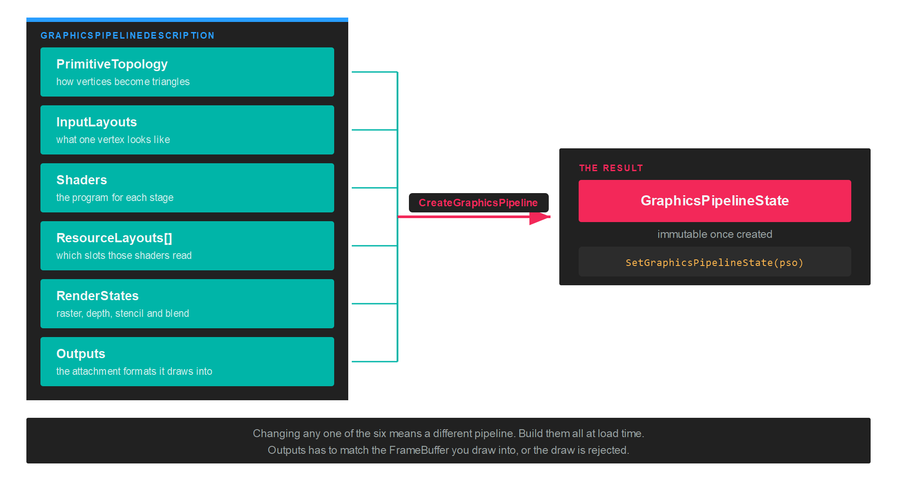

# GraphicsPipeline

A `GraphicsPipelineState` holds everything the GPU needs to know about a draw, fixed at creation time: the shaders, the vertex format, the raster and blend and depth settings, the resource layouts, and the formats it will draw into. Binding one is the only per-draw cost, because none of it can change afterwards.

That immutability is the point. The older implicit APIs let you flip individual states between draws, and the driver then recompiled behind your back at unpredictable moments. Here the compilation happens once, when you create the object.



## Creation

```csharp
var pipelineDescription = new GraphicsPipelineDescription()
{
    PrimitiveTopology = PrimitiveTopology.TriangleList,
    InputLayouts = vertexLayouts,
    ResourceLayouts = new[] { resourceLayout },
    Shaders = new GraphicsShaderStateDescription()
    {
        VertexShader = vertexShader,
        PixelShader = pixelShader,
    },
    RenderStates = new RenderStateDescription()
    {
        RasterizerState = RasterizerStates.CullBack,
        BlendState = BlendStates.Opaque,
        DepthStencilState = DepthStencilStates.ReadWrite,
    },
    Outputs = this.frameBuffer.OutputDescription,
};

var pipelineState = this.graphicsContext.Factory.CreateGraphicsPipeline(ref pipelineDescription);
```

### GraphicsPipelineDescription

| Property | Type | Description |
| --- | --- | --- |
| **PrimitiveTopology** | `PrimitiveTopology` | How the vertex stream is assembled into primitives. |
| **InputLayouts** | `InputLayouts` | The layout of each vertex buffer that will be bound. |
| **ResourceLayouts** | `ResourceLayout[]` | The layouts the shaders read, in the order their sets will be bound. |
| **Shaders** | `GraphicsShaderStateDescription` | One `Shader` per stage in use. |
| **RenderStates** | `RenderStateDescription` | Rasterizer, depth and stencil, and blend configuration. |
| **Outputs** | `OutputDescription` | The attachment formats this pipeline draws into. Take it from the [FrameBuffer](framebuffer.md). |

> [!IMPORTANT]
> `Outputs` has to describe the same formats and sample count as the framebuffer bound when the pipeline runs. Take it from `frameBuffer.OutputDescription` rather than building one by hand, and create a separate pipeline for each framebuffer whose format differs.

### GraphicsShaderStateDescription

| Property | Type | Description |
| --- | --- | --- |
| **VertexShader** | `Shader` | The vertex stage. |
| **HullShader** | `Shader` | The hull stage, for tessellation. |
| **DomainShader** | `Shader` | The domain stage, for tessellation. |
| **GeometryShader** | `Shader` | The geometry stage. |
| **PixelShader** | `Shader` | The pixel stage. |
| **ShaderInputLayout** | `InputLayouts` | Maps vertex semantics to shader locations, where a backend needs that mapping stated. |

Leave a stage `null` when you do not use it. See [Shader](shader.md) for how each one is compiled.

### PrimitiveTopology

| PrimitiveTopology | Description |
| --- | --- |
| **Undefined** | No topology set. |
| **PointList** | Each vertex is a point. |
| **LineList** | Each pair of vertices is a separate line. |
| **LineStrip** | Each vertex continues the line from the previous one. |
| **TriangleList** | Each group of three vertices is a separate triangle. |
| **TriangleStrip** | Each vertex forms a triangle with the previous two. |
| **LineListWithAdjacency** | Line list with adjacent vertices, readable from a geometry shader. |
| **LineStripWithAdjacency** | Line strip with adjacent vertices. |
| **TriangleListWithAdjacency** | Triangle list with adjacent vertices. |
| **TriangleStripWithAdjacency** | Triangle strip with adjacent vertices. |
| **Patch_List** | Control point patches, for the tessellation stages. |

## Render states

`RenderStateDescription` groups the three fixed-function state blocks. `RenderStateDescription.Default` gives you a sensible starting point, and the preset classes cover the common combinations without building a description by hand.

| Property | Type | Description |
| --- | --- | --- |
| **RasterizerState** | `RasterizerStateDescription` | Fill mode, cull mode, depth bias, scissor. |
| **DepthStencilState** | `DepthStencilStateDescription` | Depth test and write, stencil operations. |
| **BlendState** | `BlendStateDescription` | Per render target blending and colour write mask. |
| **StencilReference** | `int` | The reference value for the stencil test. `0` by default. |
| **BlendFactor** | `Vector4?` | The constant used by the blend factor modes. `null` means `{ 1, 1, 1, 1 }`. |
| **SampleMask** | `int?` | Sample coverage mask. `0xFFFFFF` by default. |

### Presets

| Class | Values |
| --- | --- |
| **RasterizerStates** | `CullFront`, `CullBack`, `None`, `WireframeCullFront`, `WireframeCullBack`, `WireframeCullNone` |
| **BlendStates** | `Opaque`, `AlphaBlend`, `Additive`, `Multiplicative`, `NonPremultiplied` |
| **DepthStencilStates** | `None`, `ReadWrite`, `Read` |

`DepthStencilStates.Read` tests depth without writing it, which is what transparent geometry wants. `DepthStencilStates.None` skips the test altogether, for full screen passes.

## Describing the vertex format

`InputLayouts` is built fluently. Each `LayoutDescription` corresponds to one vertex buffer, and each `ElementDescription` to one attribute inside it, in memory order:

```csharp
var vertexLayouts = new InputLayouts()
      .Add(new LayoutDescription()
                  .Add(new ElementDescription(ElementFormat.Float4, ElementSemanticType.Position))
                  .Add(new ElementDescription(ElementFormat.Float4, ElementSemanticType.Color)));
```

Offsets are computed from the order and the formats, so the elements have to be listed exactly as they are packed in the buffer. Add a second `LayoutDescription` when you bind a second vertex buffer, for instance to keep per-instance data separate from per-vertex data.

## Using the pipeline

Bind the pipeline inside the render pass, before the draw:

```csharp
commandBuffer.BeginRenderPass(ref renderPassDescription);

commandBuffer.SetViewports(this.viewports);
commandBuffer.SetScissorRectangles(this.scissors);
commandBuffer.SetGraphicsPipelineState(this.pipelineState);
commandBuffer.SetResourceSet(this.resourceSet);
commandBuffer.SetVertexBuffers(this.vertexBuffers);

commandBuffer.Draw(vertexCount);

commandBuffer.EndRenderPass();
```

> [!TIP]
> Create every pipeline you need during loading. Creating one mid-frame compiles shaders on the spot, and that shows up as a stall in exactly the frame you least want it.

## Cleaning up

```csharp
pipelineState.Dispose();
```
