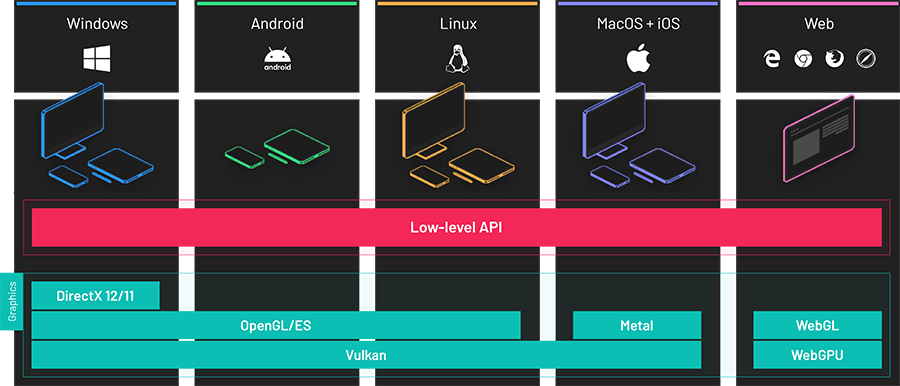
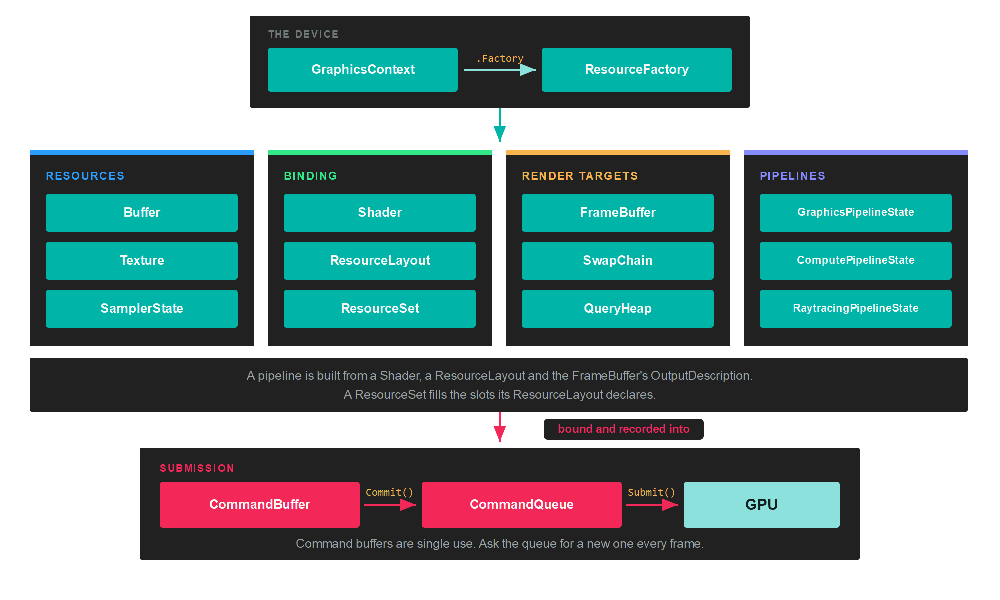
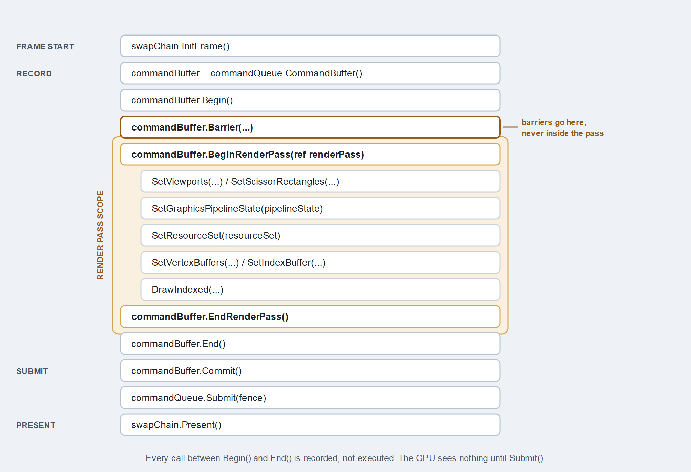
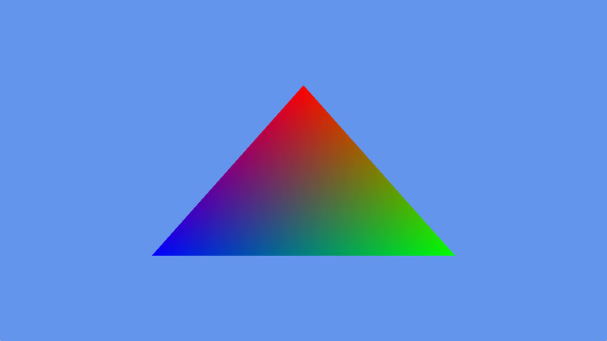

# Low-level API

---



**Evergine** uses a custom low-level graphics API to send commands to the GPU.

It is a cross-platform, backend-agnostic library that runs on top of DirectX, Vulkan, OpenGL, Metal and WebGPU. Its shape follows the explicit APIs (DirectX 12, Vulkan and Metal) so that nothing is hidden from you and nothing is guessed on your behalf, while staying compatible with the older implicit ones (DirectX 11, OpenGL and WebGL).

Everything in this section sits below the component layer. You do not need any of it to build a scene with entities and components, and most applications never touch it. Reach for it when you are writing a custom render pipeline, a compute pass, or an application that has no scene at all.

> [!NOTE]
> The [Low-Level API samples repository](https://github.com/evergineteam/LowLevelAPIDemo) contains complete applications built directly on this API, without the component layer.

## The object graph

Two objects create everything else. The `GraphicsContext` is the device, and its `Factory` is the only way to allocate GPU objects. Everything else is either a resource the factory made or a way to describe how those resources are used.



Reading the diagram from the top:

* The **GraphicsContext** owns the device and the `Factory`. You create one per application, choosing the concrete class for the backend you want.
* The **resources** hold data. A `Buffer` is a block of memory, a `Texture` is an image, and a `SamplerState` says how that image is read.
* The **binding** objects connect resources to shaders. A `ResourceLayout` declares which slots a shader reads. A `ResourceSet` fills those slots with actual resources.
* The **render targets** say where drawing lands. A `FrameBuffer` is a set of attachments, and a `SwapChain` is the one whose result reaches the screen.
* A **pipeline** freezes the whole configuration of a draw into one immutable object: input layout, shaders, render states, resource layouts and output formats.
* Work reaches the GPU through a **CommandBuffer**, which you get from a **CommandQueue** and give back to it.

## The shape of a frame

Nothing you record executes when you call it. A command buffer accumulates commands, and the GPU sees them only after the queue submits the batch.



That ordering has three rules worth memorising:

1. A command buffer is **single use**. Ask the queue for a new one every frame instead of keeping one around.
2. **Barriers go outside the render pass.** Record them between `Begin()` and `BeginRenderPass()`, or after `EndRenderPass()`.
3. `Commit()` hands the buffer to its queue. `Submit()` is what actually starts GPU work.

Here is the whole of a frame that draws one triangle, from `DrawTriangleTest`:

```csharp
var commandBuffer = this.commandQueue.CommandBuffer();

commandBuffer.Begin();

RenderPassDescription renderPassDescription = new RenderPassDescription(this.frameBuffer, new ClearValue(ClearFlags.All, Color.CornflowerBlue));
commandBuffer.BeginRenderPass(ref renderPassDescription);

commandBuffer.SetViewports(this.viewports);
commandBuffer.SetScissorRectangles(this.scissors);
commandBuffer.SetGraphicsPipelineState(this.pipelineState);
commandBuffer.SetVertexBuffers(this.vertexBuffers);

commandBuffer.Draw((uint)this.vertexData.Length / 2);

commandBuffer.EndRenderPass();
commandBuffer.End();

commandBuffer.Commit();

this.commandQueue.Submit();
this.commandQueue.WaitIdle();
```



*What those thirty lines produce: a cleared frame and one triangle whose colours are interpolated between its vertices.*

> [!TIP]
> That final `WaitIdle()` blocks the CPU until the GPU has drained the whole queue, which is the simplest thing that is correct and the slowest thing that works. [Fence](fence.md) shows how to replace it once the rest of the frame is in place.

## Which object do I need

| To do this | Create |
| --- | --- |
| Upload vertices, indices or constants | [Buffer](buffer.md) |
| Store or sample an image | [Texture](texture.md) and [SamplerState](sampler.md) |
| Compile and load shader code | [Shader](shader.md) |
| Declare which slots a shader reads | [ResourceLayout](resourcelayout.md) |
| Put actual resources in those slots | [ResourceSet](resourceset.md) |
| Choose where the drawing lands | [FrameBuffer](framebuffer.md) |
| Put the result on screen | [SwapChain](swapchain.md) |
| Fix the configuration of a draw | [GraphicsPipeline](graphicspipeline.md) |
| Run work without rasterising anything | [ComputePipeline](computepipeline.md) |
| Trace rays against a scene | [RaytracingPipeline](raytracingpipeline.md) |
| Get a command buffer and submit it | [CommandQueue](commandqueue.md) |
| Record draws, dispatches and copies | [CommandBuffer](commandbuffer.md) |
| Declare that a resource changed use | [Barriers](barriers.md) |
| Know when the GPU finished a batch | [Fence](fence.md) |
| Measure GPU time or count samples | [QueryHeap](queryheap.md) |

## What each backend supports

Query these at runtime through `graphicsContext.Capabilities` rather than testing `BackendType`, since ray tracing and mesh shaders depend on the physical device and not only on the API.

| Backend | Context class | Compute | Ray tracing | Mesh shaders | Barriers |
| --- | --- | --- | --- | --- | --- |
| **DirectX 11** | `DX11GraphicsContext` | Yes | No | No | Ignored |
| **DirectX 12** | `DX12GraphicsContext` | Yes | Device dependent | Device dependent | **Enforced** |
| **Vulkan** | `VKGraphicsContext` | Yes | Device dependent | Device dependent | **Enforced** |
| **Metal** | `MTLGraphicsContext` | Yes | No | No | Ignored |
| **OpenGL / OpenGL ES** | `GLGraphicsContext` | No | No | No | Ignored |
| **WebGPU** | `WGPUGraphicsContext` | Yes | No | No | Ignored |

> [!IMPORTANT]
> "Ignored" in the last column means the backend implements `Barrier` as an empty method, not that barriers are unnecessary. Code that omits them still runs on DirectX 11, Metal, OpenGL and WebGPU, and then renders incorrectly on DirectX 12 and Vulkan. Write them everywhere.

## In this section

* [GraphicsContext](graphicscontext.md)
* [ResourceFactory](resourcefactory.md)
* [Buffer](buffer.md)
* [Texture](texture.md)
* [Sampler](sampler.md)
* [Shader](shader.md)
* [ResourceLayout](resourcelayout.md)
* [ResourceSet](resourceset.md)
* [Framebuffer](framebuffer.md)
* [Swapchain](swapchain.md)
* [GraphicsPipeline](graphicspipeline.md)
* [ComputePipeline](computepipeline.md)
* [RaytracingPipeline](raytracingpipeline.md)
* [CommandQueue](commandqueue.md)
* [CommandBuffer](commandbuffer.md)
* [Barriers](barriers.md)
* [Fence](fence.md)
* [QueryHeap](queryheap.md)
