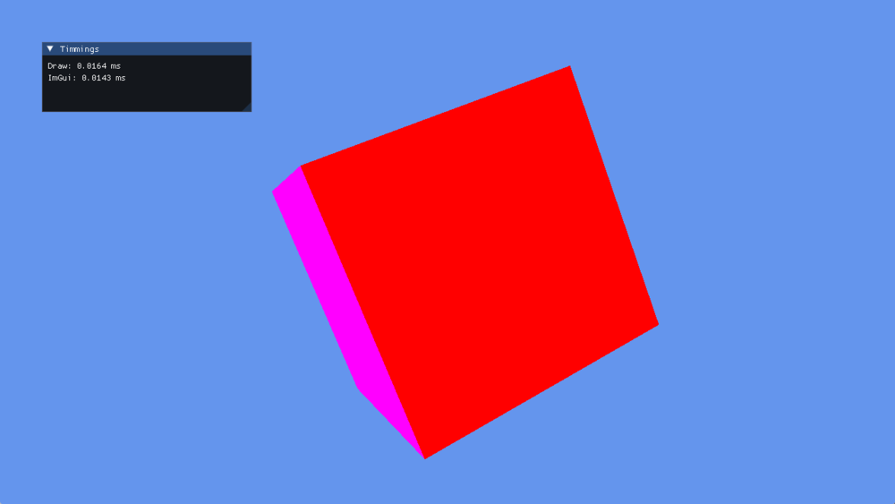

# QueryHeap

A `QueryHeap` is a fixed array of slots the GPU writes answers into. You allocate the slots up front, record queries against them by index, and read the results back later. Batching them into one heap costs less than asking one question at a time.

Two kinds of question are worth asking: how long a piece of GPU work took, and whether anything was drawn.

## Creation

A heap has one `QueryType` for all of its slots, so timestamps and occlusion queries need separate heaps:

```csharp
QueryHeap queryHeap;
uint maxQueries = 4;

QueryHeapDescription desc = new QueryHeapDescription()
{
    Type = QueryType.Timestamp,
    QueryCount = maxQueries,
};

this.queryHeap = this.graphicsContext.Factory.CreateQueryHeap(ref desc);
```

### QueryType

| Value | Description |
|-------|-------------|
| **Timestamp** | Indicates the query is for high-definition GPU and CPU timestamps. |
| **Occlusion** | Indicates the query is for depth/stencil occlusion counts. |
| **BinaryOcclusion** | Indicates the query is for binary depth/stencil occlusion statistics. |

### QueryHeapDescription

| Property | Type | Description |
| --- | --- | --- |
| **Type** | `QueryType` | The kind of query every slot in this heap holds. |
| **QueryCount** | `uint` | How many slots to allocate. Indices passed to the command buffer run from `0` to `QueryCount - 1`. |

> [!IMPORTANT]
> Timestamp queries are not available everywhere, and on some platforms they depend on what the host chooses to expose. Ask before creating the heap:
>
> ```csharp
> if (this.graphicsContext.Capabilities.IsTimestampQuerySupported)
> {
>     this.queryHeap = this.graphicsContext.Factory.CreateQueryHeap(ref desc);
> }
> ```



*`TimestampQueryTest` reading its own GPU cost back: the draw took 0.0164 ms and the interface 0.0143 ms on this frame.*

## Timestamp Queries

A timestamp is written by the GPU as it reaches that point in the recorded command stream, so the interval between two of them measures GPU work rather than the CPU time spent submitting it.

### How to use timestamp queries

```csharp
ulong[] results;

var commandBuffer = this.commandQueue.CommandBuffer();

commandBuffer.Begin();
commandBuffer.WriteTimestamp(this.queryHeap, 0);
commandBuffer.UpdateBufferData(this.constantBuffer, ref worldViewProj);

commandBuffer.SetViewports(this.viewports);
commandBuffer.SetScissorRectangles(this.scissors);

var renderPassDescription = new RenderPassDescription(this.frameBuffer, ClearValue.Default);
commandBuffer.BeginRenderPass(ref renderPassDescription);

commandBuffer.SetGraphicsPipelineState(this.pipelineState);
commandBuffer.SetResourceSet(this.resourceSet);
commandBuffer.SetVertexBuffers(this.vertexBuffers);
commandBuffer.Draw((uint)this.vertexData.Length / 2);

commandBuffer.EndRenderPass();
commandBuffer.WriteTimestamp(this.queryHeap, 1);

commandBuffer.End();
commandBuffer.Commit();

this.commandQueue.Submit();
this.commandQueue.WaitIdle();

this.queryHeap.ReadData(0, 4, this.results);
```

### How to show timestamp results

```csharp
this.surface.MouseDispatcher.DispatchEvents();
this.surface.KeyboardDispatcher.DispatchEvents();

commandBuffer.SetViewports(this.viewports);

this.uiRenderer.NewFrame(gameTime);

double gpuFrequency = this.graphicsContext.TimestampFrequency;

double time1 = ((this.results[1] - this.results[0]) / gpuFrequency) * 1000.0;
double time2 = ((this.results[3] - this.results[2]) / gpuFrequency) * 1000.0;

ImGui.SetNextWindowSize(new System.Numerics.Vector2(300, 100));
ImGui.Begin("Timings");
ImGui.Text($"Draw: {time1.ToString("0.0000")} ms");
ImGui.Text($"ImGui: {time2.ToString("0.0000")} ms");
ImGui.End();

this.uiRenderer.Render(commandBuffer);
```

## Occlusion Queries

An occlusion query counts the pixels a draw would actually write. Render the bounding box of an expensive object, read the count back, and skip the object itself when nothing would have been visible.

### Creating the heap

```csharp
uint maxQueries = 4;
QueryHeapDescription desc = new QueryHeapDescription()
{
    Type = QueryType.Occlusion,
    QueryCount = maxQueries,
};

var queryHeap = this.graphicsContext.Factory.CreateQueryHeap(ref desc);
```

### How to use occlusion queries

```csharp
// Draw
var commandBuffer = this.commandQueue.CommandBuffer();

commandBuffer.Begin();
commandBuffer.UpdateBufferData(this.constantBuffer0, ref viewProj);
commandBuffer.UpdateBufferData(this.constantBuffer1, ref worldViewProj);

commandBuffer.SetViewports(this.viewports);
commandBuffer.SetScissorRectangles(this.scissors);

var renderPassDescription = new RenderPassDescription(this.frameBuffer, ClearValue.Default);
commandBuffer.BeginRenderPass(ref renderPassDescription);

commandBuffer.SetGraphicsPipelineState(this.pipelineState);
commandBuffer.SetResourceSet(this.resourceSet0);
commandBuffer.SetVertexBuffers(this.vertexBuffers);

commandBuffer.BeginQuery(this.queryHeap, 0);
commandBuffer.Draw((uint)this.vertexData.Length / 2);
commandBuffer.EndQuery(this.queryHeap, 0);

commandBuffer.EndRenderPass();
commandBuffer.End();
commandBuffer.Commit();

this.commandQueue.Submit();
this.commandQueue.WaitIdle();

this.queryHeap.ReadData(0, 1, this.results);
```

### How to show occlusion results

```csharp
this.surface.MouseDispatcher.DispatchEvents();
this.surface.KeyboardDispatcher.DispatchEvents();

commandBuffer.SetViewports(this.viewports);

this.uiRenderer.NewFrame(gameTime);

ImGui.SetNextWindowSize(new System.Numerics.Vector2(300, 100));
ImGui.Begin("Occlusion Test");
ImGui.Text($"Samples: {this.results[0]}");
ImGui.End();

this.uiRenderer.Render(commandBuffer);
```