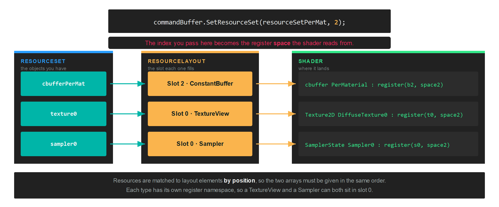

# ResourceLayout

A `ResourceLayout` declares the shape of a binding: which slots a shader reads, what kind of resource sits in each one, and which stages can see them. It carries no data of its own. The data arrives later, in a [ResourceSet](resourceset.md) built against this layout.

The same layout is referenced twice: once by the [GraphicsPipeline](graphicspipeline.md) or [ComputePipeline](computepipeline.md) that will run the shader, and once by every resource set you bind at draw time. That shared reference is how the backend knows a binding is valid before any command is recorded.

## Creation

Build a `ResourceLayoutDescription` from one `LayoutElementDescription` per slot, then hand it to the factory:

```csharp
var layoutDescription = new ResourceLayoutDescription(
    new LayoutElementDescription(0, ResourceType.ConstantBuffer, ShaderStages.Vertex),
    new LayoutElementDescription(0, ResourceType.TextureView, ShaderStages.Pixel),
    new LayoutElementDescription(0, ResourceType.Sampler, ShaderStages.Pixel));

var resourceLayout = this.graphicsContext.Factory.CreateResourceLayout(ref layoutDescription);
```

### ResourceLayoutDescription

| Property | Type | Description |
| --- | --- | --- |
| **Elements** | `LayoutElementDescription[]` | One entry per slot the shader reads. Order matters, because a resource set fills these by position. |
| **DynamicConstantBufferCount** | `int` | Set by the constructor, which counts the elements that have `AllowDynamicOffset`. You do not assign it yourself. |

### LayoutElementDescription

| Property | Type | Description |
| --- | --- | --- |
| **Slot** | `uint` | The register number inside its own namespace. A `TextureView` and a `Sampler` can both be slot 0. |
| **Type** | `ResourceType` | What kind of resource fills this slot. |
| **Stages** | `ShaderStages` | The stages that can read it. Combine flags to expose one resource to several stages. |
| **AllowDynamicOffset** | `bool` | Lets you pass a byte offset when binding, instead of creating one buffer per draw. Constant buffers only. `false` by default. |
| **Range** | `uint` | Overrides the size in bytes of this binding. `0` binds the whole buffer. Constant buffers only. Set through the constructor's `size` parameter. |

### ResourceType

| ResourceType | Description |
| --- | --- |
| **ConstantBuffer** | A [Buffer](buffer.md) read as a uniform buffer. |
| **StructuredBuffer** | A [Buffer](buffer.md) read as a read-only storage buffer. |
| **StructuredBufferReadWrite** | A [Buffer](buffer.md) a shader can also write to. |
| **TextureView** | A read-only view of a [Texture](texture.md). |
| **TextureViewReadWrite** | A view of a [Texture](texture.md) a shader can also write to. |
| **Sampler** | A [SamplerState](sampler.md). |
| **AccelerationStructure** | A ray tracing acceleration structure. See [RaytracingPipeline](raytracingpipeline.md). |

### ShaderStages

`ShaderStages` is a flags enum, so one element can be visible to several stages at once, as in `ShaderStages.Vertex | ShaderStages.Pixel`.

| ShaderStages | Value | Description |
| --- | --- | --- |
| **Undefined** | 0 | No stage. |
| **Vertex** | 1 | Vertex shader. |
| **Hull** | 2 | Hull shader. |
| **Domain** | 4 | Domain shader. |
| **Geometry** | 8 | Geometry shader. |
| **Pixel** | 16 | Pixel shader. |
| **Compute** | 32 | Compute shader. |
| **RayGeneration** | 64 | Ray generation shader. |
| **Miss** | 128 | Ray miss shader. |
| **ClosestHit** | 256 | Closest hit shader. |
| **AnyHit** | 512 | Any hit shader. |
| **Intersection** | 1024 | Intersection shader. |
| **Mesh** | 2048 | Mesh shader, from Shader Model 6.5. |
| **Amplification** | 4096 | Amplification shader, from Shader Model 6.5. |

## How a slot reaches the shader

Two numbers decide where a resource lands. The `Slot` on the layout element is the register number, and the index you pass to `SetResourceSet` is the register space.



Each resource type has its own register namespace, so slot numbers only ever collide within a type. In HLSL those namespaces are `b` for constant buffers, `t` for read-only reads, `u` for read-write access and `s` for samplers.

> [!IMPORTANT]
> The elements in a layout and the resources in the set that fills it are matched **by position**, not by slot number. Reordering one array without the other silently binds the wrong resource.

## Group elements by how often they change

A pipeline can take several layouts, and you bind each one to its own space. Splitting them by update frequency means the per-frame data is not rebound with every material:

```csharp
// One layout per update frequency...
var perDrawDescription = new ResourceLayoutDescription(
    new LayoutElementDescription(0, ResourceType.ConstantBuffer, ShaderStages.Vertex, true, (uint)Unsafe.SizeOf<Matrix4x4>()));
var perViewDescription = new ResourceLayoutDescription(
    new LayoutElementDescription(1, ResourceType.ConstantBuffer, ShaderStages.Vertex));
var perMaterialDescription = new ResourceLayoutDescription(
    new LayoutElementDescription(2, ResourceType.ConstantBuffer, ShaderStages.Pixel),
    new LayoutElementDescription(0, ResourceType.TextureView, ShaderStages.Pixel),
    new LayoutElementDescription(0, ResourceType.Sampler, ShaderStages.Pixel));

// ...and the pipeline lists them in the order they will be bound.
var pipelineDescription = new GraphicsPipelineDescription()
{
    ResourceLayouts = new[] { perDraw, perView, perMaterial },
    // ...
};
```

At draw time each set goes to the index that matches its position in that array:

```csharp
commandBuffer.SetResourceSet(this.resourceSetPerDraw, 0, new uint[] { this.stride * (uint)i });
commandBuffer.SetResourceSet(this.resourceSetPerView, 1);
commandBuffer.SetResourceSet(this.resourceSetPerMat, 2);
```

> [!TIP]
> The first element above was declared with `AllowDynamicOffset` and an explicit size, which is what lets the third argument of `SetResourceSet` walk one shared constant buffer instead of allocating one per draw.

## Cleaning up

```csharp
resourceLayout.Dispose();
```
