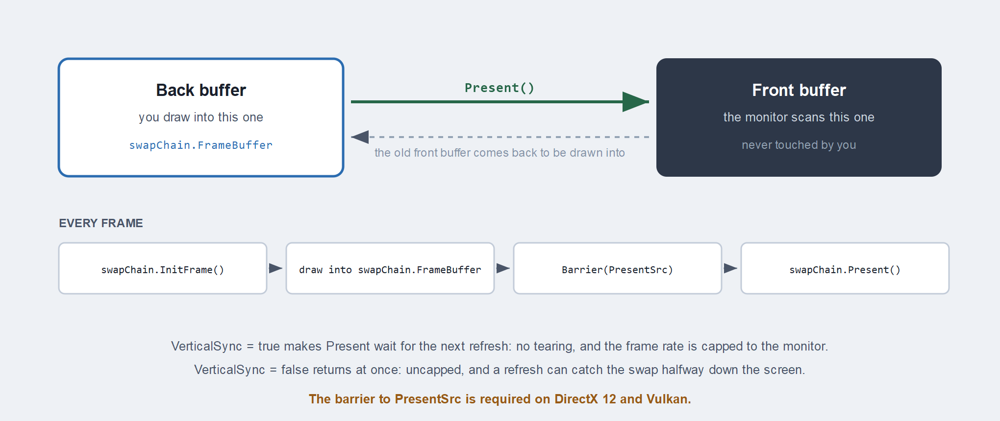

# Swapchain

A swapchain is the set of buffers that puts your rendering on screen. You draw into one of them, and presenting hands it to the display while giving you back another to draw into.

The reason it is not a single buffer is timing. Monitors refresh between 60 and 240 times a second, far slower than the GPU can produce frames, and they scan the image out from top to bottom. Writing into the buffer the monitor is currently scanning means the top of the screen shows the old frame and the bottom shows the new one, split at whatever line the scan had reached. That split is called tearing.



## Creation

A swapchain is created from the [GraphicsContext](graphicscontext.md), not from the factory, because it binds to a window rather than to the device alone:

```csharp
// Create a window...
var windowSystem = new Evergine.Forms.FormsWindowsSystem();
var window = windowSystem.CreateWindow(windowsTitle, width, height);

// Describe the buffers, and point the description at the window's surface...
var swapChainDescriptor = new SwapChainDescription()
{
    Width = window.Width,
    Height = window.Height,
    SurfaceInfo = window.SurfaceInfo,
    ColorTargetFormat = PixelFormat.R8G8B8A8_UNorm,
    ColorTargetFlags = TextureFlags.RenderTarget | TextureFlags.ShaderResource,
    DepthStencilTargetFormat = PixelFormat.D24_UNorm_S8_UInt,
    DepthStencilTargetFlags = TextureFlags.DepthStencil,
    SampleCount = TextureSampleCount.None,
    IsWindowed = true,
    RefreshRate = 60,
};

var swapChain = this.graphicsContext.CreateSwapChain(swapChainDescriptor);
swapChain.VerticalSync = false;
```

### SwapChainDescription

| Property | Type | Description |
| --- | --- | --- |
| **SurfaceInfo** | `SurfaceInfo` | The window surface to present to. See [GraphicsContext](graphicscontext.md) for the windowing systems available. |
| **Width** | `uint` | Width of the swapchain buffers. |
| **Height** | `uint` | Height of the swapchain buffers. |
| **RefreshRate** | `uint` | Target screen refresh rate. |
| **ColorTargetFormat** | `PixelFormat` | Pixel format of the colour target. |
| **ColorTargetFlags** | `TextureFlags` | How the colour target may be bound. Combine flags with a logical OR. |
| **DepthStencilTargetFormat** | `PixelFormat` | Pixel format of the depth stencil target. |
| **DepthStencilTargetFlags** | `TextureFlags` | How the depth target may be bound. |
| **SampleCount** | `TextureSampleCount` | Multisample count for the swapchain buffers. |
| **IsWindowed** | `bool` | Whether the output is windowed rather than fullscreen. |

`TextureFlags` and `TextureSampleCount` are documented in full on the [Texture](texture.md) page.

> [!TIP]
> Add `TextureFlags.ShaderResource` to `ColorTargetFlags` when a post-processing pass needs to sample the result before it is presented. Leaving it out costs nothing, but adding it later means recreating the swapchain.

## Presenting

Four steps per frame:

```csharp
this.swapChain.InitFrame();

var commandBuffer = this.commandQueue.CommandBuffer();
commandBuffer.Begin();

RenderPassDescription renderPassDescription = new RenderPassDescription(
    this.swapChain.FrameBuffer,
    new ClearValue(ClearFlags.All, Color.CornflowerBlue));
commandBuffer.BeginRenderPass(ref renderPassDescription);

// ...draws...

commandBuffer.EndRenderPass();
commandBuffer.End();
commandBuffer.Commit();

this.commandQueue.Submit();

this.swapChain.Present();
```

`InitFrame()` acquires the next buffer, which is why it comes before any recording. `swapChain.FrameBuffer` is the [Framebuffer](framebuffer.md) for the buffer it handed you, so read it after `InitFrame` rather than caching it across frames.

> [!IMPORTANT]
> On DirectX 12 and Vulkan a swapchain texture you wrote to yourself, rather than through a render pass, has to be transitioned into `Texture.StateFlags.PresentSrc` before `Present()`. A pass that ends with a copy into the swapchain is the usual case. See [Barriers](barriers.md).
>
> ```csharp
> commandBuffer.Barrier(new Texture.Barrier(swapchainColor, Texture.StateFlags.PresentSrc));
> ```

## Members

| Member | Description |
| --- | --- |
| **FrameBuffer** | The framebuffer for the current back buffer. |
| **SwapChainDescription** | The description it was created from. |
| **VerticalSync** | Whether `Present` waits for the next refresh. |
| **InitFrame()** | Acquires the next back buffer. Call it at the start of each frame. |
| **Present()** | Hands the back buffer to the display. |
| **ResizeSwapChain(width, height)** | Recreates the buffers at a new size. |
| **RefreshSurfaceInfo(surfaceInfo)** | Points the swapchain at a new surface. |
| **ChangeDepthStencilFormat(format)** | Recreates the depth target with a different format. |
| **GetCurrentFramebufferTexture()** | The texture behind the current back buffer. |
| **Name** | Debug name, shown in graphics debugging tools. |

## Vertical sync

```csharp
swapChain.VerticalSync = true;
```

With it on, `Present` waits for the next refresh before swapping. There is no tearing, and the frame rate is capped to the monitor. With it off, `Present` returns as soon as the swap is queued, the frame rate is uncapped, and a refresh can catch the swap partway down the screen.

Leave it on for anything a person looks at. Turn it off to measure throughput, where a capped frame rate hides the difference you are trying to see.

## Resizing

A window resize invalidates the buffers, so handle it before the next frame:

```csharp
protected override void OnResized(uint width, uint height)
{
    this.swapChain.ResizeSwapChain(width, height);

    this.viewports[0] = new Viewport(0, 0, width, height);
    this.scissors[0] = new Rectangle(0, 0, (int)width, (int)height);
}
```

`ResizeSwapChain` recreates the underlying textures, so anything that captured the old ones has to be rebuilt: your own framebuffers over swapchain textures, and resource sets that sampled them. Pipelines survive, because a resize does not change formats.

> [!WARNING]
> Wait for the GPU to finish with the old buffers before resizing, with `commandQueue.WaitIdle()` or a [Fence](fence.md). Resizing under a frame that is still in flight destroys textures the GPU is reading.

## Cleaning up

```csharp
this.commandQueue.WaitIdle();
swapChain.Dispose();
```
