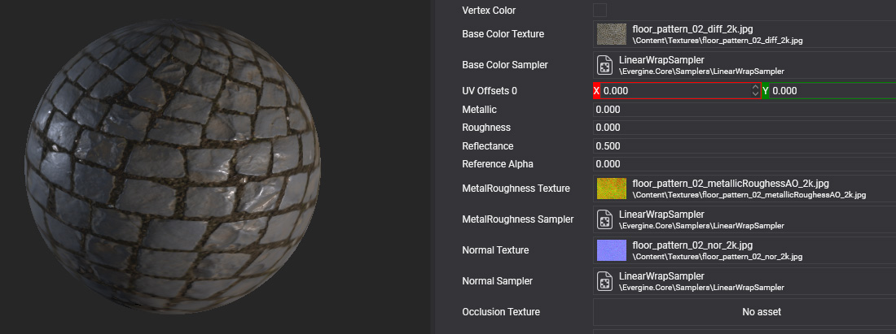
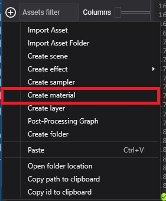
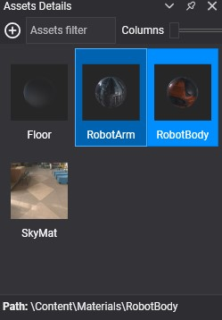

# Create Materials
---


Materials describe the appearance of object surfaces and how they react to [light](../lights.md).

## Create a Material Asset in Evergine Studio
To create a material, click on the button  in the [Assets Details](../../evergine_studio/interface.md) panel. This action will deploy the create menu options. Then, click on the option _"Create material"_.



### Inspect Materials in Asset Details
You can find the material assets in the [**Assets Details**](../../evergine_studio/interface.md) panel when you select a folder in the [**Project Explorer**](../../evergine_studio/interface.md).



### Material Files in Content Directory
The material file has the `.wemt` extension.


## Create a New Material from Code
The following sample code can be used to create a new material and apply it to an entity in your scene. In this case, the material will be created using the **StandardEffect** effect and the **Opaque** render layer:

```csharp
protected override void CreateScene()
{
    var assetsService = Application.Current.Container.Resolve<AssetsService>();

    // Load the effect
    Effect standardEffect = assetsService.Load<Effect>(EvergineContent.Effects.StandardEffect);

    // Load a Render Layer description
    RenderLayerDescription layer = assetsService.Load<RenderLayerDescription>(EvergineContent.RenderLayers.Opaque);

    // Create your own material
    Material material = new Material(standardEffect);
    material.LayerDescription = layer;

    // Apply to an entity
    Entity primitive = new Entity()
        .AddComponent(new Transform3D())
        .AddComponent(new MaterialComponent() { Material = material })  
        .AddComponent(new SphereMesh())
        .AddComponent(new MeshRenderer());

    this.Managers.EntityManager.Add(primitive);
}
```