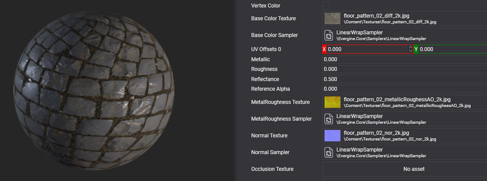

# Materials

---

A **material** describes what a surface looks like and how it reacts to [light](../lights.md): its color, how metallic and rough it is, its textures and whether it is transparent. With physically based materials you can reproduce metal, plastic, concrete, skin and most real surfaces.

## Materials and effects

Every material is based on an [effect](../effects/index.md). The effect defines which properties exist and how they are rendered; the material stores the values of those properties and which of the effect's directives are active. Many materials can share one effect.

## The default material

Every project references the [Evergine.Core package](../evergine_core.md), which includes **DefaultMaterial**, a material of the [Standard effect](../effects/builtin_effects.md#standard-effect) that primitives and imported models use until you assign another. Materials are [assets](../../evergine_studio/assets/index.md) with their own editor, the [Material Editor](material_editor.md).

## In this section

* [Create Materials](create_materials.md)
* [Using Materials](using_materials.md)
* [Material Editor](material_editor.md)
* [Material Decorators](material_decorators.md)