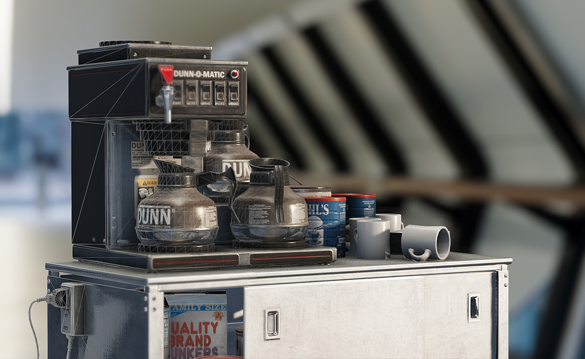
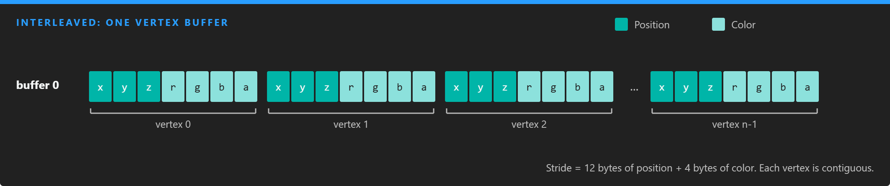
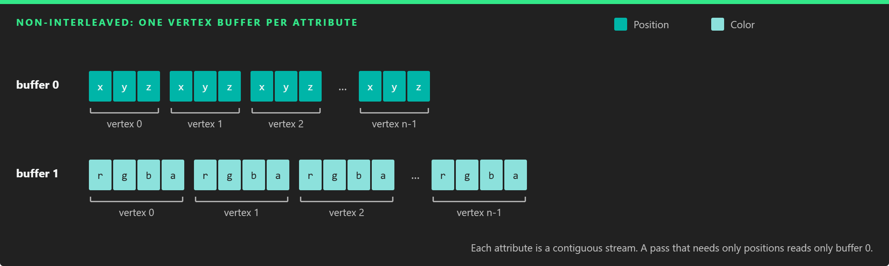
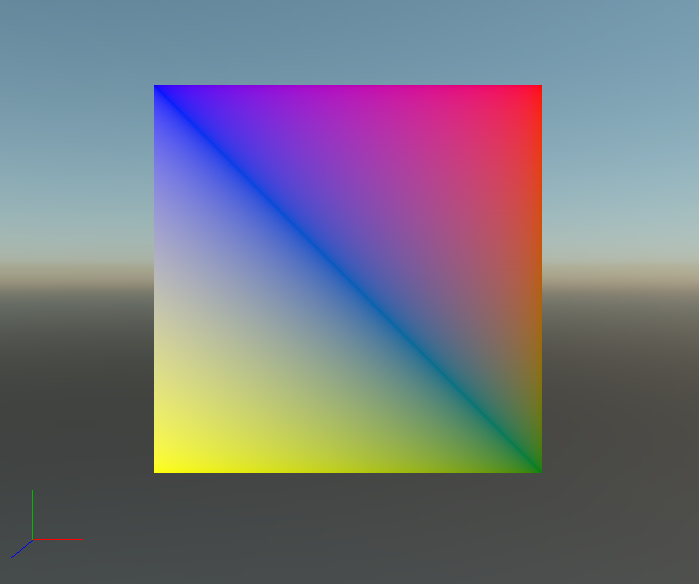

# Meshes

---



A **mesh** is the smallest thing Evergine draws: a set of vertices, usually an index buffer that joins them into triangles, and a topology that says how to read them. Each mesh is drawn with exactly one material, so an object with several materials is made of several meshes grouped in a [model](../models/index.md).

Every vertex can carry more than a position: normals tell the lighting which way the surface faces, texture coordinates map textures onto it, and colors, tangents or custom data feed whatever the shader needs.

You rarely build meshes by hand. Imported models and [primitives](../primitives.md) create them for you. Build one from code when the geometry is procedural or comes from your own data.

## Mesh

The `Mesh` class (namespace `Evergine.Framework.Graphics`) has these members:

| Member | Type | Description |
| --- | --- | --- |
| **VertexBuffers** | `VertexBuffer[]` | The vertex buffers of the mesh. See [Vertex buffers](#vertex-buffers). |
| **IndexBuffer** | `IndexBuffer` | The index buffer. It is `null` for a non-indexed mesh. See [Index buffers](#index-buffers). |
| **Buffers** | `Buffer[]` | The low-level `Buffer` of each vertex buffer, in the same order, ready to bind. |
| **Offsets** | `uint[]` | The byte offset of each vertex buffer, in the same order. |
| **InputLayouts** | `InputLayouts` | The layout descriptions of all the vertex buffers, used to build the pipeline. |
| **PrimitiveTopology** | `PrimitiveTopology` | How vertices form primitives: `PointList`, `LineList`, `LineStrip`, `TriangleList`, `TriangleStrip`, the adjacency variants, or `Patch_List` for tessellation. |
| **ElementCount** | `int` | Number of indices (or vertices for a non-indexed mesh) to draw. |
| **PrimitiveCount** | `int` | Number of primitives, derived from `ElementCount` and the topology. A triangle list with 6 elements has 2 primitives. |
| **VertexOffset** | `int` | First vertex to read. |
| **IndexOffset** | `int` | First index to read. |
| **BoundingBox** | `BoundingBox?` | Local-space bounds, used for culling and light assignment. Leave it `null` only for meshes that should never be culled. |
| **MaterialIndex** | `int` | Which entry of the model's material list this mesh uses. |
| **AllowBatching** | `bool` | Whether the mesh can be merged with others by dynamic batching. `true` by default. |

## Vertex buffers

A `VertexBuffer` pairs a GPU `Buffer` holding the raw vertex data with a `LayoutDescription` that says what each vertex contains: which attributes, in which format, at which offset.

| Member | Type | Description |
| --- | --- | --- |
| **Buffer** | `Buffer` | The buffer with the vertex data. It must be created with `BufferFlags.VertexBuffer`. |
| **LayoutDescription** | `LayoutDescription` | The attributes of one vertex: format, semantic, semantic index and offset of each element, plus the `Stride` of the whole vertex. |
| **VertexCount** | `int` | Number of vertices, computed from the buffer size and the stride. |
| **Offset** | `int` | Byte offset of the first vertex inside the buffer. |
| **Size** | `int` | Size of the data in bytes. |
| **Data** | `IntPtr` | Optional pointer to a CPU copy of the data. |

### Interleaved and non-interleaved data

A mesh can store all the attributes of a vertex together in one buffer (**interleaved**), or keep each attribute in its own buffer (**non-interleaved**), with one vertex buffer per stream.





*Interleaved data is compact and simple. Separate streams let a pass read only what it needs: a shadow map pass that only reads positions touches far less memory.*

### Predefined vertex types

Evergine provides vertex structs in `Evergine.Common.Graphics` that already carry their `LayoutDescription` in a static `VertexFormat` field:

| Type | Attributes |
| --- | --- |
| `VertexPosition` | Position |
| `VertexPositionColor` | Position, Color |
| `VertexPositionColorTexture` | Position, Color, TexCoord |
| `VertexPositionColorDualTexture` | Position, Color, TexCoord, TexCoord2 |
| `VertexPositionColorTextureAxis` | Position, Color, TexCoord, and a second `TexCoord` (Float4) with the axis |
| `VertexPositionTexture` | Position, TexCoord |
| `VertexPositionDualTexture` | Position, TexCoord, TexCoord2 |
| `VertexPositionNormal` | Position, Normal |
| `VertexPositionNormalColor` | Position, Normal, Color |
| `VertexPositionNormalTexture` | Position, Normal, TexCoord |
| `VertexPositionNormalColorTexture` | Position, Normal, Color, TexCoord |
| `VertexPositionNormalDualTexture` | Position, Normal, TexCoord, TexCoord2 |
| `VertexPositionNormalColorDualTexture` | Position, Normal, Color, TexCoord, TexCoord2 |
| `VertexPositionNormalTangentTexture` | Position, Normal, Tangent, TexCoord |
| `VertexPositionNormalTangentColorDualTexture` | Position, Normal, Tangent, Color, TexCoord, TexCoord2 |

With your own arrays you build the `LayoutDescription` yourself, as shown [below](#a-mesh-from-separate-streams).

## Index buffers

Most meshes share vertices between triangles. A quad drawn as two triangles needs six vertices, two of them duplicated; with an index buffer it needs four vertices and six indices that point at them. On real meshes, where each vertex is shared by several triangles, the saving is much larger.

| Member | Type | Description |
| --- | --- | --- |
| **Buffer** | `Buffer` | The buffer with the indices. It must be created with `BufferFlags.IndexBuffer`. |
| **IndexFormat** | `IndexFormat` | `UInt16` (the default) or `UInt32`. Use 32-bit indices only when the mesh has more than 65,535 vertices. |
| **IndexCount** | `int` | Number of indices, computed from the buffer size. |
| **FlipWinding** | `bool` | Reverses which winding order counts as front-facing for this mesh. |
| **Offset** | `int` | Byte offset of the first index inside the buffer. |
| **Size** | `int` | Size of the data in bytes. |

## Create a mesh from code

Both examples below build the same colored quad and are methods of a `Scene`, so they can be called from `CreateScene()`. They need these usings:

```csharp
using System.Runtime.CompilerServices;
using Evergine.Common.Graphics;
using Evergine.Framework.Graphics;
using Evergine.Mathematics;
using Buffer = Evergine.Common.Graphics.Buffer;
```

### A mesh from a predefined vertex type

`VertexPositionColor` supplies the layout, so one interleaved vertex buffer is enough:

```csharp
private Mesh CreateQuadMesh(GraphicsContext graphicsContext)
{
    ushort[] indexData = new ushort[] { 0, 1, 2, 0, 2, 3 };

    VertexPositionColor[] vertexData = new VertexPositionColor[]
    {
        new VertexPositionColor(new Vector3(-0.5f, 0.5f, 0.0f), Color.Blue),
        new VertexPositionColor(new Vector3(0.5f, 0.5f, 0.0f), Color.Red),
        new VertexPositionColor(new Vector3(0.5f, -0.5f, 0.0f), Color.Green),
        new VertexPositionColor(new Vector3(-0.5f, -0.5f, 0.0f), Color.Yellow),
    };

    var vertexBufferDescription = new BufferDescription()
    {
        SizeInBytes = (uint)(Unsafe.SizeOf<VertexPositionColor>() * vertexData.Length),
        Flags = BufferFlags.VertexBuffer,
        Usage = ResourceUsage.Default,
    };

    Buffer vertexGpuBuffer = graphicsContext.Factory.CreateBuffer(vertexData, ref vertexBufferDescription);
    var vertexBuffer = new VertexBuffer(vertexGpuBuffer, VertexPositionColor.VertexFormat);

    var indexBufferDescription = new BufferDescription()
    {
        SizeInBytes = (uint)(sizeof(ushort) * indexData.Length),
        Flags = BufferFlags.IndexBuffer,
        Usage = ResourceUsage.Default,
    };

    Buffer indexGpuBuffer = graphicsContext.Factory.CreateBuffer(indexData, ref indexBufferDescription);
    var indexBuffer = new IndexBuffer(indexGpuBuffer);

    return new Mesh(new VertexBuffer[] { vertexBuffer }, indexBuffer, PrimitiveTopology.TriangleList)
    {
        // Without bounds the culling system cannot tell whether the quad is in view.
        BoundingBox = new BoundingBox(new Vector3(-0.5f, -0.5f, 0), new Vector3(0.5f, 0.5f, 0)),
    };
}
```

The layout of `VertexPositionColor.VertexFormat` is:

| Element | Semantic | Semantic index | Format | Offset |
| --- | --- | --- | --- | --- |
| Position | `Position` | 0 | `Float3` | 0 |
| Color | `Color` | 0 | `UByte4Normalized` | 12 |

### A mesh from separate streams

Here positions and colors live in two arrays, and each becomes its own vertex buffer with its own one-element layout:

```csharp
private Mesh CreateQuadMeshFromStreams(GraphicsContext graphicsContext)
{
    ushort[] indexData = new ushort[] { 0, 1, 2, 0, 2, 3 };

    Vector3[] positions = new Vector3[]
    {
        new Vector3(-0.5f, 0.5f, 0.0f),
        new Vector3(0.5f, 0.5f, 0.0f),
        new Vector3(0.5f, -0.5f, 0.0f),
        new Vector3(-0.5f, -0.5f, 0.0f),
    };

    Vector4[] colors = new Vector4[]
    {
        Color.Blue.ToVector4(),
        Color.Red.ToVector4(),
        Color.Green.ToVector4(),
        Color.Yellow.ToVector4(),
    };

    var positionsDescription = new BufferDescription()
    {
        SizeInBytes = (uint)(Unsafe.SizeOf<Vector3>() * positions.Length),
        Flags = BufferFlags.VertexBuffer,
        Usage = ResourceUsage.Default,
    };

    Buffer positionsBuffer = graphicsContext.Factory.CreateBuffer(positions, ref positionsDescription);
    var positionsLayout = new LayoutDescription()
        .Add(new ElementDescription(ElementFormat.Float3, ElementSemanticType.Position));
    var positionsVertexBuffer = new VertexBuffer(positionsBuffer, positionsLayout);

    var colorsDescription = new BufferDescription()
    {
        SizeInBytes = (uint)(Unsafe.SizeOf<Vector4>() * colors.Length),
        Flags = BufferFlags.VertexBuffer,
        Usage = ResourceUsage.Default,
    };

    Buffer colorsBuffer = graphicsContext.Factory.CreateBuffer(colors, ref colorsDescription);
    var colorsLayout = new LayoutDescription()
        .Add(new ElementDescription(ElementFormat.Float4, ElementSemanticType.Color));
    var colorsVertexBuffer = new VertexBuffer(colorsBuffer, colorsLayout);

    var indexBufferDescription = new BufferDescription()
    {
        SizeInBytes = (uint)(sizeof(ushort) * indexData.Length),
        Flags = BufferFlags.IndexBuffer,
        Usage = ResourceUsage.Default,
    };

    Buffer indexGpuBuffer = graphicsContext.Factory.CreateBuffer(indexData, ref indexBufferDescription);
    var indexBuffer = new IndexBuffer(indexGpuBuffer);

    // One vertex buffer per stream; the shader sees a single vertex with both attributes.
    return new Mesh(new VertexBuffer[] { positionsVertexBuffer, colorsVertexBuffer }, indexBuffer, PrimitiveTopology.TriangleList)
    {
        BoundingBox = new BoundingBox(new Vector3(-0.5f, -0.5f, 0), new Vector3(0.5f, 0.5f, 0)),
    };
}
```

This time the color is stored as four floats, so the layouts are:

| Vertex buffer | Semantic | Semantic index | Format | Offset |
| --- | --- | --- | --- | --- |
| 0 | `Position` | 0 | `Float3` | 0 |
| 1 | `Color` | 0 | `Float4` | 0 |

> [!NOTE]
> The quad has vertex colors and no normals or texture coordinates. A [StandardMaterial](../materials/index.md) drawing it needs `VertexColorEnabled` on and `LightingEnabled` and `IBLEnabled` off, because the lighting code reads normals the mesh does not have.

## Next steps

A mesh on its own is not an entity. Wrap it in a model to add it to the scene, as shown in [Create a Model from Code](../models/create_model_from_code.md). The result looks like this:


