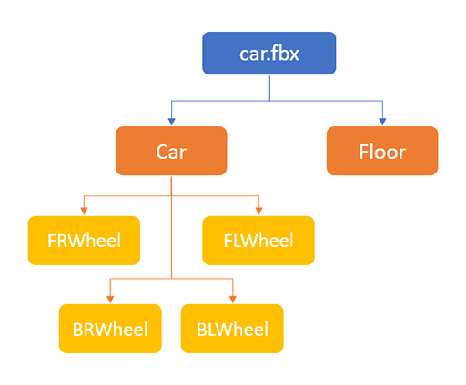
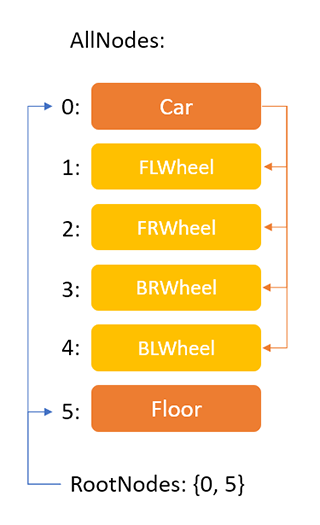

# Models
---

Models are files that contain **3D objects** like characters, items, and all kinds of elements. **Evergine** supports importing models created by 3D editing software (like _3ds Max_, _Blender_, or CAD software like _Solidworks_.) and also supports procedural model generation.

Models are crucial assets in every graphical application because they can provide high quality and realism.

In **Evergine**, a **Model** is a graphical element that combines multiple parts to form a full 3D object in a scene.

It can contain the following parts:
- Node Hierarchy
- MeshContainers
- Material references
- Skinning information
- Animation Clips

## Node Hierarchy
A **Model** contains a node graph that covers all the objects of the 3D model. These are covered in the **NodeContent** class. They can contain geometry or just serve as dummy elements, but all of them contain transform information (position, orientation, and scale) and a list of children.

The **Model** contains the hierarchy in these two properties:

| Property | Description |
| -------- | ----------- |
| AllNodes | The list of all the **NodeContents**, whether they are at the root level or not. |
| RootNodes | The indices of the **NodeContent** elements in the _AllNodes_ list that contain the nodes at root level (they don't have a parent).|

For example, if we have this node hierarchy:

A **Model** would store them in this way:

### NodeContent
The **NodeContent** refers to the class that represents one node. It contains the basic information of a node in a 3D model:

| Property | Description | 
|----------|------------ |
| Name | Name of the node |
| Children | Array of the **NodeContent** children of the node. |
| Translation | Local Vector3 translation of the node. |
| Orientation | Local Quaternion orientation of the node. |
| Scale | Local Vector3 scale of the node. |
| Mesh | **MeshContainer** reference of the node, meaning the node has geometry attached to it. _null_ if the node doesn't have geometry. |
| Skin | Reference of a **SkinContent** element, meaning the node is a skinned mesh. _null_ if the node is not skinned. |

## MeshContainers
In a **Model**, mesh containers are where the 3D geometry is stored. They usually represent one full object and can contain one or more meshes (see [this section](../meshes/index.md) for more information). The main reason for the **MeshContainer** concept is that geometry attached to a node can contain multiple sub-elements, each with a different material. One **MeshContainer** can be referenced by one or more nodes, making the model more memory efficient.

| Property | Description |
| -------- | ----------- |
| Name | Name of the mesh container. |
| Skin | Reference to the SkinContent for skinning information (if applicable). |
| BoundingBox | The bounding box of the mesh. |
| Meshes | List of the meshes in this container |

## Materials
The model also contains a list of tuples containing the material ID and the material name referenced by its meshes. The **Mesh** class contains a parameter called _MaterialIndex_ which tells us the index of this list we're referring to.

## Skinning Information

**Evergine** supports skinning animation. With this method, geometry is deformed following the transformations of a set of bones.

To support it, the model class contains an array of the **SkinContent** class, which represents the skinning information of a geometry. Every **MeshContainer** and **Node** that has a skinned mesh references one of the elements of the array.

The **SkinContent** class contains this information:

| Property | Description |
| -------- | ----------- |
| Name | Name of the skinning content. |
| Nodes | Array of integers that contain the indices of the AllNodes list of the Model class. These are the bone nodes of the skeleton. |
| InverseBindPoses | Array of **Matrix4x4**. For every node of the skeleton, there is a matrix that contains the inverse bind pose relative to its parent. |
| RootJoint | Int that represents the index in the Nodes array of the root bone of the skinning. |

Using these properties, animating the nodes referenced by this **SkinContent** will animate the geometry accordingly.

For the skinned mesh to work properly, the **Vertex Buffer** of the skinned mesh needs the following fields:

| Semantic | Type | Description |
|----------|------| ------------|
| **BoneIndices** | ´int4short´ | Vector that contains the indices of the bones (from the Nodes list) affected by this vertex. |
| **BoneWeights** | float4 | For every bone from the previous field, the weight indicates the percentage of the bone transforms that apply to this vertex. |

## Animations

In **Evergine**, model animation is achieved by animating nodes. If those nodes are part of skinning bones, it will also animate the skinned mesh accordingly.

## In this section
* [Import Models](import_model.md)
* [Using Model](using_models.md)
* [Level of Detail](level_of_detail.md)
* [Model Editor](model_editor.md)
* [Create Models from code](create_model_from_code.md)