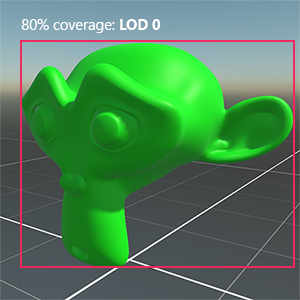
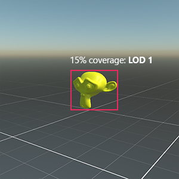
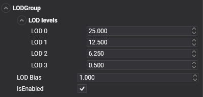
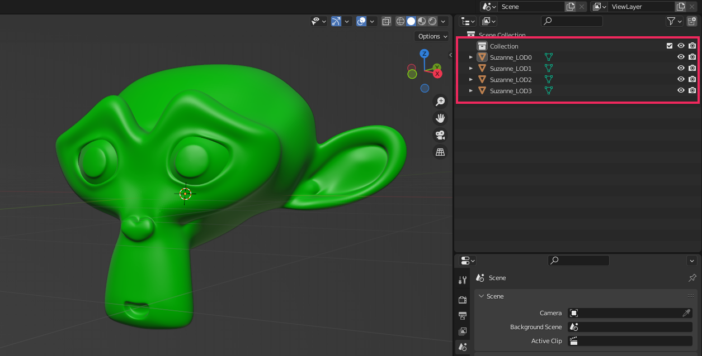

# Level of Detail (LOD) for Models

The **Level of Detail (LOD)** is a technique that reduces the number of GPU operations that Evergine requires to render distant models.

This technique allows Evergine to reduce the model complexity it renders for an Entity based on its distance from the camera. It is possible to configure LOD levels in your external 3D modeling application, and Evergine automatically creates and configures the required Entity and components for you when you drag & drop the model into a scene.

The representation inside the hierarchy tree will be a parent entity with one child entity for every LOD-defined level. The parent entity must contain an LODGroup component, which allows you to configure all the parameters to correctly render this model depending on the distance to the camera. Each child will have an LODEntry component with the information required by the LODGroup to define each level.

## LOD Levels

An LOD level in a model defines which meshes (or materials) Evergine will render for that model. LOD Levels are identified by an index, where Level 0 is the most detailed level.

## LOD Selection

Evergine selects the LOD Level of a model depending on the area covered by this model in the camera. Examples:

- If the model is too close to the camera, we select the lowest LOD (more details). In that case, the model covers 80% of the screen:

- If the model is far away, it appears smaller, and because of this, Evergine will select higher LOD levels. In that case, LOD 1 is selected because the model now covers 15% of the screen:

Here is the same example in movement:

<video width="300" height="300" autoplay loop><source src="images/LoD.mp4" type="video/mp4"></video>

## LOD Components

To set up LOD in your entities, you need to use `LODGroup` and `LODEntry` components.

### LODGroup

The LODGroup component manages the Level of Detail of the owner's entity.

It will collect all LODEntry components defined in the entity hierarchy to conform the meshes assigned to each LOD Level. They will calculate the screen coverage of the meshes in the camera and select the proper level accordingly.

| Property | Default | Description |
| --- | --- | --- |
| **LOD Levels** | 0.25, 12.5, 6.25, ... | Indicates the minimum screen coverage required per each LOD Level (for example, by default, LOD 0 requires that the entity cover at least 25% of the screen). |
| **LOD Bias** | 1 | This property is used as a factor to the calculated screen coverage. It will be used to increase or reduce the overall LOD levels. For example, an LOD Bias of 0.5 causes a model with a screen coverage of 40% to be processed as 20%. In general terms, values lower than 1 tend to increase the LOD levels, and values greater than 1 will produce lower LOD levels. |

### LODEntry

You need to add an **LODEntry** component to assign an LOD level to a specified entity with a Mesh. This component requires a `MeshRenderer` component, which will be enabled or disabled depending on the overall LOD Level.

By default, when an LOD Level is selected, it will enable all LODEntry `MeshRenderer` associated components, and they will disable the other LODEntry MeshRenderers.

| Property | Default | Description |
| --- | --- | --- |
| **LOD** | 0 | Indicates the LOD Level assigned to this entity. |
| **DisableEntity** | false | If this value is true, it will disable or enable the entire Entity, instead of only enabling or disabling the MeshRenderer. |

## Importing LOD Models

You can create models with different levels of detail in an external 3D application for use with Evergine's LOD system. If you name these meshes (and nodes) correctly, Evergine automatically creates and configures an Entity with `LODGroup` and `LODEntry` components for them when it imports the Model.

To import a Model with LOD levels into Evergine, you must do the following:
1. In your external 3D application (Blender, for example), follow the application's process to create as many LOD meshes as you need.
2. Name the meshes according to the following naming convention:
   - **ExampleMeshName_LOD0** for the first LOD level (the most detailed version).
   - **ExampleMeshName_LOD1**
   - **ExampleMeshName_LOD2**
3. Export your Model as a compatible Evergine model format (`.glb` or `.fbx`, for example).
4. Import the model into Evergine. Evergine recognizes the grouped Meshes and naming convention and automatically creates `LODGroup` and `LODEntry` components when the model is instantiated in the scene.

This is an example of a model in **Blender** with 4 LOD Levels defined:

