# Model Editor

---

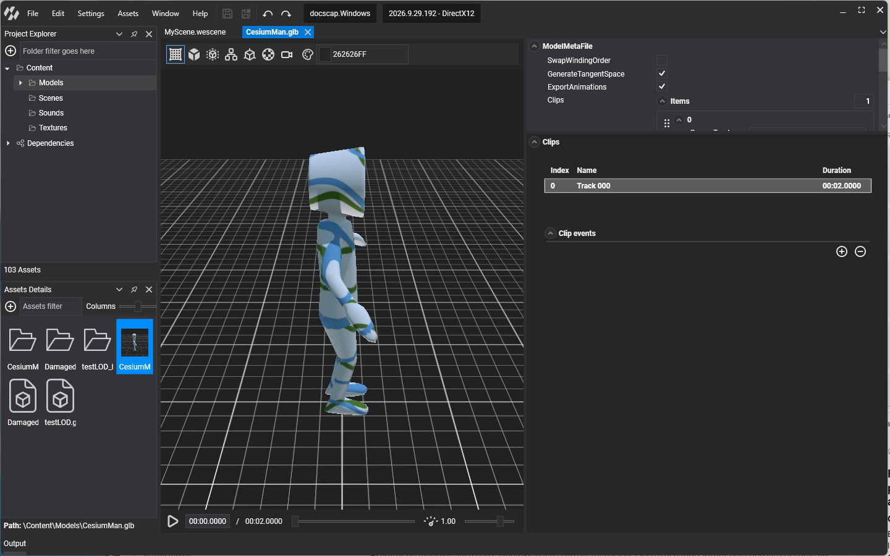

The **Model Editor** previews a model and edits its import settings. Double-click a model in [Assets Details](../../evergine_studio/interface.md) to open it. It has four parts: the viewport, the toolbar, the playback controls and the properties.

## Viewport
Shows the **Model** with the current configuration. If the model is animated, it will show the current animation state on the *animation toolbar*.

## Toolbar

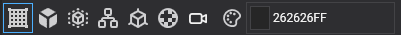

Assists with the model visualization. It has the following options:

| Item | Description |
| ---- | ----------- |
|  | Toggles the **Grid** visualization. |
|  /  | 
Toggles the visualization from **Solid** (default) to **Wireframe**. 
 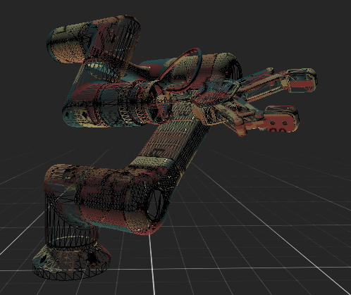 |
| 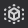 | 
Toggles the **Bounding box** visualization of the model.
 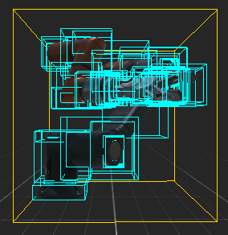 |
| 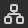 | 
Toggles the **Hierarchy** visualization of the model.
 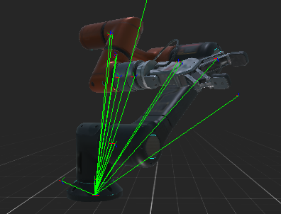 |
|  | 
Toggles the **Normals** visualization of the vertices.
 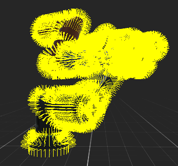 |
| 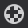 | 
Toggles the **UV checker** visualization of the model.
 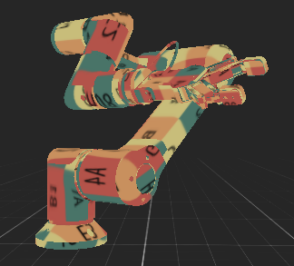 |
|  | Resets the camera position. |
| 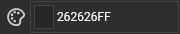 | Changes the background color. |

## Playback Controls

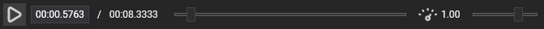

If the model has animations, the *Playback Toolbar* allows playing the selected clip.

| Control | Description |
| ---- | ----------- |
| 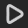 /  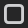 | Plays / Stops the current clip animations. |
| 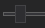 | The timeline slider. The handle will mark the current time in the animation, and its position can be modified. |
| 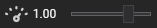 | Controls the **Speed Factor** of the reproduction. The default is **1.00**. |

## Properties
The import settings of the model, shared by every profile:

| Property | Description |
|----------|-------------|
| **Swap Winding Order** | Reverses the winding of every triangle, which flips which side faces outwards. Use it when a model shows its inside, as happens with some exporters. Off by default. |
| **Generate Tangent Space** | Generates tangents for every vertex, which normal maps need. On by default. |
| **Export Animations** | Exports the animation clips of the model. On by default. |
| **Export As Raw** | Exports the source file (for example the `.fbx`) as is, instead of converting it to an Evergine asset. |

## Animation Clip Properties
For every animation contained in the model, the following information will be shown:

| Property | Description |
|----------|-------------|
| Index | The animation order. |
| Name | The name of the clip. This string will be used in the **Animation3D** when we want to play the animation. |
| Duration | Timestamp of the duration.