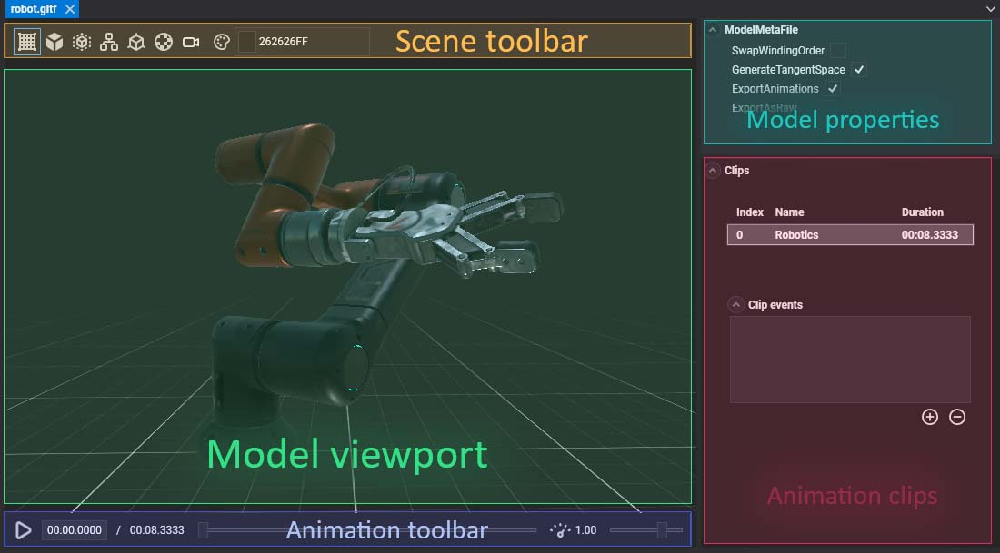

# Model Editor

The **Model Editor** allows the editing of model assets. Double-clicking a **Model** asset shown in [Assets Details](../../evergine_studio/interface.md) will open this editor. The editor is composed of five main parts:

## Viewport
Shows the **Model** with the current configuration. If the model is animated, it will show the current animation state on the *animation toolbar*.

## Toolbar

Assists with the model visualization. It has the following options:

| Item | Description |
| ---- | ----------- |
|  | Toggles the **Grid** visualization. |
|  /  | 
Toggles the visualization from **Solid** (default) to **Wireframe**. 
  |
|  | 
Toggles the **Bounding box** visualization of the model.
  |
|  | 
Toggles the **Hierarchy** visualization of the model.
  |
|  | 
Toggles the **Normals** visualization of the vertices.
  |
|  | 
Toggles the **UV checker** visualization of the model.
  |
|  | Resets the camera position. |
|  | Changes the background color. |

## Playback Controls

If the model has animations, the *Playback Toolbar* allows playing the selected clip.

| Control | Description |
| ---- | ----------- |
|  /   | Plays / Stops the current clip animations. |
|  | The timeline slider. The handle will mark the current time in the animation, and its position can be modified. |
|  | Controls the **Speed Factor** of the reproduction. The default is **1.00**. |

## Properties
Panel with all the **Model** properties. They don't depend on the profile.

| Property | Description |
|----------|-------------|
| **Swap Swinding Order** | Flips the normals of the model when activated. |
| **Generate Tangent Space** | When checked, generates the tangent coordinates of every vertex. Useful when dealing with normal mapping. |
| **Export Animations** | For exporting the animation information of the model. |
| **Export As Raw** | Will export the model as the source file (e.g., `.fbx`), instead of creating a binary **Evergine** asset.

## Animation Clip Properties
For every animation contained in the model, the following information will be shown:

| Property | Description |
|----------|-------------|
| Index | The animation order. |
| Name | The name of the clip. This string will be used in the **Animation3D** when we want to play the animation. |
| Duration | Timestamp of the duration.