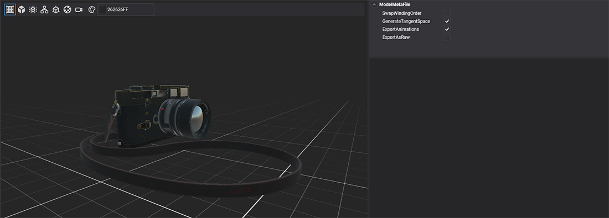
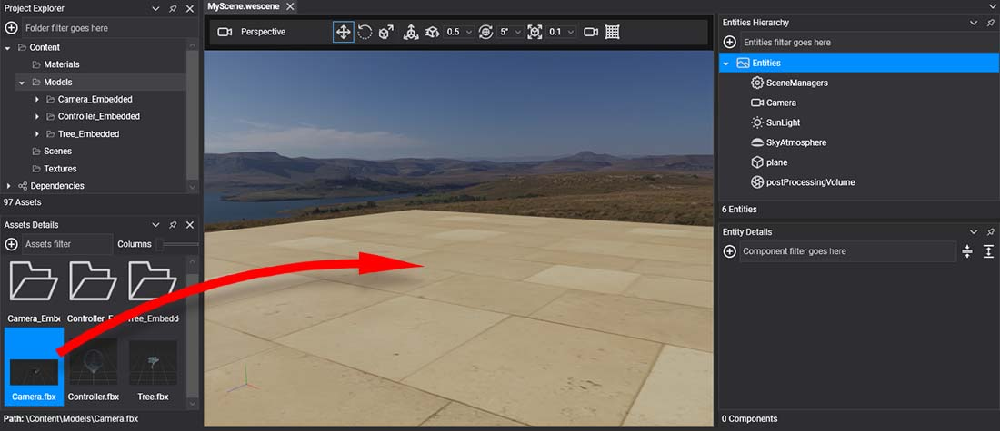
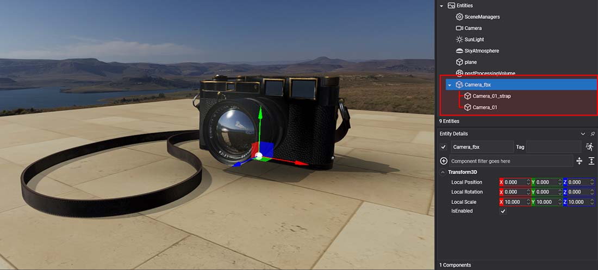

# Using Models

---



A **model** asset becomes part of a scene when it is instantiated as a hierarchy of entities. This page shows how to do it in Evergine Studio and from code, and what the resulting entities contain.

## Add a model in Evergine Studio

Drag the model asset from the **Assets Details** panel into the scene viewport or the **Entities Hierarchy**.



Evergine Studio creates one entity per node of the model:



| Node type | Components |
| --- | --- |
| **Root** | The root entity of the hierarchy. If the model has animations it gets an `Animation3D` component, and if it has levels of detail, a `LODGroup`. |
| **Node** | A node without geometry: a `Transform3D` with the node's position, orientation and scale. |
| **Mesh** | A node with geometry: `MeshComponent` (which mesh container of the model to show), one `MaterialComponent` per material the mesh uses, and `MeshRenderer`. |
| **Skin** | A skinned or morphed mesh. It has the same components as a mesh node, with `SkinnedMeshRenderer` in place of `MeshRenderer`. |

The hierarchy mirrors the node structure described in [Models](index.md).

## Load a model from code

`Model.InstantiateModelHierarchy` builds the same hierarchy from code. Load the asset through the `AssetsService`, instantiate it and add the root entity to the scene:

```csharp
using Evergine.Framework;
using Evergine.Framework.Graphics;
using Evergine.Framework.Services;

public class MyScene : Scene
{
    protected override void CreateScene()
    {
        var assetsService = Application.Current.Container.Resolve<AssetsService>();

        Model cameraModel = assetsService.Load<Model>(EvergineContent.Models.Camera_fbx);

        // The name is optional; without it the root entity gets a generated name.
        Entity camera = cameraModel.InstantiateModelHierarchy("coolCamera", assetsService);

        this.Managers.EntityManager.Add(camera);
    }
}
```

> [!TIP]
> `InstantiateModelHierarchy` creates new entities every time you call it, while the model data (meshes and buffers) is shared. Instantiating the same model many times is cheap in memory.
