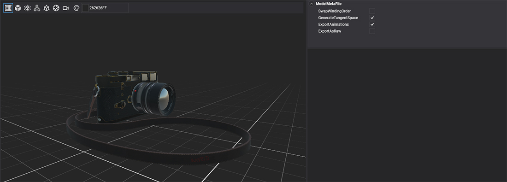

# Using Models



In this document, you will learn how to load and use **Models** in your applications.

## Load Model from Code
The following sample code can be used to instantiate an existing **Model** asset (`camera.fbx` in this case) into your scene, creating an entity hierarchy.

```csharp
protected override void CreateScene()
{
    var assetsService = Application.Current.Container.Resolve<AssetsService>();

    // Load Model assets
    Model cameraModel = assetsService.Load<Model>(EvergineContent.Models.Camera_fbx);

    // Apply to an entity
    Entity camera = cameraModel.InstantiateModelHierarchy(assetsService);

    // Alternatively, this method accepts the name of the root entity.
    Entity camera = cameraModel.InstantiateModelHierarchy("coolCamera", assetsService);

    // Add the entity into the scene.
    this.Managers.EntityManager.Add(camera);
}
```

## How to Create Models from Evergine Studio

To instantiate a **Model** into a **Scene**, simply drag the model asset from the *Asset Details Panel* into your **Scene**.


This will instantiate a full hierarchy of entities into the **Scene**.


The newly created hierarchy contains the following types of entities:

| Node Type | Description |
| --------- | --------------- |
| **Root**  | The root node of the hierarchy. If the model contains animation, this entity will contain the **Animation3D** component. |
| **Node**  | Nodes without geometry attached. They are empty entities with just a **Transform3D** with the specific position, scale, and orientation. |
| **Mesh**  | <div><p>Node that contains geometry. It includes the following components: <li>**MeshComponent**, specifying which mesh from the model will be shown.</li><li>**MaterialComponent**. For every different material from the entity mesh, a component will be created.</li><li>**MeshRenderer** for rendering the geometry.</li></div> |
| **Skin**  | If the node contains a skinned mesh, it will have the same components as a normal *Mesh* node but will use the **SkinnedMeshRenderer** component instead. |

As you can see, this entity hierarchy mirrors the inner **Model** asset structure seen [here](index.md).