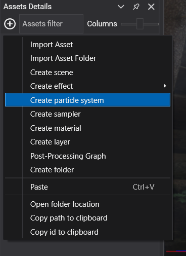
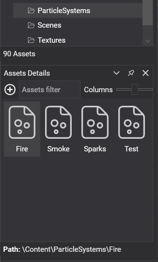
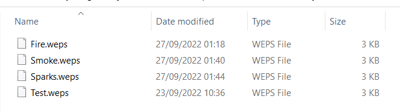

# Create Particle Systems

---


A particle system simulates and renders large numbers of small textured quads, the particles, for effects such as fire, smoke, sparks or magic.

## Create a Particle System asset in Evergine Studio
Click the  button in the [Assets Details](../../evergine_studio/interface.md) panel and choose **Create particle system**.



### Inspect Particle Systems in Asset Details
You can find the particle system assets in the [**Assets Details**](../../evergine_studio/interface.md) panel when you select a folder in the [**Project Explorer**](../../evergine_studio/interface.md).



### Particle System files in content directory
The particle system file has the `.weps` extension.

 

## Create a new Particle System from code
This scene builds a particle system in code and adds it to an entity:

```csharp
using Evergine.Common.Graphics;
using Evergine.Framework;
using Evergine.Framework.Graphics;
using Evergine.Framework.Particles;
using Evergine.Framework.Particles.Asset;
using Evergine.Framework.Particles.Components;
using Evergine.Framework.Services;

public class MyScene : Scene
{
    protected override void CreateScene()
    {
        var assetsService = Application.Current.Container.Resolve<AssetsService>();
        var graphicsContext = Application.Current.Container.Resolve<GraphicsContext>();

        // The emitter description holds every property of the particle system editor.
        var emitterDesc = new ParticleEmitterDescription()
        {
            ParticleTexture = DefaultResourcesIDs.ParticleTextureID,
            ParticleSampler = DefaultResourcesIDs.LinearClampSamplerID,
            RenderLayer = DefaultResourcesIDs.AlphaRenderLayerID,

            MaxParticles = 1000,

            InitLife = 2,
            InitSpeed = 1,
            InitSize = 0.1f,
            InitColor = Color.Red,
        };

        var emitter = new ParticlesEmitter(emitterDesc, graphicsContext, assetsService);

        var particleSystem = new ParticleSystem();
        particleSystem.AddEmitter(emitter);

        Entity particles = new Entity("particles")
            .AddComponent(new Transform3D())
            .AddComponent(new ParticlesComponent() { ParticleSystem = particleSystem })
            .AddComponent(new ParticlesRenderer());

        this.Managers.EntityManager.Add(particles);
    }
}
```