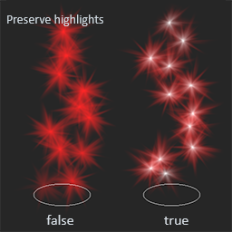
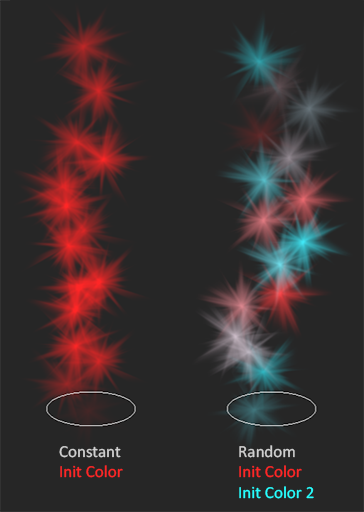
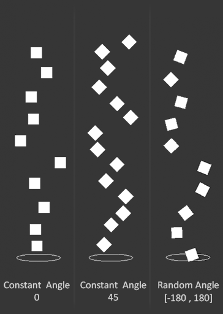

# Particle System Properties

A particle system has the following properties.

## Particles Material
Group that manages the properties related to the particle material.

|  Property      | Default value | Description   |
| ---- | ---- | ---- | 
| **Texture**  | _particle.png_            | The texture that will appear in each particle quad. |
| **Sampler State**  | _LinearClampSampler_            | The texture sampler state. |
| **RenderLayer**  | _Additive_            | The texture render layer. |

## General properties
Properties that control the basic aspects of the particle system.

|  Property      | Default value | Description   |
| ---- | ---- | ---- | 
| **Max Particles**  | _1000_ | The maximum number of particles the emitter can handle. The emission will be paused if it reaches this number. |
| **Gravity**  | _0_ | 

Sets the gravity of the particle system.
<li>Gravity value of 9.8</li><video autoplay loop muted width="480"><source src="images/gravity.mp4" type="video/mp4"></video>

| **Drag**  | _0_ | 

The amount of resistance the particle will encounter.
<li>Drag value of 0.</li><video autoplay loop muted width="480"><source src="images/drag_off.mp4" type="video/mp4"></video><li>Drag value of 2.</li><video autoplay loop muted width="480"><source src="images/drag_on.mp4" type="video/mp4"></video>
 |
| **Simulation Space**  | _World_ | 

Sets the simulation space of the particle. In **Local** space, the particle positions stay relative to its emitter transform. In **World** space, all coordinates are global.
<li>Simulation Space value of World.</li><video autoplay loop muted width="480"><source src="images/world_space.mp4" type="video/mp4"></video><li>Simulation Space value of Local.</li><video autoplay loop muted width="480"><source src="images/local_space.mp4" type="video/mp4"></video>
 |
| **Random Precision**  | _Medium_ | The precision of the random values generated, both in _GPU_ and _CPU_ simulations. **High** precision will randomize better but with a performance cost; **Low** precision will improve performance but produce less random values. **Medium** precision (_default value_) offers a good balance. |

### Life
The life configuration panel controls the particle's remaining lifetime when it's emitted.

| Property | Default value | Description |
|----------|--------------|-------------|
| Init Life mode | _Constant_ | Sets whether the lifetime of the particle is **Constant** (_Init Life_) or **RandomBetweenTwoConstants** (a random value between _Init Life_ and _Init Life2_). |
| Init Life | _5_ | The initial life of the particle. |
| Init Life 2 | _5_ | The second value of the initial life range.

The following video shows how different life parameters behave:

<video autoplay loop muted width="256">
    <source src="images/random_life.mp4" type="video/mp4">
</video>

### Color
The initial color configuration panel controls the particle color when it's emitted.

| Property | Default value | Description |
|----------|--------------|-------------|
| Init Color mode | _Constant_ | Sets whether the initial color is **Constant** (_Init Color_) or **RandomBetweenTwoConstants** (a random value between _Init Color_ and _Init Color2_). |
| Init Color | _White_ | The initial color of the particle. |
| Init Color 2 | _White_ | The second value of the initial color range. |
| Preserve Highlights | _false_ | If true, the tint effect of the initial color on the particle texture will decay when the texture color gets whiter.   |

The following image shows two examples of the initial color setting.

### Size
The initial size configuration panel controls the particle size when it's emitted.

| Property | Default value | Description |
|----------|--------------|-------------|
| Init Size mode | _Constant_ | Sets whether the initial size is **Constant** (_Init Size_) or **RandomBetweenTwoConstants** (a random value between _Init Size_ and _Init Size 2_). |
| Init Size | _0.1_ | The initial size of the particle. |
| Init Size 2 | _0.1_ | The second value of the initial size range.

The following image shows two examples of the initial size setting.

### Speed
The initial speed configuration panel controls the particle speed magnitude (in space units per second) when it's emitted. The initial **Velocity** of the particle will be the initial direction vector multiplied by the **Speed** of the particle.

| Property | Default value | Description |
|----------|--------------|-------------|
| Init Speed mode | _Constant_ | Sets whether the initial speed is **Constant** (_Init Speed_) or **RandomBetweenTwoConstants** (a random value between _Init Speed_ and _Init Speed 2_). |
| Init Speed | _0.1_ | The initial speed of the particle. |
| Init Speed 2 | _0.1_ | The second value of the initial speed range.

The following video shows how different speed parameters behave:

<video autoplay loop muted width="256">
    <source src="images/random_speed.mp4" type="video/mp4">
</video>

### Angle
The initial angle configuration panel controls the particle quad angle when it's emitted.

| Property | Default value | Description |
|----------|--------------|-------------|
| Init Angle mode | _Constant_ | Sets whether the initial angle is **Constant** (_Init Angle_) or **RandomBetweenTwoConstants** (a random value between _Init Angle_ and _Init Angle 2_). |
| Init Angle | _0_ | The initial angle of the particle in degrees. |
| Init Angle 2 | _0_ | The second value of the initial angle range in degrees.

The following image shows three examples of the initial angle setting.

### Angular Speed
The angular speed configuration panel controls the particle rotation speed when it's emitted. The quad will spin facing the camera with this angular speed.

| Property | Default value | Description |
|----------|--------------|-------------|
| Init Angular Speed mode | _Constant_ | Sets whether the initial angular speed is **Constant** (_Init Angular Speed_) or **RandomBetweenTwoConstants** (a random value between _Init Angular Speed_ and _Init Angular Speed 2_). |
| Init Angular Speed | _0_ | The initial angular speed of the particle. |
| Init Angular Speed 2 | _0_ | The second value of the initial angular speed range. |

The following video shows a random angular speed of **[-180, 180]**.

<video autoplay loop muted width="128">
    <source src="images/angular_speed.mp4" type="video/mp4">
</video>

## Shapes
The *Shape* group defines all the properties to manage the volume or surface where the particles can be emitted.

|  Property      | Default value | Description   |
| ---- | ---- | ---- | 
| **Shape type**  | _Point_ | 
_Enum_ that contains all the shape emitter types. Currently, the options are:
<li>Point</li><li>Sphere</li><li>Box</li><li>Circle</li><li>Entity</li><li>Edge</li>|

More information about these shapes here: [Particle Shapes](particle_shapes.md).

## Spawn 
The *Spawn* property defines when and how many particles are emitted.

|  Property      | Default value | Description   |
| ---- | ---- | ---- | 
| **Spawn type**  | _Rate_ | 
_Enum_ that contains all the spawn emitter types. Currently, the options are:
<li>Rate</li><li>Burst</li><li>Distance</li> |

More information about the spawn management here: [Particle Spawn](particle_spawn.md).

## Color Over Life
These properties manage how the particle color changes over its life.
In a future **Evergine** version, we will implement a proper _Gradient Color_ editor, but in the meantime, we've defined the color over the life of the particle using the following properties according to this diagram:

> [!Note]
> The color of the gradient is applied as a tint over the initial color of the particle.

| Property | Default value | Description |
|----------|--------------|-------------|
| Color Animated | _false_ | Sets whether the particle color is animated throughout its lifetime. |
| Color Over Life 1 | _Transparent_ | Color of the **first** point of the animation. |
| Color Over Life 2 | _White_ | Color of the **second** point of the animation. |
| Color Over Life 3 | _White_ | Color of the **third** point of the animation. |
| Color Over Life 4 | _Transparent_ | Color of the **fourth** point of the animation. |
| Color Over Life 2 Position | _0.2_ | Position in the curve of the **second** point of the animation. Must be in the range _[0, 1]_. |
| Color Over Life 3 Position | _0.8_ | Position in the curve of the **third** point of the animation. Must be in the range _[0, 1]_. |

The following video shows a particle system using the color gradient previously seen.

<video autoplay loop muted width="320">
    <source src="images/color_over_life.mp4" type="video/mp4">
</video>

## Size Over Life
These properties control how the particles change their size over their lifetime.
In a future **Evergine** version, we will implement a proper _Curve Editor_, but in the meantime, we've defined the size over life of the particle using the following properties according to this diagram:

> [!Note]
> The size of the curve is applied as a multiplier over the initial size of the particle.

| Property | Default value | Description |
|----------|--------------|-------------|
| Size Animated | _false_ | Sets whether the particle size is animated throughout its lifetime. |
| Size Over Life 1 | _0_ | Size multiplier of the **first** point of the animation. |
| Size Over Life 2 | _1_ | Size multiplier of the **second** point of the animation. |
| Size Over Life 3 | _1_ | Size multiplier of the **third** point of the animation. |
| Size Over Life 4 | _0_ | Size multiplier of the **fourth** point of the animation. |
| Size Over Life 2 Position | _0.2_ | Position in the curve of the **second** point of the animation. Must be in the range _[0, 1]_. |
| Size Over Life 3 Position | _0.8_ | Position in the curve of the **third** point of the animation. Must be in the range _[0, 1]_. |

The following video shows a particle system using the size curve previously seen.

<video autoplay loop muted width="320">
    <source src="images/size_over_life_view.mp4" type="video/mp4">
</video>

## Noise
The noise panel allows the application of a turbulence field into the particle system. All the properties of this panel are used to control the parameters of that field.

| Property | Default value | Description |
|----------|--------------|-------------|
| Noise Enabled  | _false_ | Sets whether the particle system is affected by the noise field. |
| Noise Strength | _1_ | How much the particles are affected by the noise field. A larger value will generate more chaos! |
| Noise Size | _1_ | The scale of the noise field. Large values cause more wavy noise; small values will change the behavior among close particles. |
| Noise Frequency | _1_ | Represents the period at which the noise data is sampled. |
| Noise Speed | _(1, 1, 1)_ | The velocity vector at which the noise field is moving. |

The following video shows a particle system affected by noise _(Strength 1, Size 10, Frequency 1, Speed (0, -1, 0))_.

<video autoplay loop muted width="320">
    <source src="images/noise_view.mp4" type="video/mp4">
</video>

## Forces
This panel allows the particle system to be affected by forces and to tune which ones can affect them.

The different available forces are explained in [this article](particle_forces.md).

| Property | Default value | Description |
|----------|--------------|-------------|
| Forces Enabled  | _false_ | Sets whether the particle system is affected by the forces. |
| Forces Category | _All_ | The particle system is only affected by forces with the same _Forces Category_ property. |

The following video shows a particle system affected by a **Point Attractor Force**.

<video autoplay loop muted width="480">
    <source src="images/forces.mp4" type="video/mp4">
</video>