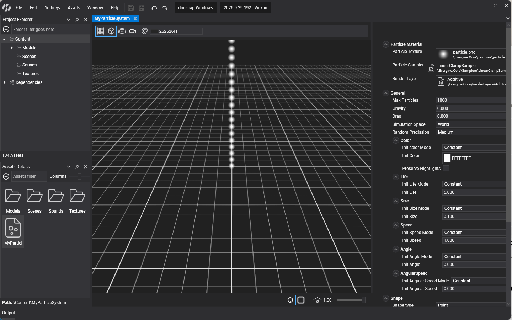
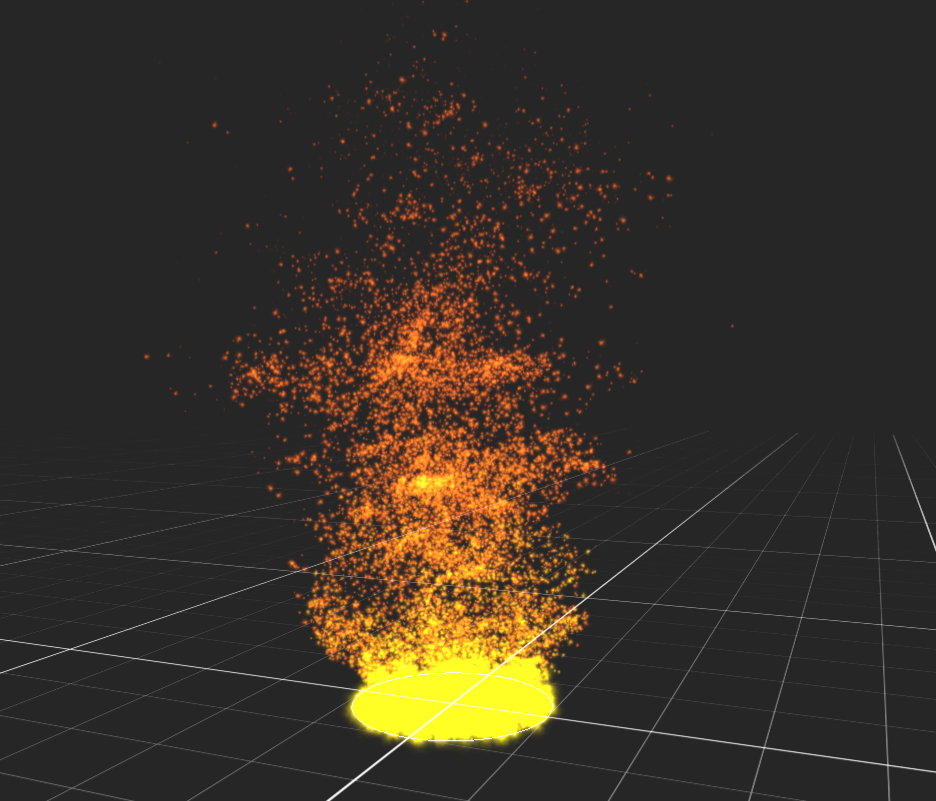
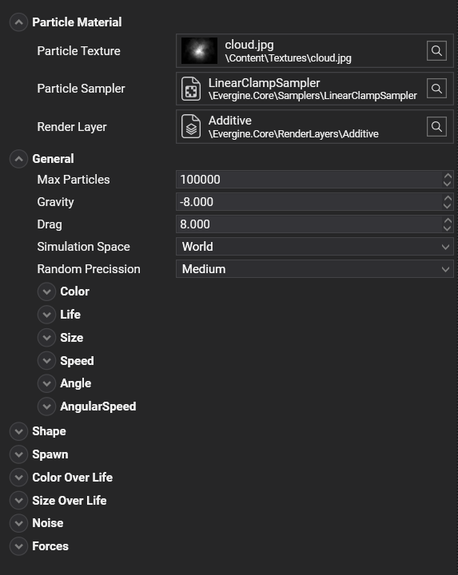

# Particle System Editor

---

The **Particle System Editor** allows the editing of particle system assets. Double-clicking on a **Particle System** asset shown in [Assets Details](../../evergine_studio/interface.md) will open this editor. The editor is composed of 4 main parts:

## Viewport
Shows the **Particle System** with the current configuration. The user can orbit, zoom, and pan the camera.

| Actions | Description |
|---------| ----------- |
| Left mouse button | Rotates the camera around the particle system. |
| Right mouse button | Rotates two lights around the particle system. |
| Mouse wheel | Zooms the camera in/out. |

## Toolbar

Controls what the viewport shows:

| Item | Description |
| ---- | ----------- |
|  | Toggles the **Grid** visualization. |
|  | Toggles the **Emitter shape gizmo** visualization. |
|  | Forces particle simulation to use the **CPU** instead of the **GPU** when this option is activated, even if GPU particles are available. |
|  | Resets the camera position. |
|  | Changes the background color. |

## Playback Controls

This bar controls some aspects of the particle simulation life.

| Control | Description |
| ---- | ----------- |
|  | Resets the particle system. |
|  /  | Starts or stops the emission. |
|  | Controls the **Time Factor** of the particle system, similar to the **Particles Component** property. |

## Particle Properties
A panel with all the **Particle System** properties. These properties do not depend on the profile.

