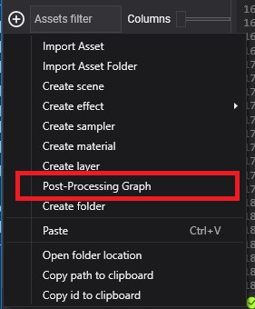
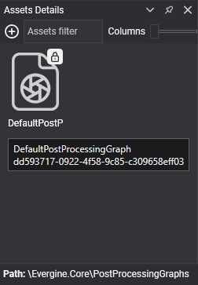
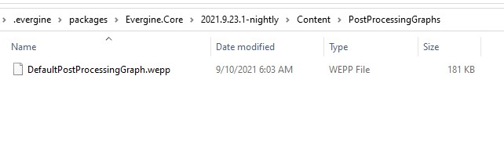

# Create a Post-Processing Graph

---

A post-processing graph is an asset: a set of connected nodes, each a compute [effect](../effects/index.md), that turns the rendered image into the final one. Create your own when the [default graph](default_postprocessing_graph/index.md) does not have the effect you need, or to keep only the effects you use.

## Create a post-processing graph asset in Evergine Studio

Click the  button in the [Assets Details](../../evergine_studio/interface.md) panel and choose **Post-Processing Graph**.

### Post-processing graphs in Assets Details

Post-processing graph assets appear in the [**Assets Details**](../../evergine_studio/interface.md) panel when you select their folder in the [**Project Explorer**](../../evergine_studio/interface.md). Double-click one to open the [Post-Processing Graph Editor](postprocessing_graph_editor.md).

### Post-processing graph files in the Content folder

A post-processing graph is stored in a file with the `.wepp` extension.

