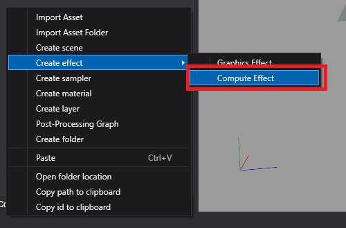
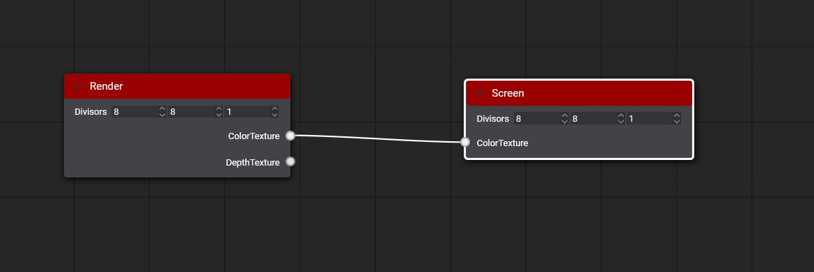
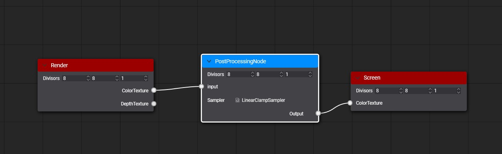
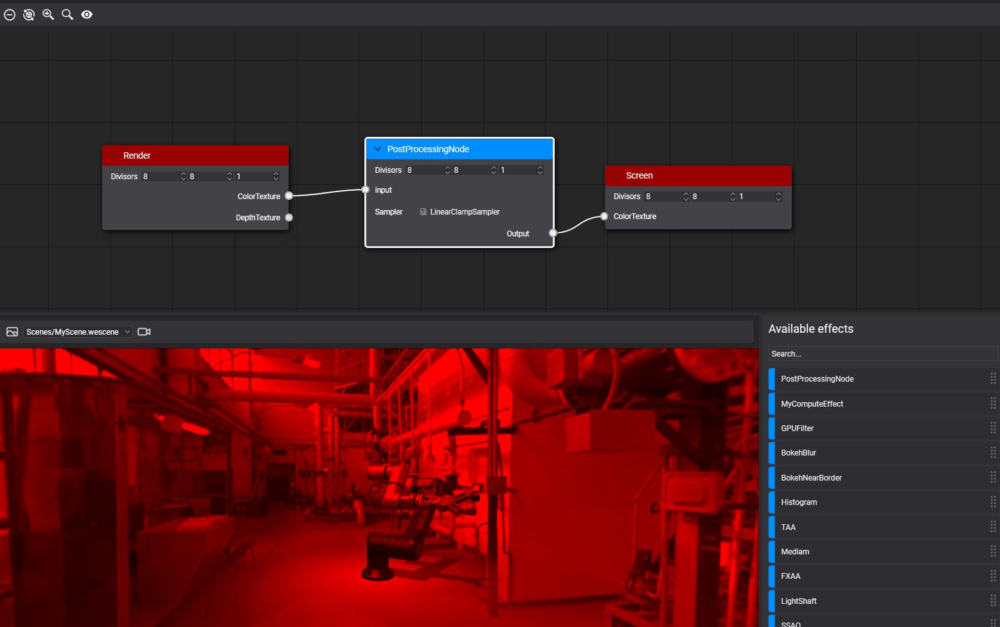
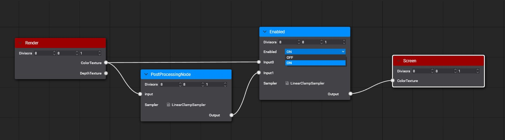

# Custom Post-Processing Graph

---

This page walks through building a post-processing graph of your own, with a new effect that the default graph does not have, and explains the special nodes, tags and decorators custom graphs use.

## Example

The example builds a simple filter that keeps only the red channel of the image.

First, create a compute effect from the [**Assets Details panel**](../../evergine_studio/interface.md):



Write the filter in the [**Effect Editor**](../effects/effect_editor.md):

```hlsl
[Begin_ResourceLayout]

    Texture2D input : register(t0);
    RWTexture2D<float4> Output : register(u0);

    SamplerState Sampler : register(s0);

[End_ResourceLayout]

[Begin_Pass:Default]

    [Profile 11_0]
    [Entrypoints CS = CS]

    [numthreads(8, 8, 1)]
    void CS(uint3 threadID : SV_DispatchThreadID)
    {
        float2 outputSize;
        Output.GetDimensions(outputSize.x, outputSize.y);
        float2 uv = (threadID.xy + 0.5) / outputSize;		

        float4 color = input.SampleLevel(Sampler, uv, 0);

        Output[threadID.xy] = float4(color.x, 0, 0, 1);	
    }

[End_Pass]
```

Create a new Postprocessing graph asset from the [**Assets Details panel**](../../evergine_studio/interface.md):


After creating the postprocessing graph asset, double-click on the asset to open the Postprocessing Graph Editor. You will see an empty postprocessing graph where the render node connects directly with the Screen node.



Drag our compute effect from the Available Effects panel to the graph editor to create a new node. Then connect the render node's _Color texture_ port with the Custom node's _Input_ port and the Custom node's _Output_ port with the Screen node's _Color Texture_ port.



After saving the graph, you can see the result in the viewport panel.



To use your custom postprocessing graph in your scene, read more details in the [using postprocessing graph section](using_postprocessing_graphs.md).

## Special Nodes

The **Enabled** node switches an effect on and off without editing the graph. Connect `Input0` to the image without the effect and `Input1` to the image with it; the node's `Enabled` parameter selects which one reaches its output. Before running the graph, Evergine discards the branch that is not selected, so a disabled effect costs nothing. The default graph wraps every effect in one. Here it is added to the example:



## Output metatags

The graph creates the texture each node writes to. By default it copies the size and format of the node's first input texture. An `[Output(...)]` tag after a `RWTexture` in the compute effect sets the size and format instead (see [Effect Metatags](../effects/effect_metatags.md#output-textures)).

**Output Overloading**

`[Output(ReferencedInput)]`

`[Output(ReferencedInput, ScaleFactor)]`

`[Output(ReferencedInput, ScaleFactor, PixelFormat)]`

`[Output(Width, Height, PixelFormat)]`

The metatag parameters are:

| Parameter         | Description                                                                                  |
| ----------------- | -------------------------------------------------------------------------------------------- |
| **ReferencedInput** | Input name used to get width, height, and pixel format of the output texture.                |
| **ScaleFactor**     | Defines the scale factor applied to the width and height of the ReferencedInput to get the output width and height dimensions. |
| **PixelFormat**     | Defines the pixel format of the output texture.                                              |
| **Width**           | Defines the width dimension of the output texture.                                           |
| **Height**          | Defines the height dimension of the output texture.                                          |

### Example
In the following example, the `Depth` input texture is 1920x1080 with the `D24_UNorm_S8_UInt` format.

```hlsl
Texture2D<float> Depth : register(t0);

RWTexture2D<float4> PositionOutput : register(u0);   [Output(Depth, 1, R16G16B16A16_Float)]
RWTexture2D<float2> VelocityOutput : register(u1);   [Output(Depth, 0.5, R16G16_Float)]
RWTexture2D<float> LinealDepthOutput : register(u2); [Output(500, 500, R32_Float)]
```

The result of the resolved output tags will be:

| Output Texture     | Dimensions | Pixel Format            |
| ------------------ | ---------- | ----------------------- |
| PositionOutput     | 1920x1080  | R16G16B16A16_Float       |
| VelocityOutput     | 960x540    | R16G16_Float             |
| LinealDepthOutput  | 500x500    | R32_Float                |

## Post-processing graph decorator

By default, the `PostProcessingGraphRenderer` component lists every input of every node in the graph. A **decorator** replaces that list with a panel designed for the graph, the way the default graph shows one section per effect.

A decorator is a class in the `.Editor` project of your solution that derives from `PostProcessingGraphDecorator`, carries the `PostProcessingGraphDecorator` attribute with the id of the graph asset, and builds its panel in `GenerateUI`. This one exposes the switch of the example's **Enabled** node:

```csharp
using System.Linq;
using Evergine.Editor.Extension;
using Evergine.Framework.Graphics;

// The id of the .wepp asset this decorator applies to.
[PostProcessingGraphDecorator("2f7a4c0e-8a0e-4b8e-9d6b-3c1f5e6a7b8c")]
public class RedFilterGraphDecorator : PostProcessingGraphDecorator
{
    public RedFilterGraphDecorator(PostProcessingGraphDescription graphDesc)
        : base(graphDesc)
    {
    }

    public override void GenerateUI(IPanelPropertyContainer panel)
    {
        var enabledNode = this.graphDesc.Nodes.First(n => n.Name == "Enabled");
        var enabled = enabledNode.Inputs[0].Type as PostProcessingNodePortDirectiveType;

        // The directive's first value is "off" and its second "on".
        var off = enabled.Directives[0];
        var on = enabled.Directives[1];

        var redFilter = panel.AddSubPanel("RedFilter", "Red filter").Properties;
        redFilter.AddBoolean(
            "RedFilterEnabled",
            "Enabled",
            enabled.Value == on,
            getValue: () => enabled.Value == on,
            setValue: (value) => enabled.Value = value ? on : off);
    }
}
```

Replace the GUID with the id of your graph, which you can copy from its `.wepp` file.
