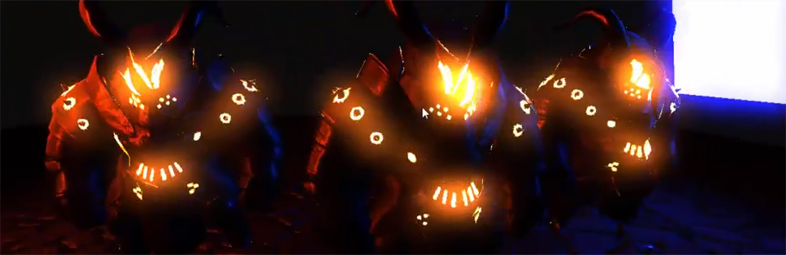
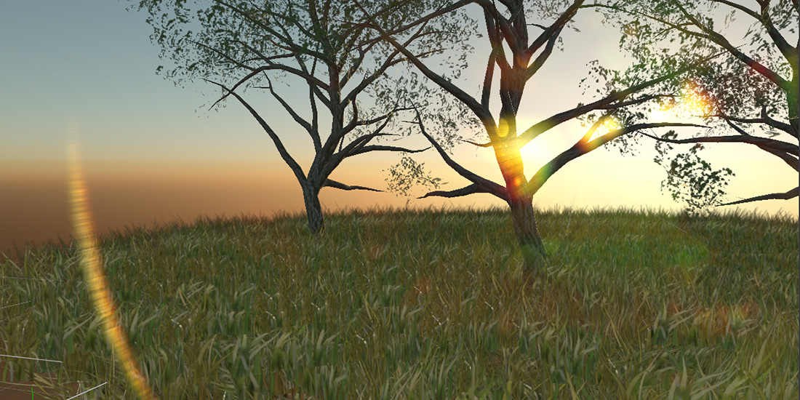

# Bloom, Dirt, Light Shaft and Lens Flare

---

These four effects share the same first steps: the image is downsampled and its brightest areas are extracted and blurred. They are computed together and combined in one node, so they are grouped under **Bloom** in the default graph. Dirt, light shafts and lens flare only appear when bloom is enabled.

## Bloom

**Bloom** spreads light from bright areas into their surroundings, the glow a real lens and eye produce around intense light. It works best with HDR rendering, where bright pixels can go well above 1.

| Parameter | Default | Description |
| --- | --- | --- |
| **Enabled** | On | Turns bloom and the effects below on. |
| **Threshold** | 2 | Luminance above which pixels bloom. With HDR, values above 1 keep ordinary surfaces from glowing. |
| **Color Intensity** | 1 | Brightness of the original image in the blend, from 0 to 1. |
| **Intensity** | 1 | Brightness of the bloom in the blend, from 0 to 1. |

## Dirt

**Dirt** simulates a dirty lens: smudges and dust that light up where bright light passes through them.

| Parameter | Default | Description |
| --- | --- | --- |
| **Enabled** | On | Turns the effect on. |
| **Texture** | `LensDirt00` of Evergine.Core | Texture with the dirt pattern. |
| **Intensity** | 0.5 | Strength of the dirt, from 0 to 1. |

## Light Shaft

**Light shafts**, also called god rays, are beams of light streaming from a bright sky past the objects in front of it.

| Parameter | Default | Description |
| --- | --- | --- |
| **Enabled** | Off | Turns the effect on. |
| **Min. Threshold** | 0.1 | Lowest luminance of the sky that produces shafts. |
| **Max. Threshold** | 0.4 | Luminance at which shafts reach full strength. |
| **Scale** | 0.05 | Length of the shafts. |
| **Intensity** | 1 | Strength of the shafts, from 0 to 1. |

## Lens Flare

A **lens flare** is the set of ghosts and halos light produces as it bounces between the elements of a camera lens.

| Parameter | Default | Description |
| --- | --- | --- |
| **Enabled** | Off | Turns the effect on. |
| **Ghost Count** | 8 | Number of ghost images, from 0 to 32. |
| **Ghost Spacing** | 0.3 | Distance between ghosts. |
| **Ghost Threshold** | 12 | Luminance above which pixels produce ghosts. |
| **Ghost Chro. Aberration** | 0.002 | Color separation of the ghosts. |
| **Halo Radius** | 0.5 | Radius of the halo ring. |
| **Halo Thickness** | 0.05 | Thickness of the halo ring. |
| **Halo Threshold** | 20 | Luminance above which pixels produce the halo. |
| **Halo Chro. Aberration** | 0.002 | Color separation of the halo. |
| **Intensity** | 1 | Strength of the flare, from 0 to 1. |
