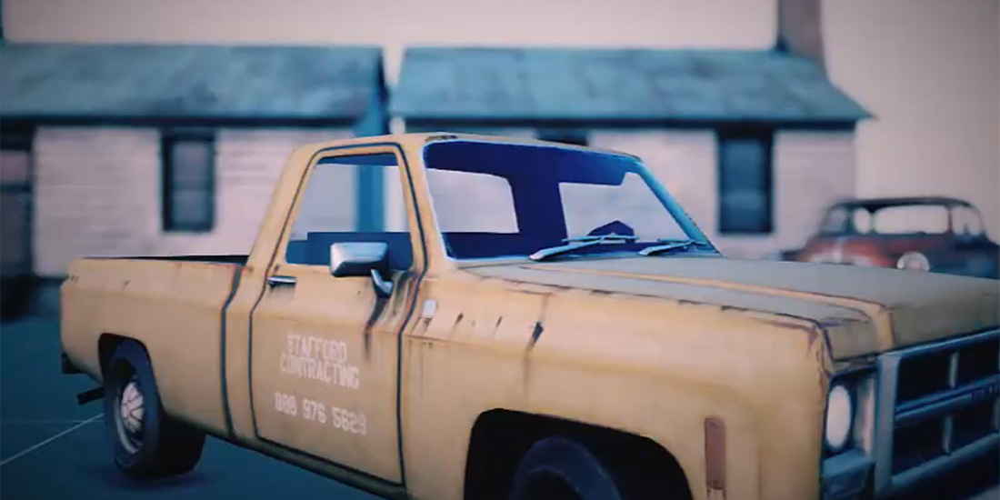

# Depth of Field (DoF)

---

**Depth of Field** blurs what is out of focus, like a real lens. The camera's **FocalDistance** sets the distance in focus, and its **Aperture** sets how quickly the blur grows away from it. Out-of-focus highlights spread into shapes called *bokeh*, which reproduce the shape of the lens aperture.

> [!TIP]
> The focus distance and the aperture are [camera](../../cameras.md#physical-camera) properties, so each camera can focus differently.

## Parameters

| Parameter | Default | Description |
| --- | --- | --- |
| **Enabled** | Off | Turns the effect on. |
| **Debug Mode** | Off | Colors the near out-of-focus area red, the area in focus green and the far out-of-focus area blue. |
| **Focal Region** | 0.3 | Depth of the region around the focus distance that stays sharp. |
| **Bokeh Shape** | `Circle` | Shape of the bokeh: `Circle`, `Pentagon`, `Hexagon` or `Heptagon`. |
| **Bokeh Size** | 10 | Size of the bokeh shapes. |
| **Bokeh Rotation** | 0 | Rotation of the bokeh shapes, in degrees. |
| **Near Fade Power** | 0.94 | How softly the blurred foreground fades over the sharp area. |
