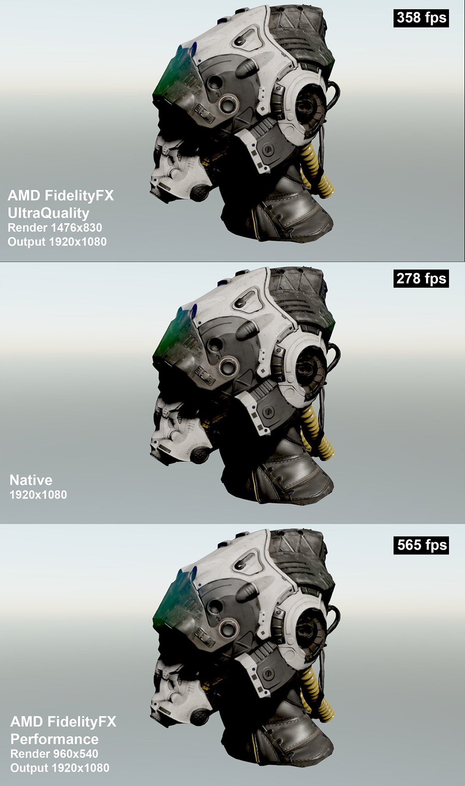

# FidelityFX Super Resolution (FSR)

---

**AMD FidelityFX Super Resolution** renders the scene at a lower resolution and upscales it to the output resolution with an edge-aware filter, then sharpens it. Rendering fewer pixels can raise the frame rate considerably, particularly in scenes limited by pixel shading, and the upscaled image looks much closer to native resolution than a plain stretch. See [AMD FidelityFX Super Resolution](https://gpuopen.com/fidelityfx-superresolution/) for details of the technique.

In the default graph, FSR renders at half the output width and height and upscales by 2x, so the scene is rendered with a quarter of the pixels. When the graph contains an FSR node, the camera renders into a lower-resolution intermediate buffer automatically; the scale comes from the `ScaleFactor` of the node's output.

## Parameters

| Parameter | Default | Description |
| --- | --- | --- |
| **Enabled** | Off | Turns the effect on. |

> [!TIP]
> Keep [Sharpen](sharpen.md) enabled with FSR to recover the detail lost in upscaling. To use a different scale, copy the default graph and change the scale factor of the FSR node's output in the [Post-Processing Graph Editor](../postprocessing_graph_editor.md).
