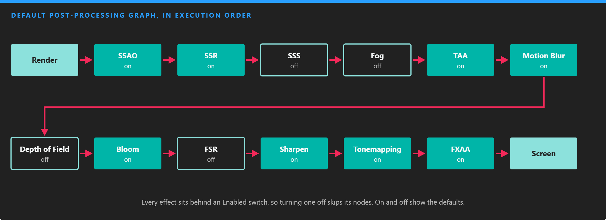
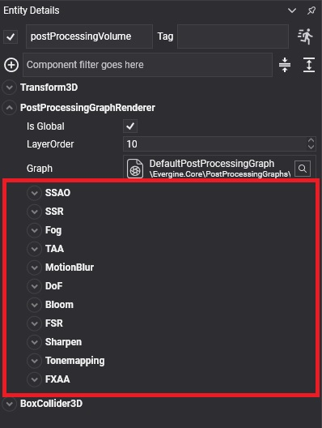

# Default Post-Processing Graph

---

The [Evergine.Core package](../../evergine_core.md) includes the **default post-processing graph**, which chains the most common effects in the order that gives correct results. Every effect sits behind an **Enabled** node, so you can turn it on or off without editing the graph, and the nodes of disabled effects are skipped.

*Effects that work in linear HDR color (ambient occlusion, reflections, fog, anti-aliasing, blur and bloom) run before tone mapping; FXAA runs last, on the final LDR image.*

## Effects

| Effect | Enabled by default | What it does |
| --- | --- | --- |
| [Screen Space Ambient Occlusion](screen_space_ambient_occlusion.md) | Yes | Darkens creases and contact areas. |
| [Screen Space Reflections](screen_space_reflection.md) | Yes | Adds reflections of what is on screen. |
| [Subsurface Scattering](subsurface_scattering.md) | No | Softens light through skin and other translucent materials. |
| [Fog](fog.md) | No | Distance and height fog. |
| [Temporal Anti-Aliasing](temporal_anti_aliasing.md) | Yes | Smooths edges using previous frames. |
| [Motion Blur](motion_blur.md) | Yes | Blurs the image along the camera's motion. |
| [Depth of Field](depth_of_field.md) | No | Blurs what is out of focus. |
| [Bloom, Dirt, Light Shaft and Lens Flare](bloom.md) | Bloom and dirt | Glow and lens artifacts around bright areas. |
| [FidelityFX Super Resolution](fidelity_super_resolution.md) | No | Renders at lower resolution and upscales. |
| [Sharpen](sharpen.md) | Yes | Restores detail softened by TAA or upscaling. |
| [Tone Mapping and friends](tonemapping.md) | Tone mapping | Maps HDR to the display, plus chromatic aberration, grain, vignette and distortion. |
| [Fast Approximate Anti-Aliasing](anti-aliasing.md) | Yes | Smooths edges in a single pass. |

## Configure it in Evergine Studio

Select the post-processing volume in the scene. The `PostProcessingGraphRenderer` component shows the default graph as one panel per effect, with its switch and its parameters:

<!-- CAPTURE: images/default_graph_volume.png; the Entity Details panel of a post-processing volume using the default graph, with the SSAO and Bloom panels expanded -->

> [!NOTE]
> The panels in the component are generated by a graph decorator for the default graph. A graph of your own shows its node parameters instead, unless you write a decorator for it; see [Custom Post-Processing Graph](../custom_postprocessing_graph.md#post-processing-graph-decorator).
