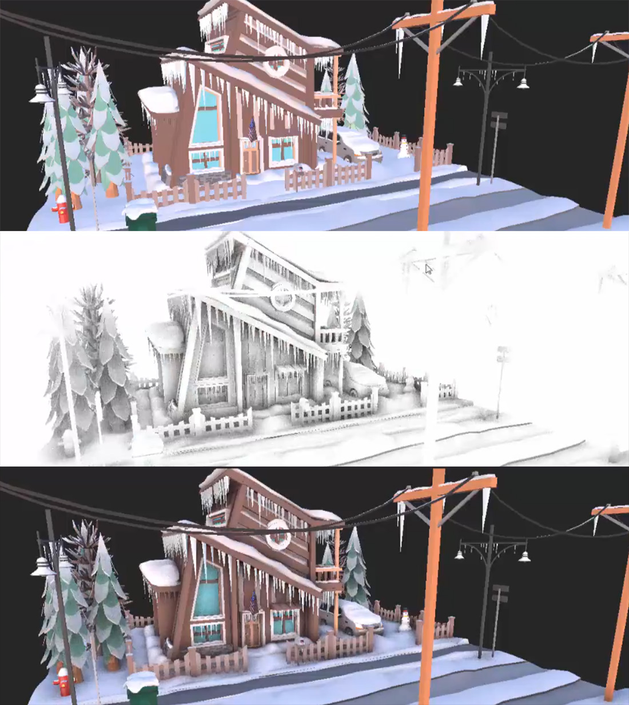

# Screen Space Ambient Occlusion (SSAO)

---

*From left to right: the render alone, the occlusion term SSAO computes, and the two blended.*

**Screen Space Ambient Occlusion** darkens the places ambient light has trouble reaching: creases, corners, and where objects touch. It estimates occlusion from the depth buffer, testing a set of sample points around each pixel for nearby geometry. The more samples that land inside geometry, the darker the pixel.

SSAO reads the normals of the GBuffer pass. Because it only knows what is on screen, it cannot see occluders that are hidden or outside the view, and its effect fades at the screen edges.

## Parameters

| Parameter | Default | Description |
| --- | --- | --- |
| **Enabled** | On | Turns the effect on. |
| **SPP** | 16 | Samples per pixel. More samples give smoother occlusion at a higher cost. |
| **Range** | 0.2 | Radius, in world units, within which geometry occludes a pixel. Match it to the size of the details you want darkened. |
| **Power** | 1 | Exponent applied to the occlusion. Higher values give darker, higher-contrast occlusion. |
| **Scale Bias** | 200 | Depth scale used to discard samples whose depth difference is too large, so distant geometry behind an edge does not darken it. |
| **Intensity** | 1 | How much of the occlusion is multiplied into the image, from 0 to 1. |
