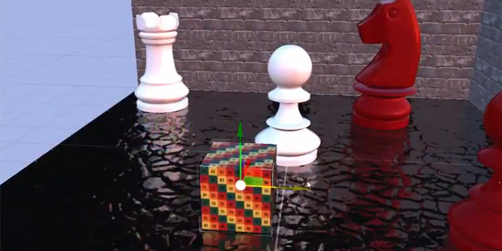

# Screen Space Reflections (SSR)

---

**Screen Space Reflections** add local, real-time reflections to glossy surfaces. For each pixel, a ray is marched through the depth buffer in the reflected direction until it hits something on screen, whose color becomes the reflection.

Like every screen-space technique, SSR can only reflect what is visible: objects off screen, behind others or facing away from the camera cannot appear in it. Combine it with [environment reflections](../../environment/index.md), which fill in where SSR finds nothing.

SSR reads the GBuffer (normals and roughness), so it needs the GBuffer pass.

## Parameters

| Parameter | Default | Description |
| --- | --- | --- |
| **Enabled** | On | Turns the effect on. |
| **Num. Rays** | 200 | Ray-march steps per pixel. More steps find more hits and cost more. |
| **Max. Reflection Distance** | 10 | Longest distance, in world units, a ray travels. |
| **Refinement Steps** | 6 | Extra steps that refine the hit point once a ray crosses a surface, for sharper reflections. |
| **Pixel Thickness** | 0.00025 | How thick each depth sample is assumed to be. Raise it if reflections have holes; lower it if objects reflect things behind them. |
| **Max. Roughness** | 0.8 | Surfaces rougher than this get no screen-space reflection. |
| **Intensity** | 0.5 | Blend of the reflection over the image, from 0 to 1. |
| **Debug Mode Enabled** | Off | Shows only the reflections, to tune the parameters. |
