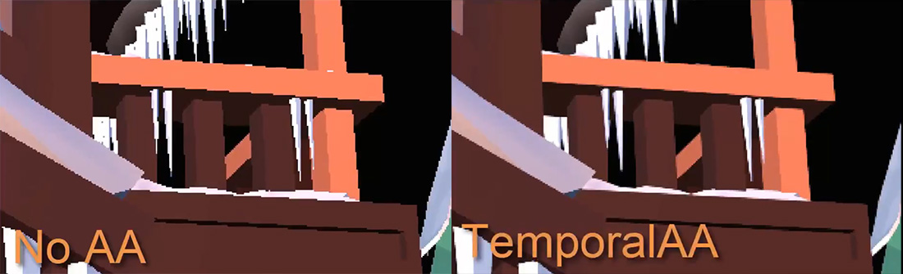

# Temporal Anti-Aliasing (TAA)

---

**Temporal Anti-Aliasing** smooths jagged edges by spreading the samples of a pixel over time. When it is enabled, the camera shifts its projection by a different sub-pixel offset every frame (jitter). TAA blends each new frame with a history of previous ones, reprojected with the motion vectors from the GBuffer, so over a few frames every pixel accumulates many samples.

TAA handles all kinds of aliasing, including specular shimmer and thin geometry, and costs about the same as one extra full-screen pass. The trade-off is some softness, which the [Sharpen](sharpen.md) effect compensates, and occasional ghosting behind fast-moving objects.

TAA needs the GBuffer pass for motion vectors. It has no parameters besides **Enabled** (on by default).

> [!TIP]
> TAA and [FXAA](anti-aliasing.md) are both on in the default graph. Keep FXAA on to clean up what TAA leaves behind, or turn it off if the image looks too soft.
