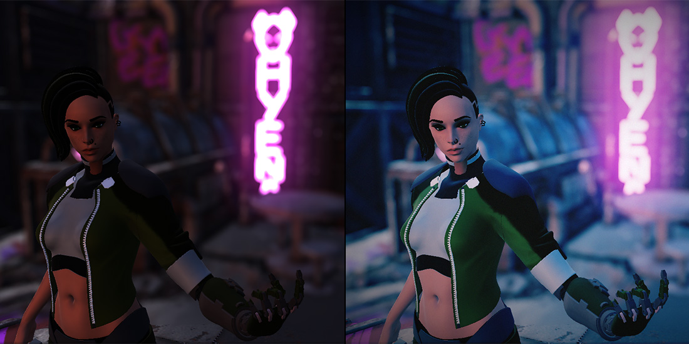
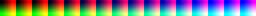
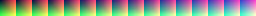
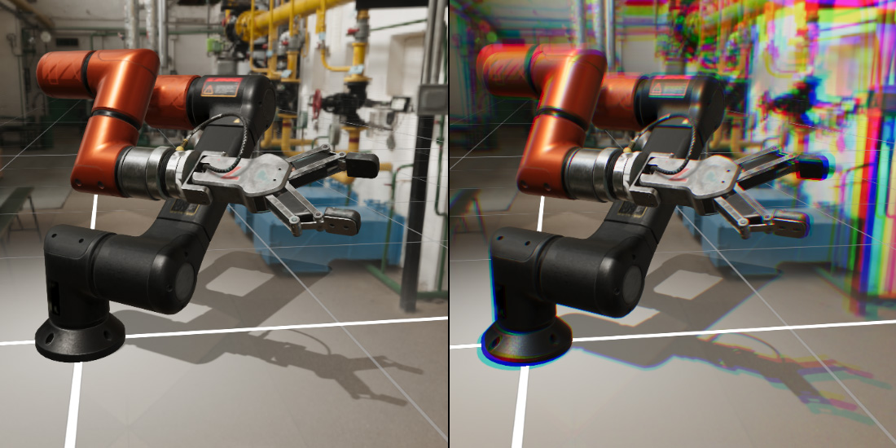
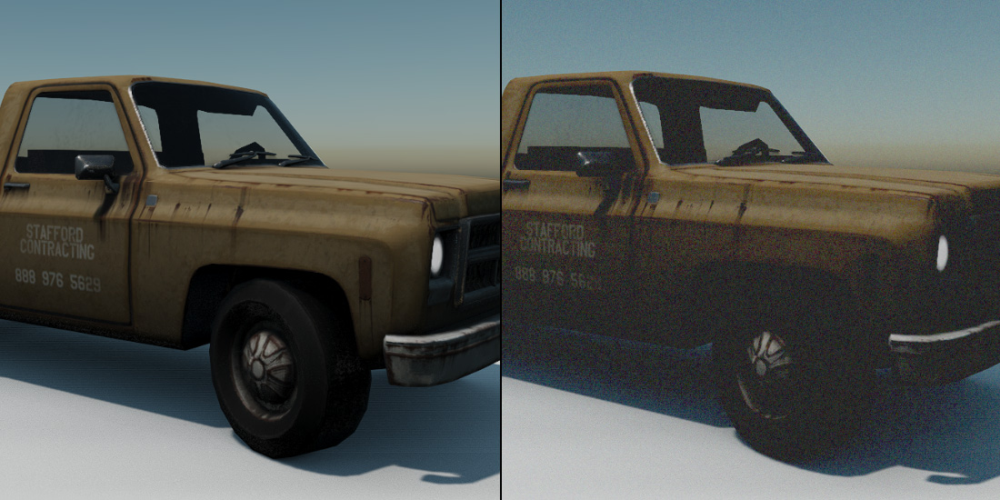
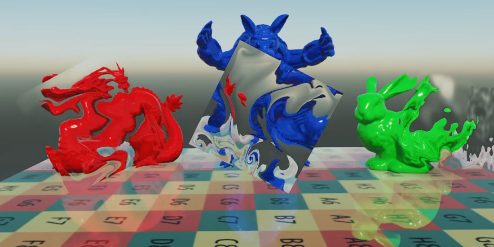

# Tone Mapping, Chromatic Aberration, Grain, Vignette and Distortion

---

These effects are applied by a single node, `ToneMapping`, that reads each pixel once and applies all of them, which is cheaper than running them one after another. Each can be switched on independently.

## Tone Mapping

**Tone mapping** converts the HDR image the camera renders, where values can be far above 1, into the limited range of the display, compressing highlights so bright areas keep their detail instead of clipping to white.

*Left, the render without tone mapping; right, with it.*

| Parameter | Default | Description |
| --- | --- | --- |
| **Enabled** | On | Turns the node, and every effect on this page, on. |
| **HDR Enabled** | On | Map HDR to the display range with the curve below. Turn it off only when the camera renders in LDR. |
| **Curve** | `ACES` | The mapping curve: `REINHARD`, `REINHARDSQ`, `LUMAREINHARD`, `FILMIC`, `ACES` or `ROMBINDAHOUSE`. ACES gives the filmic contrast and color most people expect. |
| **LUT Enabled** | Off | Color-grade the result with a lookup table. |
| **LUT Texture** | none | A 16x16x16 color lookup table unwrapped into a 256x16 texture. Start from a neutral table, grade it in an image editor together with a screenshot, and use the result. |
| **Dither Enabled** | Off | Add a small amount of noise to hide banding in smooth gradients. |

Two sample lookup tables, HDR and vintage:

## Chromatic Aberration

**Chromatic aberration** is the color fringing a lens produces because it bends each wavelength slightly differently. The effect shifts the red, green and blue channels apart, most visibly towards the edges of the image.

*Left, without chromatic aberration; right, with it.*

| Parameter | Default | Description |
| --- | --- | --- |
| **Chromatic Aberration** | Off | Turns the effect on. |
| **Strength** | 5 | Distance between the color channels. |
| **Offset** | (0.005, 0.005) | Direction and base amount of the shift. |

## Grain

**Grain** adds the fine, moving noise of photographic film.

| Parameter | Default | Description |
| --- | --- | --- |
| **Grain Enabled** | Off | Turns the effect on. |
| **Intensity** | 0.5 | Strength of the grain, from 0 to 1. |

## Vignette

A **vignette** darkens the image towards its corners, drawing the eye to the center.

| Parameter | Default | Description |
| --- | --- | --- |
| **Vignette Enabled** | Off | Turns the effect on. |
| **Power** | 1 | How dark the corners get. |
| **Radio** | 1.25 | Scale applied to the distance from the center before darkening. Larger values bring the darkening closer to the center. Evergine Studio displays this value converted as if it were an angle, so the default reads 71.6. |

## Distortion

**Distortion** bends the image behind refractive objects, such as heat haze, glass or water. Objects write how much to bend the image into the distortion target of the GBuffer, and this effect offsets the pixels accordingly.

| Parameter | Default | Description |
| --- | --- | --- |
| **Distortion** | Off | Turns the effect on. |

> [!TIP]
> Only materials that write distortion produce it, such as those made with the **Distortion** effect of Evergine.Core. See [Built-in Effects](../../effects/builtin_effects.md).

