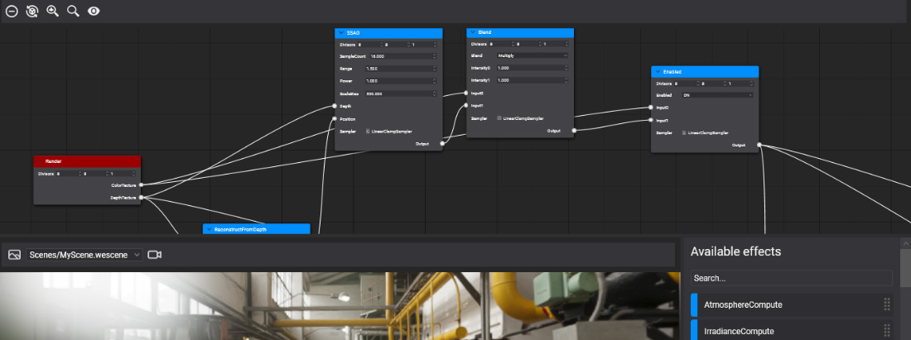
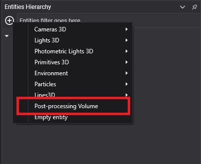
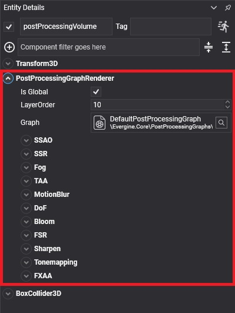

# Using the Post-Processing Graph

---



A post-processing graph affects a scene through a **post-processing volume**: an entity with a `PostProcessingGraphRenderer` component that references the graph. This page shows how to add one in Evergine Studio and from code, and how volumes decide which cameras they affect.

## Load a post-processing graph from code

Load the graph asset and add a volume that uses it:

```csharp
using Evergine.Components.Graphics3D;
using Evergine.Framework;
using Evergine.Framework.Graphics;
using Evergine.Framework.Services;

public class MyScene : Scene
{
    protected override void CreateScene()
    {
        var assetsService = Application.Current.Container.Resolve<AssetsService>();

        var graph = assetsService.Load<PostProcessingGraph>(EvergineContent.PostprocessingGraph.MyPostProcessingGraph);

        // A global volume affects every camera, so it needs no position or collider.
        Entity postprocessingVolume = new Entity("postProcessingVolume")
            .AddComponent(new Transform3D())
            .AddComponent(new PostProcessingGraphRenderer() { ppGraph = graph, IsGlobal = true });

        this.Managers.EntityManager.Add(postprocessingVolume);
    }
}
```

Without a `ppGraph`, the component uses the default post-processing graph of Evergine.Core.

## Add a post-processing volume in Evergine Studio

Click the  button in the [Entities Hierarchy](../../evergine_studio/interface.md) panel and select **Post-processing Volume**. The new volume uses the default post-processing graph.



A Postprocessing Volume is an entity in your scene composed of 3 components:
* `Transform3D`
* `PostProcessingGraphRenderer`
* `BoxCollider`

## PostProcessingGraphRenderer

| Property | Default | Description |
| --- | --- | --- |
| **ppGraph** | Default post-processing graph | The graph asset the volume applies. |
| **IsGlobal** | true | When true, the graph applies to every camera. When false, it applies only to cameras whose position is inside the volume's box collider, so you can change the look of a room or a cave. |
| **LayerOrder** | 10 | When the graph runs, compared with the `Order` of the [render layers](../renderlayers/index.md). The graph runs after every layer with a lower order, so the default of 10 runs it after opaque (0), alpha (2) and additive (3) objects. Give a UI layer an order above it to keep the UI out of post-processing. |

Below these properties, the component shows the parameters of the graph: either all of its node inputs or, when the graph has one, the panels of its [decorator](custom_postprocessing_graph.md#post-processing-graph-decorator).

