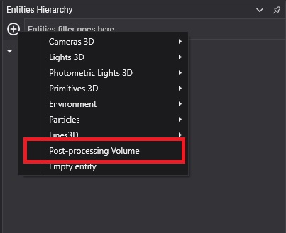

# Using Postprocessing Graph


In this document, you will learn how to load and use the **Postprocessing Graph** in your applications.

## Load Postprocessing Graph from Code
The following sample code can be used to instantiate an existing postprocessing graph asset and apply it in your scene.
```csharp
protected override void CreateScene()
{
    var assetsService = Application.Current.Container.Resolve<AssetsService>();

    var graph = assetsService.Load<PostProcessingGraph>(EvergineContent.PostprocessingGraph.MyPostProcessingGraph);

    // Add postprocessing graph to the scene
    Entity postprocessingVolume = new Entity()
        .AddComponent(new Transform3D())
        .AddComponent(new PostProcessingGraphRenderer() { ppGraph = graph });

    this.Managers.EntityManager.Add(postprocessingVolume);
}
```

## How to Apply Postprocessing Graph to a Scene from Evergine Studio

You can apply a postprocessing graph to your scene by clicking on the  button from the [Entities Hierarchy](../../evergine_studio/interface.md) panel and selecting _Post-processing Volume_.



A Postprocessing Volume is an entity in your scene composed of 3 components:
* `Transform3D`
* `PostProcessingGraphRenderer`
* `BoxCollider3D`

With the `PostProcessingGraphRenderer` component, you can configure it to work in two modes.

| Mode | Description |
| ---- | ----------- |
| **Global** | All cameras in your scene will be affected by the postprocessing graph. |
| **Volume** | The cameras that enter into the volume defined by a BoxCollider will be affected by the postprocessing graph. |

In addition, you can configure the _LayerOrder_ to execute the postprocessing in your scene. For example, you can execute the postprocessing after drawing all entities in your scene but before the UI entities.

Finally, the PostProcessingGraphRenderer allows you to load a Postprocessing Graph asset and displays all its nodes or its associated [decorator](custom_postprocessing_graph.md).

