# Primitives

---

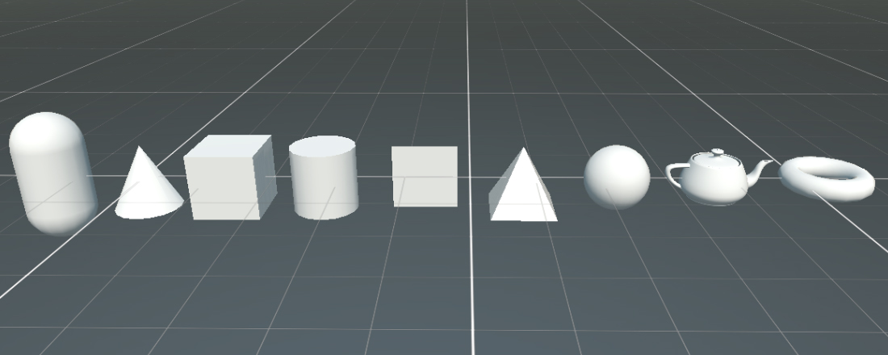

**Primitives** are simple shapes whose mesh Evergine generates from a few parameters: size, tessellation and texture coordinates. They are ideal for prototyping, tests, debug geometry and simple scene elements such as floors. Evergine includes nine:

* Capsule
* Cone       
* Cube       
* Cylinder   
* Plane      
* Pyramid
* Sphere
* Teapot
* Torus

Unlike a [model](models/index.md), a primitive's mesh does not come from an asset: a component generates it procedurally, so you can change its parameters at any time. Primitives with the same parameters share one mesh.

## Create a primitive in Evergine Studio

In the **Entities Hierarchy** panel, click the  button and open **Primitives 3D**. The new entity has a `Transform3D`, the primitive component, a `MaterialComponent` with the default material and a `MeshRenderer`.

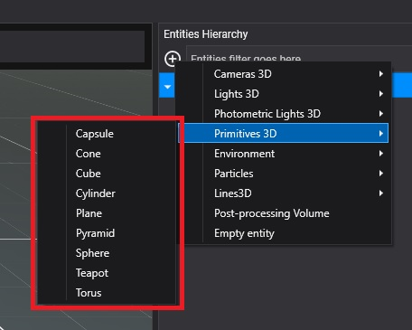

## Create a primitive from code

```csharp
using Evergine.Components.Graphics3D;
using Evergine.Framework;
using Evergine.Framework.Graphics;
using Evergine.Framework.Services;

public class MyScene : Scene
{
    protected override void CreateScene()
    {
        var assetsService = Application.Current.Container.Resolve<AssetsService>();
        var material = assetsService.Load<Material>(DefaultResourcesIDs.DefaultMaterialID);

        Entity cube = new Entity("cube")
            .AddComponent(new Transform3D())
            .AddComponent(new MaterialComponent() { Material = material })
            .AddComponent(new CubeMesh() { Size = 2 })
            .AddComponent(new MeshRenderer());

        this.Managers.EntityManager.Add(cube);
    }
}
```

> [!TIP]
> Swap `CubeMesh` for `CapsuleMesh`, `ConeMesh`, `CylinderMesh`, `PlaneMesh`, `PyramidMesh`, `SphereMesh`, `TeapotMesh` or `TorusMesh` to get the other primitives.

## Cube

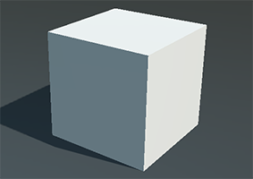

`CubeMesh`

| Parameter | Default | Description |
| --- | --- | --- |
| **Size** | 1 | Length of each edge. |
| **UMirror** | false | Flip the horizontal texture coordinate. |
| **VMirror** | false | Flip the vertical texture coordinate. |
| **UOffset** | 0 | Offset of the horizontal texture coordinate. |
| **VOffset** | 0 | Offset of the vertical texture coordinate. |
| **UTile** | 1 | Scale of the horizontal texture coordinate. |
| **VTile** | 1 | Scale of the vertical texture coordinate. |

## Sphere

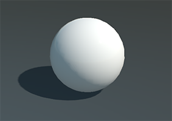

`SphereMesh`

| Parameter | Default | Description |
| --- | --- | --- |
| **Diameter** | 1 | Diameter of the sphere. |
| **Tessellation** | 16 | Number of segments around the sphere. Higher is rounder. |
| **UMirror** | false | Flip the horizontal texture coordinate. |
| **VMirror** | false | Flip the vertical texture coordinate. |

## Plane

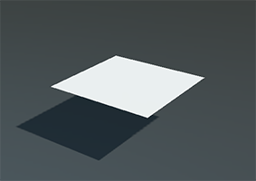

`PlaneMesh`

| Parameter | Default | Description |
| --- | --- | --- |
| **PlaneNormal** | `YPositive` | The axis the plane faces: `XPositive`, `YPositive`, `ZPositive`, `XNegative`, `YNegative` or `ZNegative`. The default is a floor. |
| **Width** | 1 | Width of the plane. |
| **Height** | 1 | Height of the plane. |
| **TwoSides** | false | Also generate the back face. |
| **UMirror** | false | Flip the horizontal texture coordinate. |
| **VMirror** | false | Flip the vertical texture coordinate. |
| **UOffset** | 0 | Offset of the horizontal texture coordinate. |
| **VOffset** | 0 | Offset of the vertical texture coordinate. |
| **UTile** | 1 | Scale of the horizontal texture coordinate. |
| **VTile** | 1 | Scale of the vertical texture coordinate. |
| **Origin** | (0.5, 0.5) | Pivot of the plane, normalized to its size. The default places the entity at the center of the plane. |

## Teapot

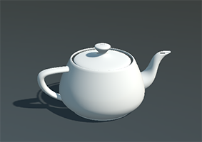

`TeapotMesh`

| Parameter | Default | Description |
| --- | --- | --- |
| **Size** | 1 | Size of the teapot. |
| **Tessellation** | 16 | Subdivision of its curved patches. |

## Capsule

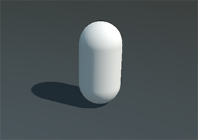

`CapsuleMesh`

| Parameter | Default | Description |
| --- | --- | --- |
| **Height** | 1 | Height of the cylindrical part. |
| **Radius** | 0.5 | Radius of the capsule and of its hemispherical caps. |
| **Tessellation** | 16 | Number of segments around the capsule. Must be even. |

## Cone

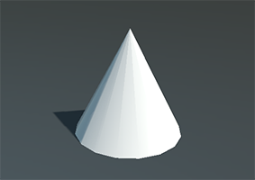

`ConeMesh`

| Parameter | Default | Description |
| --- | --- | --- |
| **Height** | 1 | Height of the cone. |
| **Diameter** | 1 | Diameter of the base. |
| **Tessellation** | 16 | Number of segments around the base. |

## Cylinder

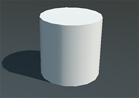

`CylinderMesh`

| Parameter | Default | Description |
| --- | --- | --- |
| **Height** | 1 | Height of the cylinder. |
| **Diameter** | 1 | Diameter of the cylinder. |
| **Tessellation** | 16 | Number of segments around the cylinder. |

## Pyramid

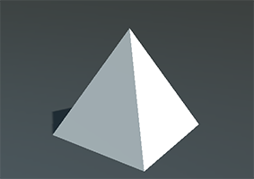

`PyramidMesh`

| Parameter | Default | Description |
| --- | --- | --- |
| **Size** | 1 | Size of the pyramid. |

## Torus

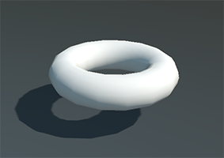

`TorusMesh`

| Parameter | Default | Description |
| --- | --- | --- |
| **Diameter** | 1 | Diameter of the torus. |
| **Thickness** | 0.333 | Thickness of the tube. |
| **Tessellation** | 16 | Number of segments around the ring and the tube. |
