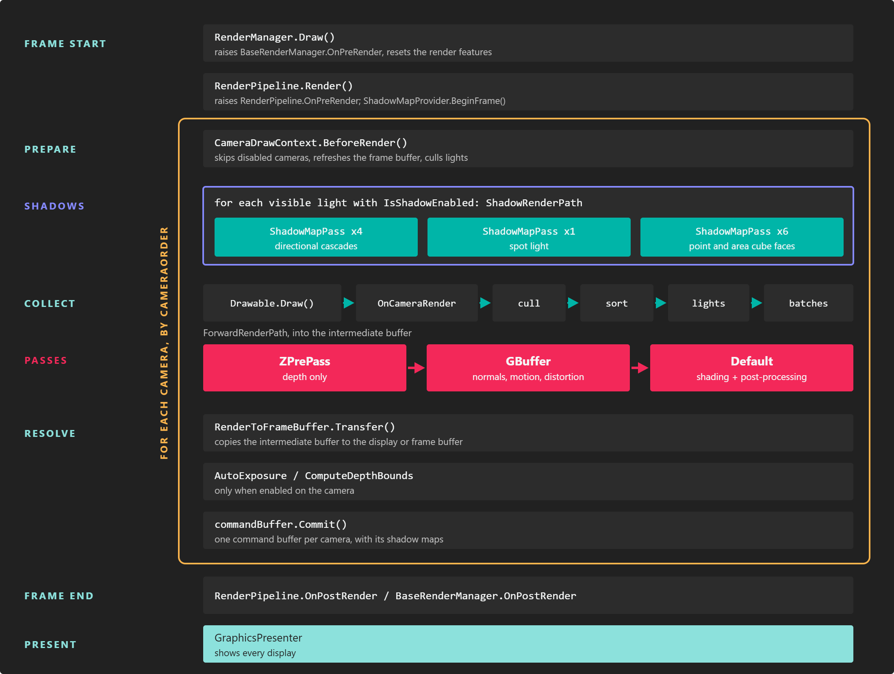
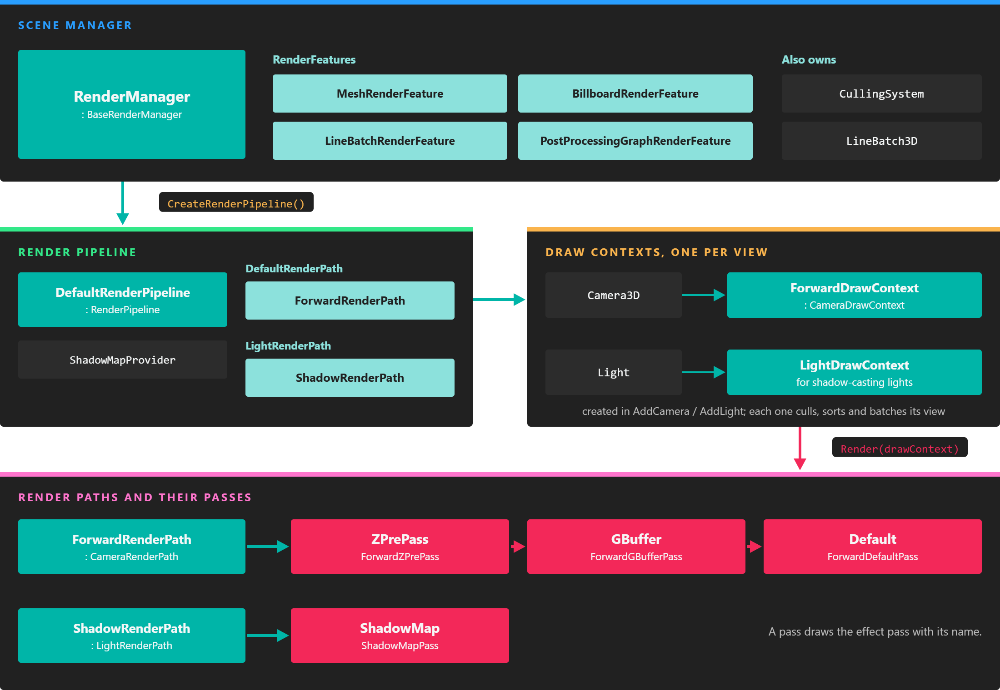

# Rendering Overview

---



Every scene has a **render manager** that turns its entities into an image each frame. It gathers what can be drawn, hands it to a **render pipeline** that decides which views to render (cameras, and lights for their shadow maps), and each view is drawn by a **render path**: an ordered list of **render passes** that record commands for the GPU through the [low-level API](low_level_api/index.md).

You never need to touch this machinery to build a scene: cameras, lights, meshes and materials plug into it automatically. This page explains how it works so you can reason about performance, write effects for the right passes, hook your own code into a frame, or replace parts of the pipeline.

## The pieces



*The render manager owns the pipeline and the render features. The pipeline creates one draw context per camera and per shadow-casting light, and each draw context is rendered by a render path made of passes.*

| Class | Role |
| --- | --- |
| `RenderManager` | The scene manager for rendering (namespace `Evergine.Framework.Managers`). It keeps the lists of cameras, lights and drawables, owns the render features and the `LineBatch3D`, and creates the render pipeline in `CreateRenderPipeline()`. Its base class, `BaseRenderManager`, is what `this.Managers.RenderManager` returns. |
| `RenderFeature` | Holds the render objects of one kind and the mesh processors that turn them into batches. The render manager registers four: `MeshRenderFeature`, `BillboardRenderFeature`, `LineBatchRenderFeature` and `PostProcessingGraphRenderFeature`. |
| `RenderObjectInfo` | One thing to draw: a mesh with its material, a billboard, a line batch or a post-processing graph. Drawables such as `MeshRenderer` add them to the render manager. |
| `RenderPipeline` | Decides what gets rendered each frame and in which order. The default is `DefaultRenderPipeline`. |
| `DrawContext` | One view of the scene: a `CameraDrawContext` for a camera, a `LightDrawContext` for a light's shadow map. It performs culling, sorting and batching for that view. |
| `RenderPath` | How a view is rendered: a `CameraRenderPath` for cameras (`ForwardRenderPath` by default) or a `LightRenderPath` for lights (`ShadowRenderPath`). |
| `RenderPass` | One step of a render path. Its name selects the pass of each effect that is used, so a material is drawn in a pass only if its effect defines a pass with that name. |
| `CullingSystem` | Decides which objects and lights a view can see. The default `FrustumCullingSystem` tests bounding boxes against the view frustum. |

## One frame

The render manager draws every frame after the scene has been updated. For each camera, in `CameraOrder`:

1. **Prepare the camera.** A disabled camera, or one without a target, is skipped. The camera refreshes its matrices and its frame buffer, and the lights it can see are culled.
2. **Render shadow maps.** For each visible light with `IsShadowEnabled`, the pipeline renders its shadow map with the `ShadowRenderPath`: four cascades for a directional light, one view for a spot light, six cube faces for point and area lights. Spot, point and area light shadows are rendered once per frame and shared by every camera; directional cascades are refitted for each camera.
3. **Collect.** The camera's draw context calls `Draw` on every active drawable, raises `OnCameraRender`, culls the render objects against the frustum, sorts them by render layer, material and distance, assigns lights to them and groups compatible ones into batches.
4. **Render passes.** The `ForwardRenderPath` runs its three passes into the camera's intermediate buffer:
   * **ZPrePass** writes depth for opaque geometry, so the default pass shades each pixel only once. It is off on WebGL.
   * **GBuffer** writes normals, roughness and metallic, motion vectors and distortion for post-processing. It only runs on Windows and when the camera renders through an intermediate buffer.
   * **Default** shades everything, in render layer order. The post-processing graph of the camera runs as the last batch of this pass.
5. **Resolve.** The intermediate buffer is copied to the camera's final target, a display or a frame buffer, and auto exposure and depth bounds are computed if enabled.

Once every camera is rendered, the graphics presenter shows the result on each display.

> [!IMPORTANT]
> Shadow views collect the scene too, so a drawable's `Draw` method runs once per camera and once per shadow view, every frame. Keep `Draw` cheap and do per-frame logic in a `Behavior` instead.

### The intermediate buffer

A camera whose target has an intermediate buffer associated (every swap chain does, except on WebGL 1) renders first into an offscreen buffer of its own. It is 16-bit floating point when `HDREnabled` is on, so bright values survive until tone mapping, and it is what makes the GBuffer pass and post-processing possible. Without one, the camera renders straight into its target in low dynamic range, which is faster but skips both.

For a frame buffer you create yourself, set `FrameBuffer.IntermediateBufferAssociated` to decide. See [Render to a texture](cameras.md#render-to-a-texture).

### Directives from the pipeline

The pipeline adds preprocessor directives to every effect it compiles, so shaders can adapt to the scene without the material knowing: whether shadows are supported and which filter is used, whether the scene has point, spot or area lights, whether the camera renders several views for XR, and more. [Effect Metatags](effects/effect_metatags.md#directives-set-by-the-engine) lists them.

## Hook into a frame

The pipeline raises events at each stage. Subscribe to them to run code at the right moment without replacing anything.

| Event | Raised |
| --- | --- |
| `BaseRenderManager.OnPreRender` / `OnPostRender` | Once per frame, before and after the pipeline renders. |
| `RenderPipeline.OnPreRender` / `OnPostRender` | Once per frame, before the first view and after the last one. |
| `RenderPipeline.OnCameraRender` | For every draw context (each camera and each shadow view) after its drawables have been drawn and before culling. The argument is the `DrawContext`. |
| `DrawContext.OnPreRender` / `OnPostRender` | Around the passes of one view, with the `CommandBuffer` being recorded, so you can add your own GPU work. |
| `BaseRenderManager.OnAddCamera`, `OnRemoveCamera`, `OnAddLight`, `OnRemoveLight`, `OnAddDrawable`, `OnRemoveDrawable` | When the lists of the render manager change. |

This component marks the point each camera is focused on, which helps when tuning depth of field. It uses `OnCameraRender` because the handler receives the draw context of the view being rendered:

```csharp
using Evergine.Common.Graphics;
using Evergine.Framework;
using Evergine.Framework.Graphics;
using Evergine.Framework.Managers;
using Evergine.Mathematics;

public class FocusPointGizmo : Component
{
    [BindSceneManager]
    private RenderManager renderManager = null;

    protected override void OnActivated()
    {
        base.OnActivated();
        this.renderManager.RenderPipeline.OnCameraRender += this.OnCameraRender;
    }

    protected override void OnDeactivated()
    {
        this.renderManager.RenderPipeline.OnCameraRender -= this.OnCameraRender;
        base.OnDeactivated();
    }

    private void OnCameraRender(object sender, DrawContext drawContext)
    {
        // The event is raised for shadow views too; only cameras have a focus distance.
        if (drawContext is CameraDrawContext cameraContext)
        {
            var camera = cameraContext.Camera;
            Vector3 focusPoint = camera.Position + (camera.Transform.WorldTransform.Forward * camera.FocalDistance);
            this.renderManager.LineBatch3D.DrawPoint(focusPoint, 0.1f, Color.Yellow);
        }
    }
}
```

## Change how a camera renders

Each camera can have its own render path. A `ForwardRenderPath` has two switches:

| Field | Default | Description |
| --- | --- | --- |
| `ZPrePassIsEnabled` | true (false on WebGL) | Run the depth prepass. Turning it off saves a geometry pass in scenes with little overdraw. |
| `GBufferPassIsEnabled` | true on Windows | Run the GBuffer pass. Post-processing effects that read normals or motion vectors (SSAO, SSR, TAA, motion blur) need it. |

A camera that only renders a minimap or a UI overlay can skip both. This component gives its camera a render path of its own:

```csharp
using Evergine.Framework;
using Evergine.Framework.Graphics;
using Evergine.Framework.Managers;

public class LightweightRenderPath : Component
{
    [BindComponent]
    private Camera3D camera = null;

    [BindSceneManager]
    private RenderManager renderManager = null;

    private ForwardRenderPath renderPath;

    protected override bool OnAttached()
    {
        if (!base.OnAttached())
        {
            return false;
        }

        this.renderPath = new ForwardRenderPath(this.renderManager)
        {
            ZPrePassIsEnabled = false,
            GBufferPassIsEnabled = false,
        };

        // Registering the path lets the pipeline dispose of it with the scene.
        this.renderManager.RenderPipeline.AddRenderPath(this.renderPath);

        // Assigning the path makes the pipeline rebuild the camera's draw context with it.
        this.camera.RenderPath = this.renderPath;

        return true;
    }
}
```

Each camera draw context of the forward path also exposes `ZPrePassIsEnabled` and `GBufferPassIsEnabled`, to change a single camera without a new path: `(camera.DrawContext as ForwardDrawContext).GBufferPassIsEnabled = false`.

Two more camera properties change what a view contains: `TagFilter` limits it to entities with a given tag, and `CullingSystem` replaces the culling system for that camera, for example with a `DummyCullingSystem` that culls nothing. See [Cameras](cameras.md#advanced-rendering-properties).

## Replace the render pipeline

For deeper changes, derive your own render manager and override `CreateRenderPipeline()`. Deriving from `DefaultRenderPipeline` keeps shadows, lighting and the forward path and lets you add to them; deriving from `RenderPipeline` starts from nothing.

```csharp
using System;
using Evergine.Framework;
using Evergine.Framework.Graphics;
using Evergine.Framework.Managers;

public class MyRenderPipeline : DefaultRenderPipeline
{
    public long RenderedCameras { get; private set; }

    public override void RenderSingleCamera(CameraDrawContext cameraContext)
    {
        base.RenderSingleCamera(cameraContext);
        this.RenderedCameras++;
    }
}

public class MyRenderManager : RenderManager
{
    protected override RenderPipeline CreateRenderPipeline()
    {
        return new MyRenderPipeline();
    }
}

public class MyScene : Scene
{
    public override void RegisterManagers()
    {
        // Registered first, so the base class sees a RenderManager and does not add the default one.
        this.Managers.AddManager(new MyRenderManager());
        base.RegisterManagers();
    }
}
```

A custom `CameraRenderPath` overrides `CameraRender(CameraDrawContext, CommandBuffer)` and fills `Passes` with its own `RenderPass` subclasses. Each pass is matched by name to the passes of the effects, so a pass called `Outline` draws the materials whose effect has a `[Begin_Pass:Outline]` block. The [low-level API](low_level_api/index.md) documents the command buffer those passes record into.

> [!TIP]
> To draw a new kind of object rather than to change how views are rendered, a custom `RenderFeature` registered with `RenderManager.RegisterRenderFeature` is usually enough.
