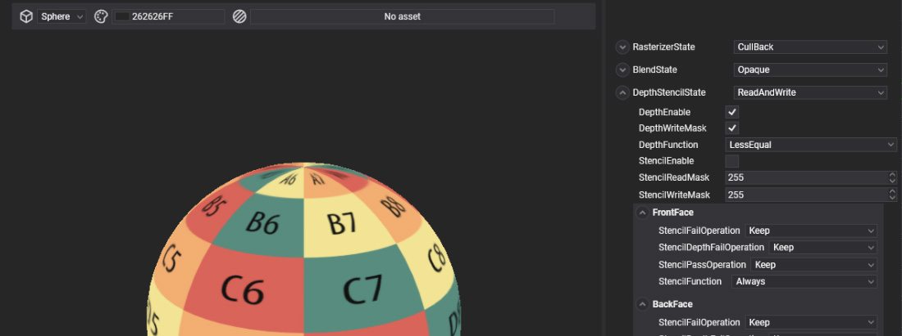

# Render Layers

---

 

A **render layer** (`RenderLayerDescription`) groups materials that are drawn the same way. It sets when they are drawn relative to other layers, how the objects inside are sorted, and the fixed-function state of the draw: culling and fill mode, blending, and depth and stencil testing. Transparent materials go in a blending layer, wireframe or stencil tricks in a layer of their own.

## Render layers and materials

Every [material](../materials/index.md) references one render layer through its `LayerDescription`. A new render layer has no effect until you assign it to materials.

## Default render layers

The Evergine.Core package includes five render layers. Layers are drawn in increasing `Order`, and objects inside a layer are sorted by `SortMode`:

| Layer | Order | Sort | Cull | Depth write | Blending | Use for |
| --- | --- | --- | --- | --- | --- | --- |
| **Skybox** | -1 | Front to back | None | No | None | The sky, drawn first behind everything. |
| **Opaque** | 0 | Front to back | Back | Yes | None | Solid surfaces. The default layer of materials. |
| **Alpha** | 2 | Back to front | Back | No | Premultiplied alpha (`One`, `InverseSourceAlpha`) | Transparent surfaces such as glass and water. |
| **AlphaDoubleSided** | 2 | Back to front | None | No | Premultiplied alpha | Transparent surfaces seen from both sides, such as leaves and fabric. |
| **Additive** | 3 | Back to front | None | No | Additive (`One`, `One`) | Glows, fire, sparks and light effects. |

All five test depth with `GreaterEqual`, because Evergine uses a reversed depth buffer. Opaque objects are sorted front to back so that hidden pixels fail the depth test early; transparent ones back to front so that they blend in the right order.

> [!TIP]
> The [post-processing graph](../postprocessing_graph/index.md) runs after every layer with an order below its `LayerOrder`, 10 by default. A UI layer with an order above 10 is drawn after post-processing and stays unaffected by it.

Render layers are [assets](../../evergine_studio/assets/index.md) with their own editor, the [RenderLayer Editor](renderlayer_editor.md).

## In this section

* [Create a Render Layer](create_renderlayer.md)
* [Using Render Layers](using_renderlayer.md)
* [RenderLayer Editor](renderlayer_editor.md)
