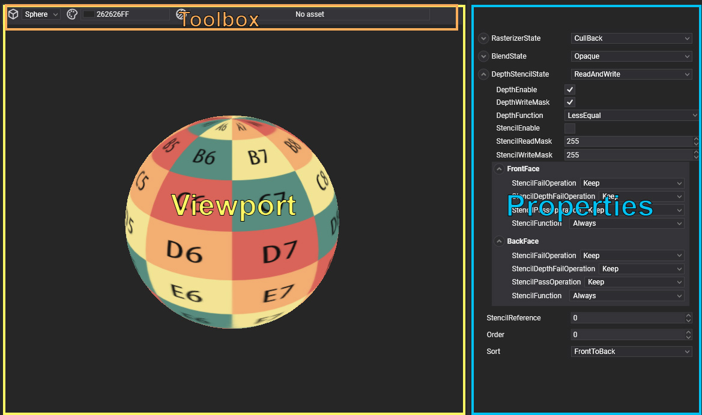

# RenderLayer Editor
---

The **RenderLayer Editor** is a dedicated tool for editing `RenderLayer` assets in Evergine. Double-clicking on a `RenderLayer` asset in the [**Assets Details**](../../evergine_studio/interface.md) panel opens this editor. The interface is divided into two main sections: the **Viewport** and the **Properties** panel.

## Viewport

The **Viewport** displays a real-time preview of the current `RenderLayer` configuration. It includes a toolbar at the top that allows you to change the displayed primitive (e.g., sphere, cube) or modify the background color. The scene is lit by two dynamic lights (front and back), which can be moved using the mouse to see how the lighting affects the material.

### Viewport Controls

| **Action**               | **Description**                                       |
|--------------------------|-------------------------------------------------------|
| **Left Mouse Button**    | Rotate the camera around the primitive.               |
| **Right Mouse Button**   | Rotate the two lights around the primitive.           |
| **Mouse Wheel**          | Zoom the camera in and out.                           |

These controls help you inspect the `RenderLayer` effects from different angles and lighting conditions.

## Properties Panel

The **Properties** panel displays all the configurable parameters of the selected `RenderLayer`. The settings are grouped into three main categories:

- **Rasterizer State**: Defines how polygons are rendered (e.g., wireframe or solid).
- **Blend State**: Controls blending modes for transparency and color.
- **Depth and Stencil State**: Manages depth testing and stencil buffer operations.

You can adjust these properties to modify the appearance and rendering behavior of the `RenderLayer`. Changes made in the properties panel are immediately reflected in the **Viewport**, allowing you to see the effect of your adjustments in real time.
