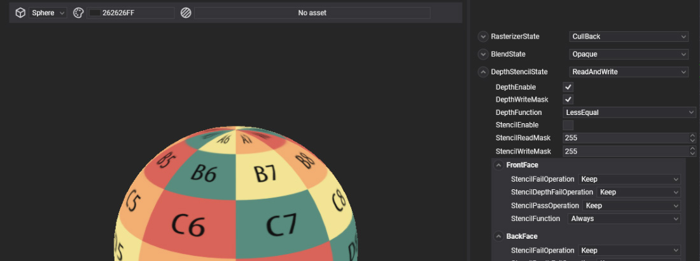
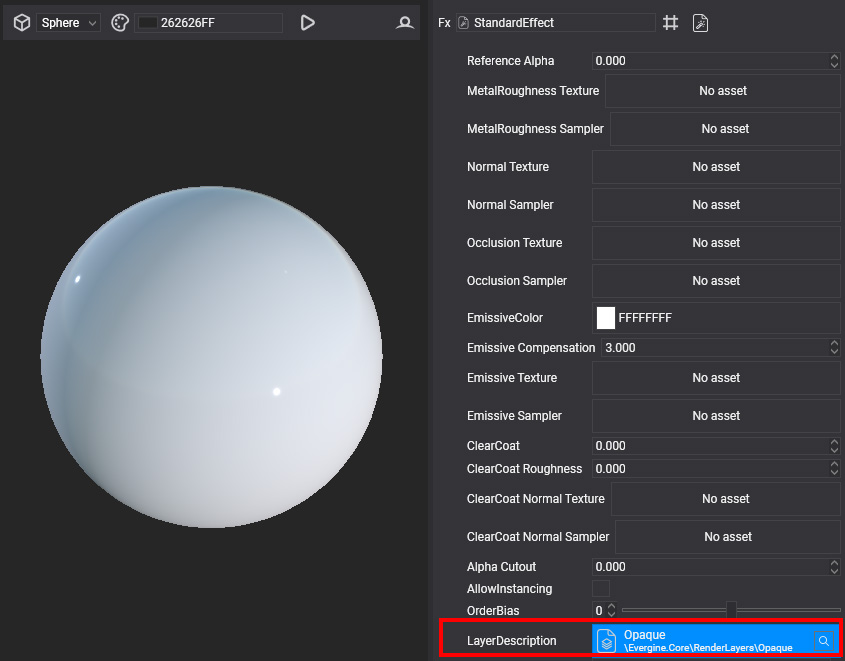

# Using RenderLayer
---



In this guide, you will learn how to load and use **RenderLayer** in your applications to control mesh rendering order and configure various rendering states.

## Loading a RenderLayer from Code
The following sample code demonstrates how to instantiate an existing `RenderLayer` asset and apply it to a material in your scene.

```csharp
protected override void CreateScene()
{
    var assetsService = Application.Current.Container.Resolve<AssetsService>();

    // Load the opaque RenderLayer
    RenderLayerDescription opaque = assetsService.Load<RenderLayerDescription>(EvergineContent.RenderLayers.Opaque);

    // Load the effect
    Effect standardEffect = assetsService.Load<Effect>(EvergineContent.Effects.StandardEffect);

    // Create your own material
    Material material = new Material(standardEffect);
    material.LayerDescription = opaque;

    // Apply the material to an entity
    Entity primitive = new Entity()
            .AddComponent(new Transform3D())
            .AddComponent(new MaterialComponent() { Material = material })
            .AddComponent(new SphereMesh())
            .AddComponent(new MeshRenderer());

    this.Managers.EntityManager.Add(primitive);
}
```

## Applying a RenderLayer to a Material in Evergine Studio

To apply a `RenderLayer` to a material in **Evergine Studio**, follow these steps:

1. Open the [**Assets Details**](../../evergine_studio/interface.md) panel and select the desired material.
2. Navigate to the [**Material Editor**](../materials/material_editor.md).
3. In the Properties panel, find the `Layer` field.
4. Choose the appropriate `RenderLayer` from the dropdown menu.

This will assign the selected `RenderLayer` to your material, allowing you to control the rendering order and define its rendering behavior.

