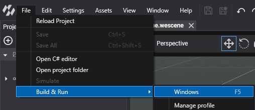

# DirectX 11

---


**DirectX 11** is Microsoft's previous-generation graphics API, available on every Windows PC. It is an implicit API: the driver manages memory and synchronization, which makes it robust and widely compatible, at the cost of more CPU overhead than DirectX 12.

Evergine keeps DirectX 11 for the templates whose UI frameworks or runtimes integrate with it: **Windows (DirectX11)**, **WinUI**, **MAUI** on Windows, **Avalonia** and **Windows OpenXR**. It supports compute shaders, but not ray tracing or mesh shaders.

## Supported devices

* Windows 10 and 11 PCs.
* PC VR headsets, through the Windows OpenXR template.

## Check your DirectX version

Run `dxdiag` to see the DirectX version of your system. See [Microsoft support](https://support.microsoft.com/windows/checking-your-version-of-directx-7b71e74f-02e8-456f-72c7-9a1c1bbf0e9a) for details.

## Create a graphics context

```csharp
GraphicsContext graphicsContext = new Evergine.DirectX11.DX11GraphicsContext();
graphicsContext.CreateDevice();
```

## Build & Run

Add a profile with the **Windows (DirectX11)** template from **Settings > Project Settings** (see [DirectX 12](directx12.md#build--run) for the steps), and run it from **File > Build & Run > Windows.DirectX11**:


