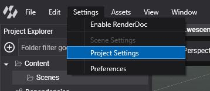
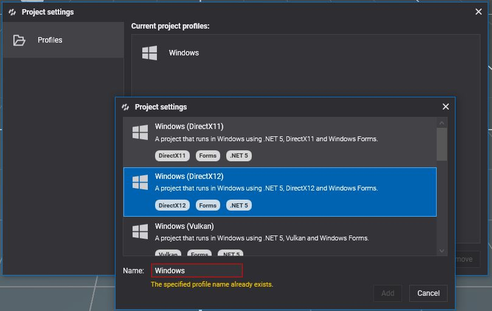
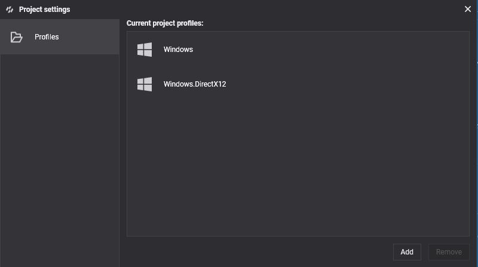
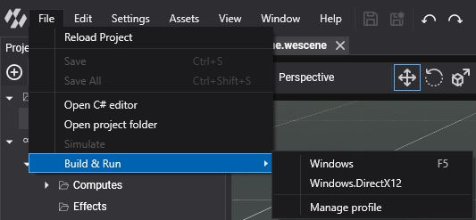

# DirectX 12

---


**DirectX 12** is Microsoft's explicit, low-overhead graphics API for Windows 10 and 11. It is the **default backend of Evergine on Windows**: new projects use the **Windows (DirectX12)** template, and Evergine Studio renders with it unless you start it with another backend.

Being an explicit API, DirectX 12 lets Evergine record work on several threads, run graphics, compute and copy work on separate queues, and use the newest GPU features: DirectX Raytracing through the low-level [ray tracing pipeline](../low_level_api/raytracingpipeline.md), mesh and amplification shaders, and shader model 6 through the DXC compiler (effect profiles `12_0` to `12_7`).

## Supported devices

* Windows 10 and 11 PCs.

Ray tracing and mesh shaders need a GPU and driver that support them. Check `graphicsContext.Capabilities.IsRaytracingSupported` and `IsMeshShaderSupported` at runtime.

## Check your DirectX version

Run `dxdiag` to see the DirectX version and the feature levels of your GPU. DirectX 12 is updated through Windows Update and the graphics driver. See [Microsoft support](https://support.microsoft.com/windows/checking-your-version-of-directx-7b71e74f-02e8-456f-72c7-9a1c1bbf0e9a) for details.

## Create a graphics context

```csharp
GraphicsContext graphicsContext = new Evergine.DirectX12.DX12GraphicsContext();
graphicsContext.CreateDevice();
```

To render in software, with no GPU at all, pass `useWarpAdapter: true`. The [WARP](https://learn.microsoft.com/windows/win32/direct3darticles/directx-warp) adapter is slow, but it runs anywhere, which makes it useful on build servers and virtual machines for automated tests:

```csharp
GraphicsContext graphicsContext = new Evergine.DirectX12.DX12GraphicsContext(useWarpAdapter: true);
graphicsContext.CreateDevice();
```

## Build & Run

New projects already have a Windows profile with DirectX 12. To add it to an existing project, open **Settings > Project Settings** in Evergine Studio:



Add a profile with the **Windows (DirectX12)** template:





Then run it from **File > Build & Run > Windows.DirectX12**:


