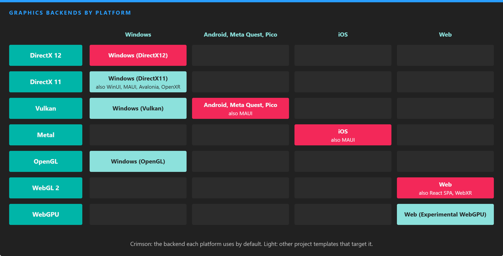

# Supported Graphics Backends

---

*Each platform has a default backend, and project templates add the others. Windows defaults to DirectX 12, Android and the standalone XR headsets to Vulkan, iOS to Metal and the web to WebGL 2.*

Evergine renders through DirectX 12, DirectX 11, Vulkan, Metal, OpenGL and OpenGL ES, WebGL and WebGPU. Your scenes, materials and effects are the same on all of them: the [low-level graphics API](../low_level_api/index.md) hides the differences, and effects written in HLSL are compiled or translated to each backend's shading language when needed.

You choose the backend through the project template of each [profile](../../evergine_studio/settings/project_profiles.md). A project can have several profiles, for example Windows with DirectX 12 and Web with WebGPU, and Evergine Studio builds and runs each one from **File > Build & Run**.

| Backend | Platforms | Project templates | Compute | Ray tracing | Mesh shaders |
| --- | --- | --- | --- | --- | --- |
| [DirectX 12](directx12.md) | Windows | **Windows (DirectX12)**, the default | Yes | Device dependent | Device dependent |
| [DirectX 11](directx11.md) | Windows | Windows (DirectX11), WinUI, MAUI, Avalonia, Windows OpenXR | Yes | No | No |
| [Vulkan](vulkan.md) | Windows, Android | **Android**, **Android Meta Quest**, **Android Pico**, MAUI, Windows (Vulkan) | Yes | Device dependent | Device dependent |
| [Metal](metal.md) | iOS | **iOS**, MAUI | Yes | No | No |
| [OpenGL](opengl.md) | Windows, Web (WebGL 2) | **Web**, React SPA, WebXR, Windows (OpenGL) | No | No | No |
| [WebGPU](webgpu.md) | Web | Web (Experimental WebGPU) | Yes | No | No |

Templates in bold are the default for their platform.

> [!TIP]
> Features such as ray tracing and mesh shaders depend on the device as well as on the backend. Check `graphicsContext.Capabilities` (`IsRaytracingSupported`, `IsMeshShaderSupported`, `IsComputeShaderSupported`...) at runtime rather than testing the backend type.

## Options common to every backend

`GraphicsContext` has two settings that apply to all backends. Set them before calling `CreateDevice()`, in the `Program.cs` of the platform project:

| Property | Default | Description |
| --- | --- | --- |
| **ReverseZBuffer** | true | Store depth reversed (1 at the near plane, 0 at the far one). It spreads depth precision far better and is what the default pipeline expects. |
| **FramesInFlight** | 0 | How many frames the CPU can prepare while the GPU is still working on earlier ones, counting the one being recorded. `0` disables the limit. With a value of 2 or 3, the graphics presenter waits on a fence per frame, which keeps latency bounded. |

## In this section

* [DirectX 12](directx12.md)
* [DirectX 11](directx11.md)
* [Vulkan](vulkan.md)
* [Metal](metal.md)
* [OpenGL](opengl.md)
* [WebGPU](webgpu.md)
