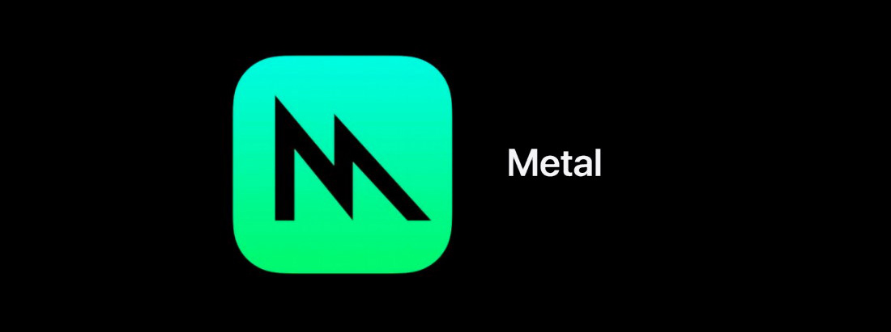

# Metal

---



**Metal** is Apple's low-level graphics and compute API. Evergine uses it on iOS and iPadOS: both the **iOS** template and the iOS target of the **MAUI** template render with Metal.

## Supported devices

* iPhone and iPad.

## Check your Metal version

Metal is part of the operating system and is updated with it. Keep the device on a recent iOS version to get the latest Metal features.

## Create a graphics context

```csharp
GraphicsContext graphicsContext = new Evergine.Metal.MTLGraphicsContext();
graphicsContext.CreateDevice();
```

## Build & Run

Add a profile with the **iOS** or **MAUI** template from **Settings > Project Settings** (see [DirectX 12](directx12.md#build--run) for the steps). Building for iOS needs a Mac with Xcode, as described in [iOS](../../platforms/ios/index.md).
