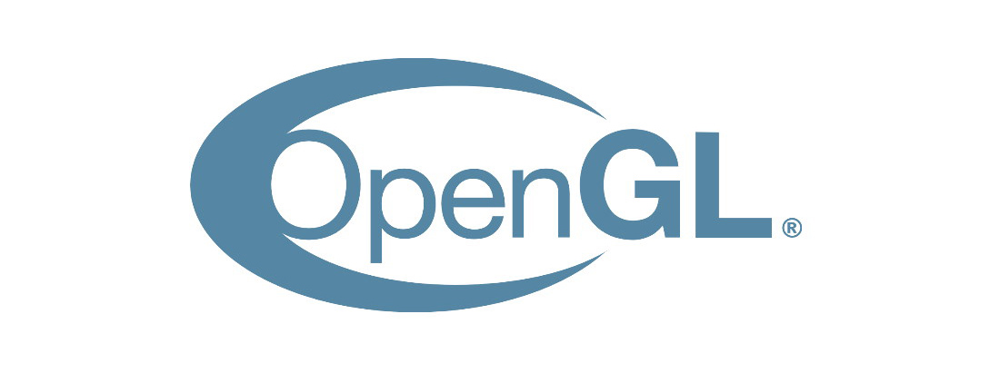
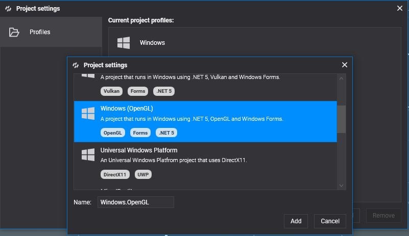
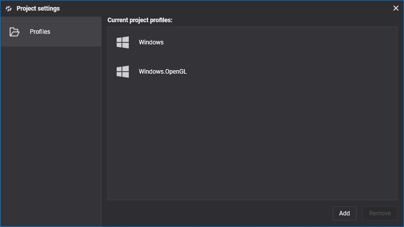
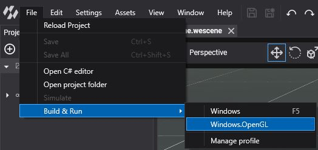
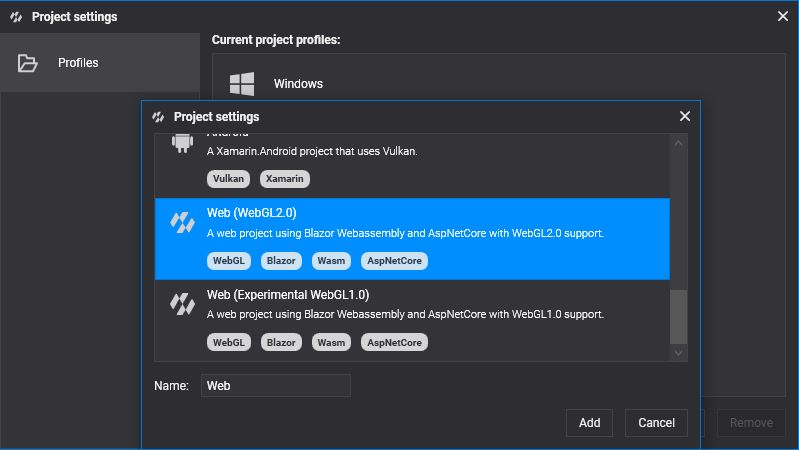

# OpenGL

---



**OpenGL** is the veteran cross-platform graphics API of the **Khronos Group**. Evergine uses it in two forms:

* **WebGL 2**, the OpenGL ES 3.0 based API of web browsers, is the **default backend for the web**: the **Web**, **React SPA** and **WebXR** templates use it.
* Desktop **OpenGL** on Windows, through the **Windows (OpenGL)** template.

OpenGL does not support compute shaders in Evergine, so features built on them, such as GPU particles and most post-processing effects, are not available. For new desktop work prefer [DirectX 12](directx12.md) or [Vulkan](vulkan.md); for the web, consider [WebGPU](webgpu.md).

## Supported devices

* Current Chrome, Edge, Firefox and Safari browsers on desktop and mobile (WebGL 2).
* Windows 10 and 11 PCs (OpenGL).

## Check your OpenGL version

On Windows, OpenGL comes with the graphics driver; the [OpenGL Hardware Capability Viewer](https://opengl.gpuinfo.org/download.php) shows the version it supports. For browsers, [caniuse.com/webgl2](https://caniuse.com/webgl2) shows WebGL 2 support.

## Create a graphics context

```csharp
GraphicsContext graphicsContext = new Evergine.OpenGL.GLGraphicsContext();
graphicsContext.CreateDevice();
```

For WebGL 2, pass the backend explicitly:

```csharp
GraphicsContext graphicsContext = new Evergine.OpenGL.GLGraphicsContext(GraphicsBackend.WebGL2);
graphicsContext.CreateDevice();
```

## Build & Run

### Desktop

Add a profile with the **Windows (OpenGL)** template from **Settings > Project Settings** (see [DirectX 12](directx12.md#build--run) for the steps):





Then run it from **File > Build & Run > Windows.OpenGL**:



### Web

Add a profile with the **Web (WebGL2.0)** template to target browsers with WebGL 2:


